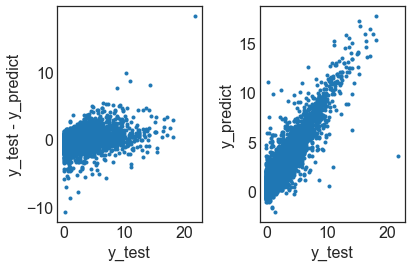
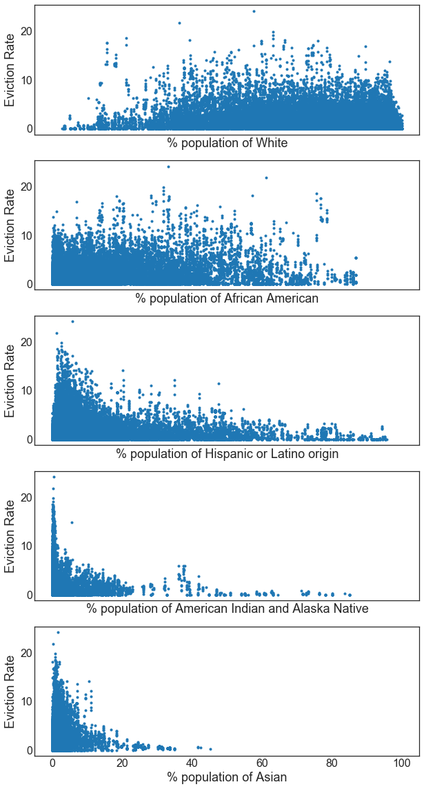

```python
import pandas as pd
import numpy as np
import matplotlib.pyplot as plt
from sklearn.model_selection import train_test_split
from sklearn import svm
import xgboost as xgb
import seaborn as sns
from sklearn import linear_model
from sklearn.linear_model import SGDRegressor
import matplotlib.ticker
matplotlib.rcParams.update({'font.size': 16})
%matplotlib inline
```


```python

```


```python
#visualization
#df.hist(column= 'poverty_rate', bins = 50)
plt.show()
df.hist(column= 'eviction_rate', bins = 50)
#df.hist(column = 'median_household_income', bins = 50)
```


    array([[<matplotlib.axes._subplots.AxesSubplot object at 0x0000022617AD2160>]], dtype=object)


```python
print(df.iloc[0])
```

    GEOID                                   1001
    year                                    2000
    name                          Autauga County
    parent_location                      Alabama
    population                             43671
    poverty_rate                           10.92
    pct_renter_occupied                    19.21
    median_gross_rent                        537
    median_household_income                42013
    median_property_value                  94800
    rent_burden                             22.6
    pct_white                              79.74
    pct_af_am                              17.01
    pct_hispanic                             1.4
    pct_am_ind                              0.43
    pct_asian                               0.44
    pct_nh_pi                               0.03
    pct_multiple                            0.86
    pct_other                                0.1
    renter_occupied_households              3074
    eviction_filings                          61
    evictions                                 40
    eviction_rate                            1.3
    eviction_filing_rate                    1.98
    imputed                                    0
    subbed                                     0
    Name: 0, dtype: object
    


```python

X, y = get_x_y(df4, features=[ 'year','population',
       'poverty_rate', 'pct_renter_occupied', 'median_gross_rent',
       'median_household_income', 'median_property_value', 'rent_burden',
       'pct_white', 'pct_af_am', 'renter_occupied_households', 'Percent of adults with less than a high school diploma 2012_2016',
       'Percent of adults with a high school diploma only 2012_2016', 'Percent of adults completing some college or associates degree 2012_2016', \
       'Percent of adults with a bachelors degree or higher 2012_2016','Unemployment_rate_2016', 'Med_HH_Income_Percent_of_State_Total_2016','students_total_enrollments', 'State short_AL',
 'State short_AZ',
 'State short_CA',
 'State short_CO',
 'State short_CT',
 'State short_DE',
 'State short_FL',
 'State short_GA',
 'State short_HI',
 'State short_IA',
 'State short_ID',
 'State short_IL',
 'State short_IN',
 'State short_KS',
 'State short_KY',
 'State short_LA',
 'State short_MA',
 'State short_MD',
 'State short_ME',
 'State short_MI',
 'State short_MN',
 'State short_MO',
 'State short_MS',
 'State short_MT',
 'State short_NC',
 'State short_NE',
 'State short_NH',
 'State short_NJ',
 'State short_NM',
 'State short_NV',
 'State short_NY',
 'State short_OH',
 'State short_OK',
 'State short_OR',
 'State short_PA',
 'State short_RI',
 'State short_SC',
 'State short_TN',
 'State short_TX',
 'State short_UT',
 'State short_VA',
 'State short_VT',
 'State short_WA',
 'State short_WI',
 'State short_WV',
 'State short_WY'])


X_train, X_test, y_train, y_test = train_test_split(X, y, test_size=0.3, random_state=42)
```


```python
xgtrain = xgb.DMatrix(X_train.values, y_train.values)
xgtest = xgb.DMatrix(X_test.values, y_test.values)
evallist = [(xgtest, 'eval'), (xgtrain, 'train')]
param = {'silent': 1, 'max_depth': 10, 'eta': 1, 'lambda':10, 'alpha': 10, 'objective': 'reg:linear'}
```


```python
np.mean(y_test)
```


    1.691047872340415


```python
np.mean((y_test-np.mean(y_test))**2)**.5
```


    1.9605448885754657


```python
num_round = 1000
bst = xgb.train(param, xgtrain, num_round, evallist)
```

    [0]	eval-rmse:1.16518	train-rmse:1.11729
    [1]	eval-rmse:1.06783	train-rmse:0.997675
    [2]	eval-rmse:0.991798	train-rmse:0.905045
    [3]	eval-rmse:0.963919	train-rmse:0.872483
    [4]	eval-rmse:0.950015	train-rmse:0.853665
    [5]	eval-rmse:0.929078	train-rmse:0.818836
    [6]	eval-rmse:0.909728	train-rmse:0.786521
    [7]	eval-rmse:0.874631	train-rmse:0.734245
    [8]	eval-rmse:0.861871	train-rmse:0.715257
    [9]	eval-rmse:0.844194	train-rmse:0.683438
    [10]	eval-rmse:0.829301	train-rmse:0.662962
    [11]	eval-rmse:0.813518	train-rmse:0.638058
    [12]	eval-rmse:0.800331	train-rmse:0.614744
    [13]	eval-rmse:0.793462	train-rmse:0.601018
    [14]	eval-rmse:0.786068	train-rmse:0.585447
    [15]	eval-rmse:0.777386	train-rmse:0.572877
    [16]	eval-rmse:0.774489	train-rmse:0.566401
    [17]	eval-rmse:0.768717	train-rmse:0.554148
    [18]	eval-rmse:0.761439	train-rmse:0.540785
    [19]	eval-rmse:0.758459	train-rmse:0.532793
    [20]	eval-rmse:0.753764	train-rmse:0.519911
    [21]	eval-rmse:0.750528	train-rmse:0.511126
    [22]	eval-rmse:0.746296	train-rmse:0.504114
    [23]	eval-rmse:0.742725	train-rmse:0.496824
    [24]	eval-rmse:0.74041	train-rmse:0.490882
    [25]	eval-rmse:0.738139	train-rmse:0.48491
    [26]	eval-rmse:0.735362	train-rmse:0.478813
    [27]	eval-rmse:0.732384	train-rmse:0.47269
    [28]	eval-rmse:0.73012	train-rmse:0.468301
    [29]	eval-rmse:0.729073	train-rmse:0.463549
    [30]	eval-rmse:0.727027	train-rmse:0.459173
    [31]	eval-rmse:0.724453	train-rmse:0.451476
    [32]	eval-rmse:0.722641	train-rmse:0.447869
    [33]	eval-rmse:0.721156	train-rmse:0.443861
    [34]	eval-rmse:0.718742	train-rmse:0.439591
    [35]	eval-rmse:0.71751	train-rmse:0.435455
    [36]	eval-rmse:0.716813	train-rmse:0.432953
    [37]	eval-rmse:0.715532	train-rmse:0.428676
    [38]	eval-rmse:0.714602	train-rmse:0.424697
    [39]	eval-rmse:0.714194	train-rmse:0.420295
    [40]	eval-rmse:0.712917	train-rmse:0.416878
    [41]	eval-rmse:0.712248	train-rmse:0.413905
    [42]	eval-rmse:0.711189	train-rmse:0.410626
    [43]	eval-rmse:0.710239	train-rmse:0.407942
    [44]	eval-rmse:0.709725	train-rmse:0.405436
    [45]	eval-rmse:0.709375	train-rmse:0.403434
    [46]	eval-rmse:0.70815	train-rmse:0.401302
    [47]	eval-rmse:0.706587	train-rmse:0.398281
    [48]	eval-rmse:0.706465	train-rmse:0.395686
    [49]	eval-rmse:0.706005	train-rmse:0.39237
    [50]	eval-rmse:0.705893	train-rmse:0.389971
    [51]	eval-rmse:0.70545	train-rmse:0.387806
    [52]	eval-rmse:0.704989	train-rmse:0.385966
    [53]	eval-rmse:0.704358	train-rmse:0.383683
    [54]	eval-rmse:0.703819	train-rmse:0.381389
    [55]	eval-rmse:0.703515	train-rmse:0.379715
    [56]	eval-rmse:0.702984	train-rmse:0.378011
    [57]	eval-rmse:0.702902	train-rmse:0.376426
    [58]	eval-rmse:0.702317	train-rmse:0.374938
    [59]	eval-rmse:0.701927	train-rmse:0.373192
    [60]	eval-rmse:0.701769	train-rmse:0.371476
    [61]	eval-rmse:0.701343	train-rmse:0.370309
    [62]	eval-rmse:0.701195	train-rmse:0.369022
    [63]	eval-rmse:0.701047	train-rmse:0.368126
    [64]	eval-rmse:0.700529	train-rmse:0.367086
    [65]	eval-rmse:0.699731	train-rmse:0.365655
    [66]	eval-rmse:0.699414	train-rmse:0.363817
    [67]	eval-rmse:0.699162	train-rmse:0.361688
    [68]	eval-rmse:0.698887	train-rmse:0.360538
    [69]	eval-rmse:0.69845	train-rmse:0.359605
    [70]	eval-rmse:0.697806	train-rmse:0.357333
    [71]	eval-rmse:0.697729	train-rmse:0.355777
    [72]	eval-rmse:0.697238	train-rmse:0.354508
    [73]	eval-rmse:0.697011	train-rmse:0.35378
    [74]	eval-rmse:0.696899	train-rmse:0.352836
    [75]	eval-rmse:0.696479	train-rmse:0.350075
    [76]	eval-rmse:0.696346	train-rmse:0.349369
    [77]	eval-rmse:0.696496	train-rmse:0.348029
    [78]	eval-rmse:0.696442	train-rmse:0.346594
    [79]	eval-rmse:0.696229	train-rmse:0.3451
    [80]	eval-rmse:0.695576	train-rmse:0.343703
    [81]	eval-rmse:0.695634	train-rmse:0.342868
    [82]	eval-rmse:0.695651	train-rmse:0.342268
    [83]	eval-rmse:0.695502	train-rmse:0.341522
    [84]	eval-rmse:0.695372	train-rmse:0.340677
    [85]	eval-rmse:0.695103	train-rmse:0.339358
    [86]	eval-rmse:0.694895	train-rmse:0.338297
    [87]	eval-rmse:0.695059	train-rmse:0.337695
    [88]	eval-rmse:0.694972	train-rmse:0.336551
    [89]	eval-rmse:0.694481	train-rmse:0.335506
    [90]	eval-rmse:0.69436	train-rmse:0.335028
    [91]	eval-rmse:0.693834	train-rmse:0.33387
    [92]	eval-rmse:0.693741	train-rmse:0.333237
    [93]	eval-rmse:0.693469	train-rmse:0.33195
    [94]	eval-rmse:0.693156	train-rmse:0.330905
    [95]	eval-rmse:0.692843	train-rmse:0.330043
    [96]	eval-rmse:0.692705	train-rmse:0.329091
    [97]	eval-rmse:0.692568	train-rmse:0.32861
    [98]	eval-rmse:0.692383	train-rmse:0.328122
    [99]	eval-rmse:0.692407	train-rmse:0.327509
    [100]	eval-rmse:0.692249	train-rmse:0.327079
    [101]	eval-rmse:0.691892	train-rmse:0.32598
    [102]	eval-rmse:0.691986	train-rmse:0.324737
    [103]	eval-rmse:0.692044	train-rmse:0.324118
    [104]	eval-rmse:0.691781	train-rmse:0.322647
    [105]	eval-rmse:0.691087	train-rmse:0.32078
    [106]	eval-rmse:0.690921	train-rmse:0.320062
    [107]	eval-rmse:0.690849	train-rmse:0.31971
    [108]	eval-rmse:0.690764	train-rmse:0.318817
    [109]	eval-rmse:0.690882	train-rmse:0.318453
    [110]	eval-rmse:0.690773	train-rmse:0.31794
    [111]	eval-rmse:0.690524	train-rmse:0.317173
    [112]	eval-rmse:0.690547	train-rmse:0.316907
    [113]	eval-rmse:0.690399	train-rmse:0.31642
    [114]	eval-rmse:0.69038	train-rmse:0.316135
    [115]	eval-rmse:0.690395	train-rmse:0.315602
    [116]	eval-rmse:0.69051	train-rmse:0.31523
    [117]	eval-rmse:0.6903	train-rmse:0.314372
    [118]	eval-rmse:0.690101	train-rmse:0.313628
    [119]	eval-rmse:0.689952	train-rmse:0.313303
    [120]	eval-rmse:0.689875	train-rmse:0.312933
    [121]	eval-rmse:0.689807	train-rmse:0.312614
    [122]	eval-rmse:0.689693	train-rmse:0.31216
    [123]	eval-rmse:0.689691	train-rmse:0.311729
    [124]	eval-rmse:0.68959	train-rmse:0.311085
    [125]	eval-rmse:0.689727	train-rmse:0.310318
    [126]	eval-rmse:0.689559	train-rmse:0.310125
    [127]	eval-rmse:0.689448	train-rmse:0.309735
    [128]	eval-rmse:0.689453	train-rmse:0.308693
    [129]	eval-rmse:0.689376	train-rmse:0.308498
    [130]	eval-rmse:0.689405	train-rmse:0.308008
    [131]	eval-rmse:0.689213	train-rmse:0.307517
    [132]	eval-rmse:0.689076	train-rmse:0.307128
    [133]	eval-rmse:0.689075	train-rmse:0.30674
    [134]	eval-rmse:0.688816	train-rmse:0.30626
    [135]	eval-rmse:0.688558	train-rmse:0.305505
    [136]	eval-rmse:0.688511	train-rmse:0.305174
    [137]	eval-rmse:0.688445	train-rmse:0.304952
    [138]	eval-rmse:0.688399	train-rmse:0.304752
    [139]	eval-rmse:0.68821	train-rmse:0.304168
    [140]	eval-rmse:0.68822	train-rmse:0.303324
    [141]	eval-rmse:0.688022	train-rmse:0.302939
    [142]	eval-rmse:0.687809	train-rmse:0.30263
    [143]	eval-rmse:0.687701	train-rmse:0.302398
    [144]	eval-rmse:0.68774	train-rmse:0.30201
    [145]	eval-rmse:0.68772	train-rmse:0.301732
    [146]	eval-rmse:0.687735	train-rmse:0.301168
    [147]	eval-rmse:0.687684	train-rmse:0.300971
    [148]	eval-rmse:0.687722	train-rmse:0.3005
    [149]	eval-rmse:0.687694	train-rmse:0.300084
    [150]	eval-rmse:0.687698	train-rmse:0.299702
    [151]	eval-rmse:0.687716	train-rmse:0.299482
    [152]	eval-rmse:0.687683	train-rmse:0.298997
    [153]	eval-rmse:0.687482	train-rmse:0.298596
    [154]	eval-rmse:0.687352	train-rmse:0.298183
    [155]	eval-rmse:0.687403	train-rmse:0.298073
    [156]	eval-rmse:0.687348	train-rmse:0.297749
    [157]	eval-rmse:0.687241	train-rmse:0.297627
    [158]	eval-rmse:0.687254	train-rmse:0.297062
    [159]	eval-rmse:0.687182	train-rmse:0.296946
    [160]	eval-rmse:0.687091	train-rmse:0.296496
    [161]	eval-rmse:0.687036	train-rmse:0.296269
    [162]	eval-rmse:0.686922	train-rmse:0.295876
    [163]	eval-rmse:0.686902	train-rmse:0.295665
    [164]	eval-rmse:0.686836	train-rmse:0.295528
    [165]	eval-rmse:0.686968	train-rmse:0.295279
    [166]	eval-rmse:0.687106	train-rmse:0.294633
    [167]	eval-rmse:0.687011	train-rmse:0.294538
    [168]	eval-rmse:0.686797	train-rmse:0.294392
    [169]	eval-rmse:0.686752	train-rmse:0.294149
    [170]	eval-rmse:0.686688	train-rmse:0.293746
    [171]	eval-rmse:0.686677	train-rmse:0.293392
    [172]	eval-rmse:0.68668	train-rmse:0.292971
    [173]	eval-rmse:0.68665	train-rmse:0.292819
    [174]	eval-rmse:0.686596	train-rmse:0.2924
    [175]	eval-rmse:0.68649	train-rmse:0.291954
    [176]	eval-rmse:0.686507	train-rmse:0.291767
    [177]	eval-rmse:0.68639	train-rmse:0.290965
    [178]	eval-rmse:0.68629	train-rmse:0.290762
    [179]	eval-rmse:0.686119	train-rmse:0.290348
    [180]	eval-rmse:0.685983	train-rmse:0.289807
    [181]	eval-rmse:0.685982	train-rmse:0.289612
    [182]	eval-rmse:0.685934	train-rmse:0.289315
    [183]	eval-rmse:0.685886	train-rmse:0.288904
    [184]	eval-rmse:0.685938	train-rmse:0.288685
    [185]	eval-rmse:0.685912	train-rmse:0.288505
    [186]	eval-rmse:0.685918	train-rmse:0.288424
    [187]	eval-rmse:0.685931	train-rmse:0.288247
    [188]	eval-rmse:0.68589	train-rmse:0.288087
    [189]	eval-rmse:0.685841	train-rmse:0.287932
    [190]	eval-rmse:0.685871	train-rmse:0.287657
    [191]	eval-rmse:0.685859	train-rmse:0.287542
    [192]	eval-rmse:0.685799	train-rmse:0.287285
    [193]	eval-rmse:0.685752	train-rmse:0.28664
    [194]	eval-rmse:0.685682	train-rmse:0.286244
    [195]	eval-rmse:0.685678	train-rmse:0.286014
    [196]	eval-rmse:0.685642	train-rmse:0.285838
    [197]	eval-rmse:0.685575	train-rmse:0.285167
    [198]	eval-rmse:0.685587	train-rmse:0.284916
    [199]	eval-rmse:0.685629	train-rmse:0.284807
    [200]	eval-rmse:0.685578	train-rmse:0.284446
    [201]	eval-rmse:0.685412	train-rmse:0.28405
    [202]	eval-rmse:0.685335	train-rmse:0.283875
    [203]	eval-rmse:0.685218	train-rmse:0.283723
    [204]	eval-rmse:0.685299	train-rmse:0.283554
    [205]	eval-rmse:0.685309	train-rmse:0.283246
    [206]	eval-rmse:0.685136	train-rmse:0.282895
    [207]	eval-rmse:0.685231	train-rmse:0.282775
    [208]	eval-rmse:0.685224	train-rmse:0.282724
    [209]	eval-rmse:0.6852	train-rmse:0.282578
    [210]	eval-rmse:0.685149	train-rmse:0.282519
    [211]	eval-rmse:0.685015	train-rmse:0.282332
    [212]	eval-rmse:0.685081	train-rmse:0.282161
    [213]	eval-rmse:0.684962	train-rmse:0.281844
    [214]	eval-rmse:0.684909	train-rmse:0.281636
    [215]	eval-rmse:0.684855	train-rmse:0.28146
    [216]	eval-rmse:0.684846	train-rmse:0.281283
    [217]	eval-rmse:0.684814	train-rmse:0.281168
    [218]	eval-rmse:0.684901	train-rmse:0.280922
    [219]	eval-rmse:0.684931	train-rmse:0.280622
    [220]	eval-rmse:0.684973	train-rmse:0.280489
    [221]	eval-rmse:0.684821	train-rmse:0.280166
    [222]	eval-rmse:0.684792	train-rmse:0.280064
    [223]	eval-rmse:0.684725	train-rmse:0.279999
    [224]	eval-rmse:0.684812	train-rmse:0.279638
    [225]	eval-rmse:0.6848	train-rmse:0.279542
    [226]	eval-rmse:0.684886	train-rmse:0.278994
    [227]	eval-rmse:0.684986	train-rmse:0.278703
    [228]	eval-rmse:0.684915	train-rmse:0.278352
    [229]	eval-rmse:0.684975	train-rmse:0.278147
    [230]	eval-rmse:0.684952	train-rmse:0.278058
    [231]	eval-rmse:0.684896	train-rmse:0.277992
    [232]	eval-rmse:0.684841	train-rmse:0.277755
    [233]	eval-rmse:0.684903	train-rmse:0.277528
    [234]	eval-rmse:0.68482	train-rmse:0.277424
    [235]	eval-rmse:0.684903	train-rmse:0.277327
    [236]	eval-rmse:0.684716	train-rmse:0.277093
    [237]	eval-rmse:0.684681	train-rmse:0.277048
    [238]	eval-rmse:0.684689	train-rmse:0.276832
    [239]	eval-rmse:0.684822	train-rmse:0.276567
    [240]	eval-rmse:0.684791	train-rmse:0.276421
    [241]	eval-rmse:0.684677	train-rmse:0.276267
    [242]	eval-rmse:0.684686	train-rmse:0.276163
    [243]	eval-rmse:0.684582	train-rmse:0.275974
    [244]	eval-rmse:0.684591	train-rmse:0.275603
    [245]	eval-rmse:0.684657	train-rmse:0.275525
    [246]	eval-rmse:0.684591	train-rmse:0.275357
    [247]	eval-rmse:0.684556	train-rmse:0.27531
    [248]	eval-rmse:0.684489	train-rmse:0.275212
    [249]	eval-rmse:0.684642	train-rmse:0.274952
    [250]	eval-rmse:0.684606	train-rmse:0.274744
    [251]	eval-rmse:0.684545	train-rmse:0.274594
    [252]	eval-rmse:0.684521	train-rmse:0.274468
    [253]	eval-rmse:0.684482	train-rmse:0.274358
    [254]	eval-rmse:0.684462	train-rmse:0.274306
    [255]	eval-rmse:0.684468	train-rmse:0.274134
    [256]	eval-rmse:0.684472	train-rmse:0.273876
    [257]	eval-rmse:0.684434	train-rmse:0.273778
    [258]	eval-rmse:0.684447	train-rmse:0.273722
    [259]	eval-rmse:0.684514	train-rmse:0.273605
    [260]	eval-rmse:0.684452	train-rmse:0.273386
    [261]	eval-rmse:0.684474	train-rmse:0.273316
    [262]	eval-rmse:0.684421	train-rmse:0.273207
    [263]	eval-rmse:0.68455	train-rmse:0.273101
    [264]	eval-rmse:0.684432	train-rmse:0.273001
    [265]	eval-rmse:0.684488	train-rmse:0.272774
    [266]	eval-rmse:0.684407	train-rmse:0.27262
    [267]	eval-rmse:0.684399	train-rmse:0.272572
    [268]	eval-rmse:0.684387	train-rmse:0.272534
    [269]	eval-rmse:0.684397	train-rmse:0.272487
    [270]	eval-rmse:0.684361	train-rmse:0.272338
    [271]	eval-rmse:0.684405	train-rmse:0.272288
    [272]	eval-rmse:0.684421	train-rmse:0.272237
    [273]	eval-rmse:0.684398	train-rmse:0.272112
    [274]	eval-rmse:0.684544	train-rmse:0.271786
    [275]	eval-rmse:0.684398	train-rmse:0.271571
    [276]	eval-rmse:0.684353	train-rmse:0.271467
    [277]	eval-rmse:0.684266	train-rmse:0.271238
    [278]	eval-rmse:0.684256	train-rmse:0.271184
    [279]	eval-rmse:0.684246	train-rmse:0.271032
    [280]	eval-rmse:0.684226	train-rmse:0.270878
    [281]	eval-rmse:0.684285	train-rmse:0.27074
    [282]	eval-rmse:0.684278	train-rmse:0.27071
    [283]	eval-rmse:0.684254	train-rmse:0.270565
    [284]	eval-rmse:0.684121	train-rmse:0.270448
    [285]	eval-rmse:0.684175	train-rmse:0.270313
    [286]	eval-rmse:0.684193	train-rmse:0.270089
    [287]	eval-rmse:0.684161	train-rmse:0.270073
    [288]	eval-rmse:0.684128	train-rmse:0.269937
    [289]	eval-rmse:0.684059	train-rmse:0.269711
    [290]	eval-rmse:0.684124	train-rmse:0.269596
    [291]	eval-rmse:0.684038	train-rmse:0.26938
    [292]	eval-rmse:0.684048	train-rmse:0.269302
    [293]	eval-rmse:0.68401	train-rmse:0.269197
    [294]	eval-rmse:0.683958	train-rmse:0.269048
    [295]	eval-rmse:0.683927	train-rmse:0.269005
    [296]	eval-rmse:0.684012	train-rmse:0.268794
    [297]	eval-rmse:0.684008	train-rmse:0.268748
    [298]	eval-rmse:0.684258	train-rmse:0.26832
    [299]	eval-rmse:0.684202	train-rmse:0.268179
    [300]	eval-rmse:0.684253	train-rmse:0.268058
    [301]	eval-rmse:0.684168	train-rmse:0.267975
    [302]	eval-rmse:0.684236	train-rmse:0.267799
    [303]	eval-rmse:0.684265	train-rmse:0.267581
    [304]	eval-rmse:0.684171	train-rmse:0.267485
    [305]	eval-rmse:0.684199	train-rmse:0.267363
    [306]	eval-rmse:0.684265	train-rmse:0.267297
    [307]	eval-rmse:0.684211	train-rmse:0.267244
    [308]	eval-rmse:0.684154	train-rmse:0.26714
    [309]	eval-rmse:0.6841	train-rmse:0.266993
    [310]	eval-rmse:0.684057	train-rmse:0.266974
    [311]	eval-rmse:0.684104	train-rmse:0.266937
    [312]	eval-rmse:0.684045	train-rmse:0.266884
    [313]	eval-rmse:0.684015	train-rmse:0.26679
    [314]	eval-rmse:0.683979	train-rmse:0.266728
    [315]	eval-rmse:0.684016	train-rmse:0.266545
    [316]	eval-rmse:0.684058	train-rmse:0.266488
    [317]	eval-rmse:0.683936	train-rmse:0.266367
    [318]	eval-rmse:0.683857	train-rmse:0.26626
    [319]	eval-rmse:0.683799	train-rmse:0.266205
    [320]	eval-rmse:0.683772	train-rmse:0.265726
    [321]	eval-rmse:0.683733	train-rmse:0.26568
    [322]	eval-rmse:0.683817	train-rmse:0.265598
    [323]	eval-rmse:0.683821	train-rmse:0.265364
    [324]	eval-rmse:0.683806	train-rmse:0.265299
    [325]	eval-rmse:0.683818	train-rmse:0.265207
    [326]	eval-rmse:0.68394	train-rmse:0.265034
    [327]	eval-rmse:0.683905	train-rmse:0.264927
    [328]	eval-rmse:0.683877	train-rmse:0.264845
    [329]	eval-rmse:0.683862	train-rmse:0.264757
    [330]	eval-rmse:0.683795	train-rmse:0.264519
    [331]	eval-rmse:0.683795	train-rmse:0.264426
    [332]	eval-rmse:0.683806	train-rmse:0.264332
    [333]	eval-rmse:0.68379	train-rmse:0.264261
    [334]	eval-rmse:0.683717	train-rmse:0.264135
    [335]	eval-rmse:0.68379	train-rmse:0.264061
    [336]	eval-rmse:0.683782	train-rmse:0.26404
    [337]	eval-rmse:0.683801	train-rmse:0.263875
    [338]	eval-rmse:0.683786	train-rmse:0.263825
    [339]	eval-rmse:0.683826	train-rmse:0.263643
    [340]	eval-rmse:0.683769	train-rmse:0.263557
    [341]	eval-rmse:0.683721	train-rmse:0.26351
    [342]	eval-rmse:0.683707	train-rmse:0.263494
    [343]	eval-rmse:0.68371	train-rmse:0.263382
    [344]	eval-rmse:0.683735	train-rmse:0.263216
    [345]	eval-rmse:0.683723	train-rmse:0.263184
    [346]	eval-rmse:0.68376	train-rmse:0.263134
    [347]	eval-rmse:0.683743	train-rmse:0.263044
    [348]	eval-rmse:0.683739	train-rmse:0.262949
    [349]	eval-rmse:0.683784	train-rmse:0.262815
    [350]	eval-rmse:0.683762	train-rmse:0.262788
    [351]	eval-rmse:0.683746	train-rmse:0.262766
    [352]	eval-rmse:0.683746	train-rmse:0.262729
    [353]	eval-rmse:0.683801	train-rmse:0.262652
    [354]	eval-rmse:0.683699	train-rmse:0.262409
    [355]	eval-rmse:0.683704	train-rmse:0.26229
    [356]	eval-rmse:0.683754	train-rmse:0.262194
    [357]	eval-rmse:0.683724	train-rmse:0.262142
    [358]	eval-rmse:0.683755	train-rmse:0.261769
    [359]	eval-rmse:0.683805	train-rmse:0.261717
    [360]	eval-rmse:0.683809	train-rmse:0.261577
    [361]	eval-rmse:0.683869	train-rmse:0.261375
    [362]	eval-rmse:0.683876	train-rmse:0.261226
    [363]	eval-rmse:0.683917	train-rmse:0.26114
    [364]	eval-rmse:0.683934	train-rmse:0.261088
    [365]	eval-rmse:0.683923	train-rmse:0.261039
    [366]	eval-rmse:0.683875	train-rmse:0.260999
    [367]	eval-rmse:0.683828	train-rmse:0.260937
    [368]	eval-rmse:0.683802	train-rmse:0.260894
    [369]	eval-rmse:0.683827	train-rmse:0.260835
    [370]	eval-rmse:0.683821	train-rmse:0.260684
    [371]	eval-rmse:0.683797	train-rmse:0.260592
    [372]	eval-rmse:0.683766	train-rmse:0.260557
    [373]	eval-rmse:0.683714	train-rmse:0.260316
    [374]	eval-rmse:0.683652	train-rmse:0.260064
    [375]	eval-rmse:0.68365	train-rmse:0.260049
    [376]	eval-rmse:0.683628	train-rmse:0.259936
    [377]	eval-rmse:0.683591	train-rmse:0.2599
    [378]	eval-rmse:0.683598	train-rmse:0.259881
    [379]	eval-rmse:0.68355	train-rmse:0.25985
    [380]	eval-rmse:0.683583	train-rmse:0.259709
    [381]	eval-rmse:0.683558	train-rmse:0.259668
    [382]	eval-rmse:0.68356	train-rmse:0.259615
    [383]	eval-rmse:0.683504	train-rmse:0.259525
    [384]	eval-rmse:0.683486	train-rmse:0.259471
    [385]	eval-rmse:0.683455	train-rmse:0.259115
    [386]	eval-rmse:0.68341	train-rmse:0.259002
    [387]	eval-rmse:0.68341	train-rmse:0.259002
    [388]	eval-rmse:0.68341	train-rmse:0.259002
    [389]	eval-rmse:0.68341	train-rmse:0.259002
    [390]	eval-rmse:0.68341	train-rmse:0.259002
    [391]	eval-rmse:0.68341	train-rmse:0.259002
    [392]	eval-rmse:0.68341	train-rmse:0.259002
    [393]	eval-rmse:0.68341	train-rmse:0.259002
    [394]	eval-rmse:0.68341	train-rmse:0.259002
    [395]	eval-rmse:0.68341	train-rmse:0.259002
    [396]	eval-rmse:0.68341	train-rmse:0.259002
    [397]	eval-rmse:0.68341	train-rmse:0.259002
    [398]	eval-rmse:0.68341	train-rmse:0.259002
    [399]	eval-rmse:0.68341	train-rmse:0.259002
    [400]	eval-rmse:0.68341	train-rmse:0.259002
    [401]	eval-rmse:0.68341	train-rmse:0.259002
    [402]	eval-rmse:0.68341	train-rmse:0.259002
    [403]	eval-rmse:0.68341	train-rmse:0.259002
    [404]	eval-rmse:0.68341	train-rmse:0.259002
    [405]	eval-rmse:0.68341	train-rmse:0.259002
    [406]	eval-rmse:0.68341	train-rmse:0.259002
    [407]	eval-rmse:0.68341	train-rmse:0.259002
    [408]	eval-rmse:0.68341	train-rmse:0.259002
    [409]	eval-rmse:0.68341	train-rmse:0.259002
    [410]	eval-rmse:0.68341	train-rmse:0.259002
    [411]	eval-rmse:0.68341	train-rmse:0.259002
    [412]	eval-rmse:0.68341	train-rmse:0.259002
    [413]	eval-rmse:0.68341	train-rmse:0.259002
    [414]	eval-rmse:0.68341	train-rmse:0.259002
    [415]	eval-rmse:0.68341	train-rmse:0.259002
    [416]	eval-rmse:0.68341	train-rmse:0.259002
    [417]	eval-rmse:0.68341	train-rmse:0.259002
    [418]	eval-rmse:0.68341	train-rmse:0.259002
    [419]	eval-rmse:0.68341	train-rmse:0.259002
    [420]	eval-rmse:0.68341	train-rmse:0.259002
    [421]	eval-rmse:0.68341	train-rmse:0.259002
    [422]	eval-rmse:0.68341	train-rmse:0.259002
    [423]	eval-rmse:0.68341	train-rmse:0.259002
    [424]	eval-rmse:0.68341	train-rmse:0.259002
    [425]	eval-rmse:0.68341	train-rmse:0.259002
    [426]	eval-rmse:0.68341	train-rmse:0.259002
    [427]	eval-rmse:0.68341	train-rmse:0.259002
    [428]	eval-rmse:0.68341	train-rmse:0.259002
    [429]	eval-rmse:0.68341	train-rmse:0.259002
    [430]	eval-rmse:0.68341	train-rmse:0.259002
    [431]	eval-rmse:0.68341	train-rmse:0.259002
    [432]	eval-rmse:0.68341	train-rmse:0.259002
    [433]	eval-rmse:0.68341	train-rmse:0.259002
    [434]	eval-rmse:0.68341	train-rmse:0.259002
    [435]	eval-rmse:0.68341	train-rmse:0.259002
    [436]	eval-rmse:0.68341	train-rmse:0.259002
    [437]	eval-rmse:0.68341	train-rmse:0.259002
    [438]	eval-rmse:0.68341	train-rmse:0.259002
    [439]	eval-rmse:0.68341	train-rmse:0.259002
    [440]	eval-rmse:0.68341	train-rmse:0.259002
    [441]	eval-rmse:0.68341	train-rmse:0.259002
    [442]	eval-rmse:0.68341	train-rmse:0.259002
    [443]	eval-rmse:0.68341	train-rmse:0.259002
    [444]	eval-rmse:0.68341	train-rmse:0.259002
    [445]	eval-rmse:0.68341	train-rmse:0.259002
    [446]	eval-rmse:0.68341	train-rmse:0.259002
    [447]	eval-rmse:0.68341	train-rmse:0.259002
    [448]	eval-rmse:0.68341	train-rmse:0.259002
    [449]	eval-rmse:0.68341	train-rmse:0.259002
    [450]	eval-rmse:0.68341	train-rmse:0.259002
    [451]	eval-rmse:0.68341	train-rmse:0.259002
    [452]	eval-rmse:0.68341	train-rmse:0.259002
    [453]	eval-rmse:0.68341	train-rmse:0.259002
    [454]	eval-rmse:0.68341	train-rmse:0.259002
    [455]	eval-rmse:0.68341	train-rmse:0.259002
    [456]	eval-rmse:0.68341	train-rmse:0.259002
    [457]	eval-rmse:0.68341	train-rmse:0.259002
    [458]	eval-rmse:0.68341	train-rmse:0.259002
    [459]	eval-rmse:0.68341	train-rmse:0.259002
    [460]	eval-rmse:0.68341	train-rmse:0.259002
    [461]	eval-rmse:0.68341	train-rmse:0.259002
    [462]	eval-rmse:0.68341	train-rmse:0.259002
    [463]	eval-rmse:0.68341	train-rmse:0.259002
    [464]	eval-rmse:0.68341	train-rmse:0.259002
    [465]	eval-rmse:0.68341	train-rmse:0.259002
    [466]	eval-rmse:0.68341	train-rmse:0.259002
    [467]	eval-rmse:0.68341	train-rmse:0.259002
    [468]	eval-rmse:0.68341	train-rmse:0.259002
    [469]	eval-rmse:0.68341	train-rmse:0.259002
    [470]	eval-rmse:0.68341	train-rmse:0.259002
    [471]	eval-rmse:0.68341	train-rmse:0.259002
    [472]	eval-rmse:0.68341	train-rmse:0.259002
    [473]	eval-rmse:0.68341	train-rmse:0.259002
    [474]	eval-rmse:0.68341	train-rmse:0.259002
    [475]	eval-rmse:0.68341	train-rmse:0.259002
    [476]	eval-rmse:0.68341	train-rmse:0.259002
    [477]	eval-rmse:0.68341	train-rmse:0.259002
    [478]	eval-rmse:0.68341	train-rmse:0.259002
    [479]	eval-rmse:0.68341	train-rmse:0.259002
    [480]	eval-rmse:0.68341	train-rmse:0.259002
    [481]	eval-rmse:0.68341	train-rmse:0.259002
    [482]	eval-rmse:0.68341	train-rmse:0.259002
    [483]	eval-rmse:0.68341	train-rmse:0.259002
    [484]	eval-rmse:0.68341	train-rmse:0.259002
    [485]	eval-rmse:0.68341	train-rmse:0.259002
    [486]	eval-rmse:0.68341	train-rmse:0.259002
    [487]	eval-rmse:0.68341	train-rmse:0.259002
    [488]	eval-rmse:0.68341	train-rmse:0.259002
    [489]	eval-rmse:0.68341	train-rmse:0.259002
    [490]	eval-rmse:0.68341	train-rmse:0.259002
    [491]	eval-rmse:0.68341	train-rmse:0.259002
    [492]	eval-rmse:0.68341	train-rmse:0.259002
    [493]	eval-rmse:0.68341	train-rmse:0.259002
    [494]	eval-rmse:0.68341	train-rmse:0.259002
    [495]	eval-rmse:0.68341	train-rmse:0.259002
    [496]	eval-rmse:0.68341	train-rmse:0.259002
    [497]	eval-rmse:0.68341	train-rmse:0.259002
    [498]	eval-rmse:0.68341	train-rmse:0.259002
    [499]	eval-rmse:0.68341	train-rmse:0.259002
    [500]	eval-rmse:0.68341	train-rmse:0.259002
    [501]	eval-rmse:0.68341	train-rmse:0.259002
    [502]	eval-rmse:0.68341	train-rmse:0.259002
    [503]	eval-rmse:0.68341	train-rmse:0.259002
    [504]	eval-rmse:0.68341	train-rmse:0.259002
    [505]	eval-rmse:0.68341	train-rmse:0.259002
    [506]	eval-rmse:0.68341	train-rmse:0.259002
    [507]	eval-rmse:0.68341	train-rmse:0.259002
    [508]	eval-rmse:0.68341	train-rmse:0.259002
    [509]	eval-rmse:0.68341	train-rmse:0.259002
    [510]	eval-rmse:0.68341	train-rmse:0.259002
    [511]	eval-rmse:0.68341	train-rmse:0.259002
    [512]	eval-rmse:0.68341	train-rmse:0.259002
    [513]	eval-rmse:0.68341	train-rmse:0.259002
    [514]	eval-rmse:0.68341	train-rmse:0.259002
    [515]	eval-rmse:0.68341	train-rmse:0.259002
    [516]	eval-rmse:0.68341	train-rmse:0.259002
    [517]	eval-rmse:0.68341	train-rmse:0.259002
    [518]	eval-rmse:0.68341	train-rmse:0.259002
    [519]	eval-rmse:0.68341	train-rmse:0.259002
    [520]	eval-rmse:0.68341	train-rmse:0.259002
    [521]	eval-rmse:0.68341	train-rmse:0.259002
    [522]	eval-rmse:0.68341	train-rmse:0.259002
    [523]	eval-rmse:0.68341	train-rmse:0.259002
    [524]	eval-rmse:0.68341	train-rmse:0.259002
    [525]	eval-rmse:0.68341	train-rmse:0.259002
    [526]	eval-rmse:0.68341	train-rmse:0.259002
    [527]	eval-rmse:0.68341	train-rmse:0.259002
    [528]	eval-rmse:0.68341	train-rmse:0.259002
    [529]	eval-rmse:0.68341	train-rmse:0.259002
    [530]	eval-rmse:0.68341	train-rmse:0.259002
    [531]	eval-rmse:0.68341	train-rmse:0.259002
    [532]	eval-rmse:0.68341	train-rmse:0.259002
    [533]	eval-rmse:0.68341	train-rmse:0.259002
    [534]	eval-rmse:0.68341	train-rmse:0.259002
    [535]	eval-rmse:0.68341	train-rmse:0.259002
    [536]	eval-rmse:0.68341	train-rmse:0.259002
    [537]	eval-rmse:0.68341	train-rmse:0.259002
    [538]	eval-rmse:0.68341	train-rmse:0.259002
    [539]	eval-rmse:0.68341	train-rmse:0.259002
    [540]	eval-rmse:0.68341	train-rmse:0.259002
    [541]	eval-rmse:0.68341	train-rmse:0.259002
    [542]	eval-rmse:0.68341	train-rmse:0.259002
    [543]	eval-rmse:0.68341	train-rmse:0.259002
    [544]	eval-rmse:0.68341	train-rmse:0.259002
    [545]	eval-rmse:0.68341	train-rmse:0.259002
    [546]	eval-rmse:0.68341	train-rmse:0.259002
    [547]	eval-rmse:0.68341	train-rmse:0.259002
    [548]	eval-rmse:0.68341	train-rmse:0.259002
    [549]	eval-rmse:0.68341	train-rmse:0.259002
    [550]	eval-rmse:0.68341	train-rmse:0.259002
    [551]	eval-rmse:0.68341	train-rmse:0.259002
    [552]	eval-rmse:0.68341	train-rmse:0.259002
    [553]	eval-rmse:0.68341	train-rmse:0.259002
    [554]	eval-rmse:0.68341	train-rmse:0.259002
    [555]	eval-rmse:0.68341	train-rmse:0.259002
    [556]	eval-rmse:0.68341	train-rmse:0.259002
    [557]	eval-rmse:0.68341	train-rmse:0.259002
    [558]	eval-rmse:0.68341	train-rmse:0.259002
    [559]	eval-rmse:0.68341	train-rmse:0.259002
    [560]	eval-rmse:0.68341	train-rmse:0.259002
    [561]	eval-rmse:0.68341	train-rmse:0.259002
    [562]	eval-rmse:0.68341	train-rmse:0.259002
    [563]	eval-rmse:0.68341	train-rmse:0.259002
    [564]	eval-rmse:0.68341	train-rmse:0.259002
    [565]	eval-rmse:0.68341	train-rmse:0.259002
    [566]	eval-rmse:0.68341	train-rmse:0.259002
    [567]	eval-rmse:0.68341	train-rmse:0.259002
    [568]	eval-rmse:0.68341	train-rmse:0.259002
    [569]	eval-rmse:0.68341	train-rmse:0.259002
    [570]	eval-rmse:0.68341	train-rmse:0.259002
    [571]	eval-rmse:0.68341	train-rmse:0.259002
    [572]	eval-rmse:0.68341	train-rmse:0.259002
    [573]	eval-rmse:0.68341	train-rmse:0.259002
    [574]	eval-rmse:0.68341	train-rmse:0.259002
    [575]	eval-rmse:0.68341	train-rmse:0.259002
    [576]	eval-rmse:0.68341	train-rmse:0.259002
    [577]	eval-rmse:0.68341	train-rmse:0.259002
    [578]	eval-rmse:0.68341	train-rmse:0.259002
    [579]	eval-rmse:0.68341	train-rmse:0.259002
    [580]	eval-rmse:0.68341	train-rmse:0.259002
    [581]	eval-rmse:0.68341	train-rmse:0.259002
    [582]	eval-rmse:0.68341	train-rmse:0.259002
    [583]	eval-rmse:0.68341	train-rmse:0.259002
    [584]	eval-rmse:0.68341	train-rmse:0.259002
    [585]	eval-rmse:0.68341	train-rmse:0.259002
    [586]	eval-rmse:0.68341	train-rmse:0.259002
    [587]	eval-rmse:0.68341	train-rmse:0.259002
    [588]	eval-rmse:0.68341	train-rmse:0.259002
    [589]	eval-rmse:0.68341	train-rmse:0.259002
    [590]	eval-rmse:0.68341	train-rmse:0.259002
    [591]	eval-rmse:0.68341	train-rmse:0.259002
    [592]	eval-rmse:0.68341	train-rmse:0.259002
    [593]	eval-rmse:0.68341	train-rmse:0.259002
    [594]	eval-rmse:0.68341	train-rmse:0.259002
    [595]	eval-rmse:0.68341	train-rmse:0.259002
    [596]	eval-rmse:0.68341	train-rmse:0.259002
    [597]	eval-rmse:0.68341	train-rmse:0.259002
    [598]	eval-rmse:0.68341	train-rmse:0.259002
    [599]	eval-rmse:0.68341	train-rmse:0.259002
    [600]	eval-rmse:0.68341	train-rmse:0.259002
    [601]	eval-rmse:0.68341	train-rmse:0.259002
    [602]	eval-rmse:0.68341	train-rmse:0.259002
    [603]	eval-rmse:0.68341	train-rmse:0.259002
    [604]	eval-rmse:0.68341	train-rmse:0.259002
    [605]	eval-rmse:0.68341	train-rmse:0.259002
    [606]	eval-rmse:0.68341	train-rmse:0.259002
    [607]	eval-rmse:0.68341	train-rmse:0.259002
    [608]	eval-rmse:0.68341	train-rmse:0.259002
    [609]	eval-rmse:0.68341	train-rmse:0.259002
    [610]	eval-rmse:0.68341	train-rmse:0.259002
    [611]	eval-rmse:0.68341	train-rmse:0.259002
    [612]	eval-rmse:0.68341	train-rmse:0.259002
    [613]	eval-rmse:0.68341	train-rmse:0.259002
    [614]	eval-rmse:0.68341	train-rmse:0.259002
    [615]	eval-rmse:0.68341	train-rmse:0.259002
    [616]	eval-rmse:0.68341	train-rmse:0.259002
    [617]	eval-rmse:0.68341	train-rmse:0.259002
    [618]	eval-rmse:0.68341	train-rmse:0.259002
    [619]	eval-rmse:0.68341	train-rmse:0.259002
    [620]	eval-rmse:0.68341	train-rmse:0.259002
    [621]	eval-rmse:0.68341	train-rmse:0.259002
    [622]	eval-rmse:0.68341	train-rmse:0.259002
    [623]	eval-rmse:0.68341	train-rmse:0.259002
    [624]	eval-rmse:0.68341	train-rmse:0.259002
    [625]	eval-rmse:0.68341	train-rmse:0.259002
    [626]	eval-rmse:0.68341	train-rmse:0.259002
    [627]	eval-rmse:0.68341	train-rmse:0.259002
    [628]	eval-rmse:0.68341	train-rmse:0.259002
    [629]	eval-rmse:0.68341	train-rmse:0.259002
    [630]	eval-rmse:0.68341	train-rmse:0.259002
    [631]	eval-rmse:0.68341	train-rmse:0.259002
    [632]	eval-rmse:0.68341	train-rmse:0.259002
    [633]	eval-rmse:0.68341	train-rmse:0.259002
    [634]	eval-rmse:0.68341	train-rmse:0.259002
    [635]	eval-rmse:0.68341	train-rmse:0.259002
    [636]	eval-rmse:0.68341	train-rmse:0.259002
    [637]	eval-rmse:0.68341	train-rmse:0.259002
    [638]	eval-rmse:0.68341	train-rmse:0.259002
    [639]	eval-rmse:0.68341	train-rmse:0.259002
    [640]	eval-rmse:0.68341	train-rmse:0.259002
    [641]	eval-rmse:0.68341	train-rmse:0.259002
    [642]	eval-rmse:0.68341	train-rmse:0.259002
    [643]	eval-rmse:0.68341	train-rmse:0.259002
    [644]	eval-rmse:0.68341	train-rmse:0.259002
    [645]	eval-rmse:0.68341	train-rmse:0.259002
    [646]	eval-rmse:0.68341	train-rmse:0.259002
    [647]	eval-rmse:0.68341	train-rmse:0.259002
    [648]	eval-rmse:0.68341	train-rmse:0.259002
    [649]	eval-rmse:0.68341	train-rmse:0.259002
    [650]	eval-rmse:0.68341	train-rmse:0.259002
    [651]	eval-rmse:0.68341	train-rmse:0.259002
    [652]	eval-rmse:0.68341	train-rmse:0.259002
    [653]	eval-rmse:0.68341	train-rmse:0.259002
    [654]	eval-rmse:0.68341	train-rmse:0.259002
    [655]	eval-rmse:0.68341	train-rmse:0.259002
    [656]	eval-rmse:0.68341	train-rmse:0.259002
    [657]	eval-rmse:0.68341	train-rmse:0.259002
    [658]	eval-rmse:0.68341	train-rmse:0.259002
    [659]	eval-rmse:0.68341	train-rmse:0.259002
    [660]	eval-rmse:0.68341	train-rmse:0.259002
    [661]	eval-rmse:0.68341	train-rmse:0.259002
    [662]	eval-rmse:0.68341	train-rmse:0.259002
    [663]	eval-rmse:0.68341	train-rmse:0.259002
    [664]	eval-rmse:0.68341	train-rmse:0.259002
    [665]	eval-rmse:0.68341	train-rmse:0.259002
    [666]	eval-rmse:0.68341	train-rmse:0.259002
    [667]	eval-rmse:0.68341	train-rmse:0.259002
    [668]	eval-rmse:0.68341	train-rmse:0.259002
    [669]	eval-rmse:0.68341	train-rmse:0.259002
    [670]	eval-rmse:0.68341	train-rmse:0.259002
    [671]	eval-rmse:0.68341	train-rmse:0.259002
    [672]	eval-rmse:0.68341	train-rmse:0.259002
    [673]	eval-rmse:0.68341	train-rmse:0.259002
    [674]	eval-rmse:0.68341	train-rmse:0.259002
    [675]	eval-rmse:0.68341	train-rmse:0.259002
    [676]	eval-rmse:0.68341	train-rmse:0.259002
    [677]	eval-rmse:0.68341	train-rmse:0.259002
    [678]	eval-rmse:0.68341	train-rmse:0.259002
    [679]	eval-rmse:0.68341	train-rmse:0.259002
    [680]	eval-rmse:0.68341	train-rmse:0.259002
    [681]	eval-rmse:0.68341	train-rmse:0.259002
    [682]	eval-rmse:0.68341	train-rmse:0.259002
    [683]	eval-rmse:0.68341	train-rmse:0.259002
    [684]	eval-rmse:0.68341	train-rmse:0.259002
    [685]	eval-rmse:0.68341	train-rmse:0.259002
    [686]	eval-rmse:0.68341	train-rmse:0.259002
    [687]	eval-rmse:0.68341	train-rmse:0.259002
    [688]	eval-rmse:0.68341	train-rmse:0.259002
    [689]	eval-rmse:0.68341	train-rmse:0.259002
    [690]	eval-rmse:0.68341	train-rmse:0.259002
    [691]	eval-rmse:0.68341	train-rmse:0.259002
    [692]	eval-rmse:0.68341	train-rmse:0.259002
    [693]	eval-rmse:0.68341	train-rmse:0.259002
    [694]	eval-rmse:0.68341	train-rmse:0.259002
    [695]	eval-rmse:0.68341	train-rmse:0.259002
    [696]	eval-rmse:0.68341	train-rmse:0.259002
    [697]	eval-rmse:0.68341	train-rmse:0.259002
    [698]	eval-rmse:0.68341	train-rmse:0.259002
    [699]	eval-rmse:0.68341	train-rmse:0.259002
    [700]	eval-rmse:0.68341	train-rmse:0.259002
    [701]	eval-rmse:0.68341	train-rmse:0.259002
    [702]	eval-rmse:0.68341	train-rmse:0.259002
    [703]	eval-rmse:0.68341	train-rmse:0.259002
    [704]	eval-rmse:0.68341	train-rmse:0.259002
    [705]	eval-rmse:0.68341	train-rmse:0.259002
    [706]	eval-rmse:0.68341	train-rmse:0.259002
    [707]	eval-rmse:0.68341	train-rmse:0.259002
    [708]	eval-rmse:0.68341	train-rmse:0.259002
    [709]	eval-rmse:0.68341	train-rmse:0.259002
    [710]	eval-rmse:0.68341	train-rmse:0.259002
    [711]	eval-rmse:0.68341	train-rmse:0.259002
    [712]	eval-rmse:0.68341	train-rmse:0.259002
    [713]	eval-rmse:0.68341	train-rmse:0.259002
    [714]	eval-rmse:0.68341	train-rmse:0.259002
    [715]	eval-rmse:0.68341	train-rmse:0.259002
    [716]	eval-rmse:0.68341	train-rmse:0.259002
    [717]	eval-rmse:0.68341	train-rmse:0.259002
    [718]	eval-rmse:0.68341	train-rmse:0.259002
    [719]	eval-rmse:0.68341	train-rmse:0.259002
    [720]	eval-rmse:0.68341	train-rmse:0.259002
    [721]	eval-rmse:0.68341	train-rmse:0.259002
    [722]	eval-rmse:0.68341	train-rmse:0.259002
    [723]	eval-rmse:0.68341	train-rmse:0.259002
    [724]	eval-rmse:0.68341	train-rmse:0.259002
    [725]	eval-rmse:0.68341	train-rmse:0.259002
    [726]	eval-rmse:0.68341	train-rmse:0.259002
    [727]	eval-rmse:0.68341	train-rmse:0.259002
    [728]	eval-rmse:0.68341	train-rmse:0.259002
    [729]	eval-rmse:0.68341	train-rmse:0.259002
    [730]	eval-rmse:0.68341	train-rmse:0.259002
    [731]	eval-rmse:0.68341	train-rmse:0.259002
    [732]	eval-rmse:0.68341	train-rmse:0.259002
    [733]	eval-rmse:0.68341	train-rmse:0.259002
    [734]	eval-rmse:0.68341	train-rmse:0.259002
    [735]	eval-rmse:0.68341	train-rmse:0.259002
    [736]	eval-rmse:0.68341	train-rmse:0.259002
    [737]	eval-rmse:0.68341	train-rmse:0.259002
    [738]	eval-rmse:0.68341	train-rmse:0.259002
    [739]	eval-rmse:0.68341	train-rmse:0.259002
    [740]	eval-rmse:0.68341	train-rmse:0.259002
    [741]	eval-rmse:0.68341	train-rmse:0.259002
    [742]	eval-rmse:0.68341	train-rmse:0.259002
    [743]	eval-rmse:0.68341	train-rmse:0.259002
    [744]	eval-rmse:0.68341	train-rmse:0.259002
    [745]	eval-rmse:0.68341	train-rmse:0.259002
    [746]	eval-rmse:0.68341	train-rmse:0.259002
    [747]	eval-rmse:0.68341	train-rmse:0.259002
    [748]	eval-rmse:0.68341	train-rmse:0.259002
    [749]	eval-rmse:0.68341	train-rmse:0.259002
    [750]	eval-rmse:0.68341	train-rmse:0.259002
    [751]	eval-rmse:0.68341	train-rmse:0.259002
    [752]	eval-rmse:0.68341	train-rmse:0.259002
    [753]	eval-rmse:0.68341	train-rmse:0.259002
    [754]	eval-rmse:0.68341	train-rmse:0.259002
    [755]	eval-rmse:0.68341	train-rmse:0.259002
    [756]	eval-rmse:0.68341	train-rmse:0.259002
    [757]	eval-rmse:0.68341	train-rmse:0.259002
    [758]	eval-rmse:0.68341	train-rmse:0.259002
    [759]	eval-rmse:0.68341	train-rmse:0.259002
    [760]	eval-rmse:0.68341	train-rmse:0.259002
    [761]	eval-rmse:0.68341	train-rmse:0.259002
    [762]	eval-rmse:0.68341	train-rmse:0.259002
    [763]	eval-rmse:0.68341	train-rmse:0.259002
    [764]	eval-rmse:0.68341	train-rmse:0.259002
    [765]	eval-rmse:0.68341	train-rmse:0.259002
    [766]	eval-rmse:0.68341	train-rmse:0.259002
    [767]	eval-rmse:0.68341	train-rmse:0.259002
    [768]	eval-rmse:0.68341	train-rmse:0.259002
    [769]	eval-rmse:0.68341	train-rmse:0.259002
    [770]	eval-rmse:0.68341	train-rmse:0.259002
    [771]	eval-rmse:0.68341	train-rmse:0.259002
    [772]	eval-rmse:0.68341	train-rmse:0.259002
    [773]	eval-rmse:0.68341	train-rmse:0.259002
    [774]	eval-rmse:0.68341	train-rmse:0.259002
    [775]	eval-rmse:0.68341	train-rmse:0.259002
    [776]	eval-rmse:0.68341	train-rmse:0.259002
    [777]	eval-rmse:0.68341	train-rmse:0.259002
    [778]	eval-rmse:0.68341	train-rmse:0.259002
    [779]	eval-rmse:0.68341	train-rmse:0.259002
    [780]	eval-rmse:0.68341	train-rmse:0.259002
    [781]	eval-rmse:0.68341	train-rmse:0.259002
    [782]	eval-rmse:0.68341	train-rmse:0.259002
    [783]	eval-rmse:0.68341	train-rmse:0.259002
    [784]	eval-rmse:0.68341	train-rmse:0.259002
    [785]	eval-rmse:0.68341	train-rmse:0.259002
    [786]	eval-rmse:0.68341	train-rmse:0.259002
    [787]	eval-rmse:0.68341	train-rmse:0.259002
    [788]	eval-rmse:0.68341	train-rmse:0.259002
    [789]	eval-rmse:0.68341	train-rmse:0.259002
    [790]	eval-rmse:0.68341	train-rmse:0.259002
    [791]	eval-rmse:0.68341	train-rmse:0.259002
    [792]	eval-rmse:0.68341	train-rmse:0.259002
    [793]	eval-rmse:0.68341	train-rmse:0.259002
    [794]	eval-rmse:0.68341	train-rmse:0.259002
    [795]	eval-rmse:0.68341	train-rmse:0.259002
    [796]	eval-rmse:0.68341	train-rmse:0.259002
    [797]	eval-rmse:0.68341	train-rmse:0.259002
    [798]	eval-rmse:0.68341	train-rmse:0.259002
    [799]	eval-rmse:0.68341	train-rmse:0.259002
    [800]	eval-rmse:0.68341	train-rmse:0.259002
    [801]	eval-rmse:0.68341	train-rmse:0.259002
    [802]	eval-rmse:0.68341	train-rmse:0.259002
    [803]	eval-rmse:0.68341	train-rmse:0.259002
    [804]	eval-rmse:0.68341	train-rmse:0.259002
    [805]	eval-rmse:0.68341	train-rmse:0.259002
    [806]	eval-rmse:0.68341	train-rmse:0.259002
    [807]	eval-rmse:0.68341	train-rmse:0.259002
    [808]	eval-rmse:0.68341	train-rmse:0.259002
    [809]	eval-rmse:0.68341	train-rmse:0.259002
    [810]	eval-rmse:0.68341	train-rmse:0.259002
    [811]	eval-rmse:0.68341	train-rmse:0.259002
    [812]	eval-rmse:0.68341	train-rmse:0.259002
    [813]	eval-rmse:0.68341	train-rmse:0.259002
    [814]	eval-rmse:0.68341	train-rmse:0.259002
    [815]	eval-rmse:0.68341	train-rmse:0.259002
    [816]	eval-rmse:0.68341	train-rmse:0.259002
    [817]	eval-rmse:0.68341	train-rmse:0.259002
    [818]	eval-rmse:0.68341	train-rmse:0.259002
    [819]	eval-rmse:0.68341	train-rmse:0.259002
    [820]	eval-rmse:0.68341	train-rmse:0.259002
    [821]	eval-rmse:0.68341	train-rmse:0.259002
    [822]	eval-rmse:0.68341	train-rmse:0.259002
    [823]	eval-rmse:0.68341	train-rmse:0.259002
    [824]	eval-rmse:0.68341	train-rmse:0.259002
    [825]	eval-rmse:0.68341	train-rmse:0.259002
    [826]	eval-rmse:0.68341	train-rmse:0.259002
    [827]	eval-rmse:0.68341	train-rmse:0.259002
    [828]	eval-rmse:0.68341	train-rmse:0.259002
    [829]	eval-rmse:0.68341	train-rmse:0.259002
    [830]	eval-rmse:0.68341	train-rmse:0.259002
    [831]	eval-rmse:0.68341	train-rmse:0.259002
    [832]	eval-rmse:0.68341	train-rmse:0.259002
    [833]	eval-rmse:0.68341	train-rmse:0.259002
    [834]	eval-rmse:0.68341	train-rmse:0.259002
    [835]	eval-rmse:0.68341	train-rmse:0.259002
    [836]	eval-rmse:0.68341	train-rmse:0.259002
    [837]	eval-rmse:0.68341	train-rmse:0.259002
    [838]	eval-rmse:0.68341	train-rmse:0.259002
    [839]	eval-rmse:0.68341	train-rmse:0.259002
    [840]	eval-rmse:0.68341	train-rmse:0.259002
    [841]	eval-rmse:0.68341	train-rmse:0.259002
    [842]	eval-rmse:0.68341	train-rmse:0.259002
    [843]	eval-rmse:0.68341	train-rmse:0.259002
    [844]	eval-rmse:0.68341	train-rmse:0.259002
    [845]	eval-rmse:0.68341	train-rmse:0.259002
    [846]	eval-rmse:0.68341	train-rmse:0.259002
    [847]	eval-rmse:0.68341	train-rmse:0.259002
    [848]	eval-rmse:0.68341	train-rmse:0.259002
    [849]	eval-rmse:0.68341	train-rmse:0.259002
    [850]	eval-rmse:0.68341	train-rmse:0.259002
    [851]	eval-rmse:0.68341	train-rmse:0.259002
    [852]	eval-rmse:0.68341	train-rmse:0.259002
    [853]	eval-rmse:0.68341	train-rmse:0.259002
    [854]	eval-rmse:0.68341	train-rmse:0.259002
    [855]	eval-rmse:0.68341	train-rmse:0.259002
    [856]	eval-rmse:0.68341	train-rmse:0.259002
    [857]	eval-rmse:0.68341	train-rmse:0.259002
    [858]	eval-rmse:0.68341	train-rmse:0.259002
    [859]	eval-rmse:0.68341	train-rmse:0.259002
    [860]	eval-rmse:0.68341	train-rmse:0.259002
    [861]	eval-rmse:0.68341	train-rmse:0.259002
    [862]	eval-rmse:0.68341	train-rmse:0.259002
    [863]	eval-rmse:0.68341	train-rmse:0.259002
    [864]	eval-rmse:0.68341	train-rmse:0.259002
    [865]	eval-rmse:0.68341	train-rmse:0.259002
    [866]	eval-rmse:0.68341	train-rmse:0.259002
    [867]	eval-rmse:0.68341	train-rmse:0.259002
    [868]	eval-rmse:0.68341	train-rmse:0.259002
    [869]	eval-rmse:0.68341	train-rmse:0.259002
    [870]	eval-rmse:0.68341	train-rmse:0.259002
    [871]	eval-rmse:0.68341	train-rmse:0.259002
    [872]	eval-rmse:0.68341	train-rmse:0.259002
    [873]	eval-rmse:0.68341	train-rmse:0.259002
    [874]	eval-rmse:0.68341	train-rmse:0.259002
    [875]	eval-rmse:0.68341	train-rmse:0.259002
    [876]	eval-rmse:0.68341	train-rmse:0.259002
    [877]	eval-rmse:0.68341	train-rmse:0.259002
    [878]	eval-rmse:0.68341	train-rmse:0.259002
    [879]	eval-rmse:0.68341	train-rmse:0.259002
    [880]	eval-rmse:0.68341	train-rmse:0.259002
    [881]	eval-rmse:0.68341	train-rmse:0.259002
    [882]	eval-rmse:0.68341	train-rmse:0.259002
    [883]	eval-rmse:0.68341	train-rmse:0.259002
    [884]	eval-rmse:0.68341	train-rmse:0.259002
    [885]	eval-rmse:0.68341	train-rmse:0.259002
    [886]	eval-rmse:0.68341	train-rmse:0.259002
    [887]	eval-rmse:0.68341	train-rmse:0.259002
    [888]	eval-rmse:0.68341	train-rmse:0.259002
    [889]	eval-rmse:0.68341	train-rmse:0.259002
    [890]	eval-rmse:0.68341	train-rmse:0.259002
    [891]	eval-rmse:0.68341	train-rmse:0.259002
    [892]	eval-rmse:0.68341	train-rmse:0.259002
    [893]	eval-rmse:0.68341	train-rmse:0.259002
    [894]	eval-rmse:0.68341	train-rmse:0.259002
    [895]	eval-rmse:0.68341	train-rmse:0.259002
    [896]	eval-rmse:0.68341	train-rmse:0.259002
    [897]	eval-rmse:0.68341	train-rmse:0.259002
    [898]	eval-rmse:0.68341	train-rmse:0.259002
    [899]	eval-rmse:0.68341	train-rmse:0.259002
    [900]	eval-rmse:0.68341	train-rmse:0.259002
    [901]	eval-rmse:0.68341	train-rmse:0.259002
    [902]	eval-rmse:0.68341	train-rmse:0.259002
    [903]	eval-rmse:0.68341	train-rmse:0.259002
    [904]	eval-rmse:0.68341	train-rmse:0.259002
    [905]	eval-rmse:0.68341	train-rmse:0.259002
    [906]	eval-rmse:0.68341	train-rmse:0.259002
    [907]	eval-rmse:0.68341	train-rmse:0.259002
    [908]	eval-rmse:0.68341	train-rmse:0.259002
    [909]	eval-rmse:0.68341	train-rmse:0.259002
    [910]	eval-rmse:0.68341	train-rmse:0.259002
    [911]	eval-rmse:0.68341	train-rmse:0.259002
    [912]	eval-rmse:0.68341	train-rmse:0.259002
    [913]	eval-rmse:0.68341	train-rmse:0.259002
    [914]	eval-rmse:0.68341	train-rmse:0.259002
    [915]	eval-rmse:0.68341	train-rmse:0.259002
    [916]	eval-rmse:0.68341	train-rmse:0.259002
    [917]	eval-rmse:0.68341	train-rmse:0.259002
    [918]	eval-rmse:0.68341	train-rmse:0.259002
    [919]	eval-rmse:0.68341	train-rmse:0.259002
    [920]	eval-rmse:0.68341	train-rmse:0.259002
    [921]	eval-rmse:0.68341	train-rmse:0.259002
    [922]	eval-rmse:0.68341	train-rmse:0.259002
    [923]	eval-rmse:0.68341	train-rmse:0.259002
    [924]	eval-rmse:0.68341	train-rmse:0.259002
    [925]	eval-rmse:0.68341	train-rmse:0.259002
    [926]	eval-rmse:0.68341	train-rmse:0.259002
    [927]	eval-rmse:0.68341	train-rmse:0.259002
    [928]	eval-rmse:0.68341	train-rmse:0.259002
    [929]	eval-rmse:0.68341	train-rmse:0.259002
    [930]	eval-rmse:0.68341	train-rmse:0.259002
    [931]	eval-rmse:0.68341	train-rmse:0.259002
    [932]	eval-rmse:0.68341	train-rmse:0.259002
    [933]	eval-rmse:0.68341	train-rmse:0.259002
    [934]	eval-rmse:0.68341	train-rmse:0.259002
    [935]	eval-rmse:0.68341	train-rmse:0.259002
    [936]	eval-rmse:0.68341	train-rmse:0.259002
    [937]	eval-rmse:0.68341	train-rmse:0.259002
    [938]	eval-rmse:0.68341	train-rmse:0.259002
    [939]	eval-rmse:0.68341	train-rmse:0.259002
    [940]	eval-rmse:0.68341	train-rmse:0.259002
    [941]	eval-rmse:0.68341	train-rmse:0.259002
    [942]	eval-rmse:0.68341	train-rmse:0.259002
    [943]	eval-rmse:0.68341	train-rmse:0.259002
    [944]	eval-rmse:0.68341	train-rmse:0.259002
    [945]	eval-rmse:0.68341	train-rmse:0.259002
    [946]	eval-rmse:0.68341	train-rmse:0.259002
    [947]	eval-rmse:0.68341	train-rmse:0.259002
    [948]	eval-rmse:0.68341	train-rmse:0.259002
    [949]	eval-rmse:0.68341	train-rmse:0.259002
    [950]	eval-rmse:0.68341	train-rmse:0.259002
    [951]	eval-rmse:0.68341	train-rmse:0.259002
    [952]	eval-rmse:0.68341	train-rmse:0.259002
    [953]	eval-rmse:0.68341	train-rmse:0.259002
    [954]	eval-rmse:0.68341	train-rmse:0.259002
    [955]	eval-rmse:0.68341	train-rmse:0.259002
    [956]	eval-rmse:0.68341	train-rmse:0.259002
    [957]	eval-rmse:0.68341	train-rmse:0.259002
    [958]	eval-rmse:0.68341	train-rmse:0.259002
    [959]	eval-rmse:0.68341	train-rmse:0.259002
    [960]	eval-rmse:0.68341	train-rmse:0.259002
    [961]	eval-rmse:0.68341	train-rmse:0.259002
    [962]	eval-rmse:0.68341	train-rmse:0.259002
    [963]	eval-rmse:0.68341	train-rmse:0.259002
    [964]	eval-rmse:0.68341	train-rmse:0.259002
    [965]	eval-rmse:0.68341	train-rmse:0.259002
    [966]	eval-rmse:0.68341	train-rmse:0.259002
    [967]	eval-rmse:0.68341	train-rmse:0.259002
    [968]	eval-rmse:0.68341	train-rmse:0.259002
    [969]	eval-rmse:0.68341	train-rmse:0.259002
    [970]	eval-rmse:0.68341	train-rmse:0.259002
    [971]	eval-rmse:0.68341	train-rmse:0.259002
    [972]	eval-rmse:0.68341	train-rmse:0.259002
    [973]	eval-rmse:0.68341	train-rmse:0.259002
    [974]	eval-rmse:0.68341	train-rmse:0.259002
    [975]	eval-rmse:0.68341	train-rmse:0.259002
    [976]	eval-rmse:0.68341	train-rmse:0.259002
    [977]	eval-rmse:0.68341	train-rmse:0.259002
    [978]	eval-rmse:0.68341	train-rmse:0.259002
    [979]	eval-rmse:0.68341	train-rmse:0.259002
    [980]	eval-rmse:0.68341	train-rmse:0.259002
    [981]	eval-rmse:0.68341	train-rmse:0.259002
    [982]	eval-rmse:0.68341	train-rmse:0.259002
    [983]	eval-rmse:0.68341	train-rmse:0.259002
    [984]	eval-rmse:0.68341	train-rmse:0.259002
    [985]	eval-rmse:0.68341	train-rmse:0.259002
    [986]	eval-rmse:0.68341	train-rmse:0.259002
    [987]	eval-rmse:0.68341	train-rmse:0.259002
    [988]	eval-rmse:0.68341	train-rmse:0.259002
    [989]	eval-rmse:0.68341	train-rmse:0.259002
    [990]	eval-rmse:0.68341	train-rmse:0.259002
    [991]	eval-rmse:0.68341	train-rmse:0.259002
    [992]	eval-rmse:0.68341	train-rmse:0.259002
    [993]	eval-rmse:0.68341	train-rmse:0.259002
    [994]	eval-rmse:0.68341	train-rmse:0.259002
    [995]	eval-rmse:0.68341	train-rmse:0.259002
    [996]	eval-rmse:0.68341	train-rmse:0.259002
    [997]	eval-rmse:0.68341	train-rmse:0.259002
    [998]	eval-rmse:0.68341	train-rmse:0.259002
    [999]	eval-rmse:0.68341	train-rmse:0.259002
    


```python

```





```python
dfCollege0 = pd.read_csv('CollegeCity.csv', encoding='ISO-8859-1')
dfCollege0.drop_duplicates(subset=['UNITID'], inplace = True)
dfCollegEnroll = pd.read_csv('Enrollment.csv')
dfCollegeEnroll.drop_duplicates(subset=['UNITID'], inplace = True)
dfCollege = pd.merge(dfCollege0, dfCollegeEnroll, how = 'left', on = ['UNITID'])
dfCollege.loc[dfCollege['UNITID']==210605]
```


<div>
<style>
    .dataframe thead tr:only-child th {
        text-align: right;
    }

    .dataframe thead th {
        text-align: left;
    }

    .dataframe tbody tr th {
        vertical-align: top;
    }
</style>
<table border="1" class="dataframe">
  <thead>
    <tr style="text-align: right;">
      <th></th>
      <th>UNITID</th>
      <th>INSTNM</th>
      <th>City</th>
      <th>State short</th>
      <th>ZIP</th>
      <th>REGION</th>
      <th>LOCALE</th>
      <th>LATITUDE</th>
      <th>LONGITUDE</th>
      <th>ADM_RATE</th>
      <th>ADM_RATE_ALL</th>
      <th>EFFYLEV</th>
      <th>LSTUDY</th>
      <th>XEYTOTLT</th>
      <th>EFYTOTLT</th>
      <th>XEYTOTLM</th>
      <th>EFYTOTLM</th>
      <th>XEYTOTLW</th>
      <th>EFYTOTLW</th>
    </tr>
  </thead>
  <tbody>
    <tr>
      <th>3076</th>
      <td>210605</td>
      <td>Community College of Allegheny County</td>
      <td>Pittsburgh</td>
      <td>PA</td>
      <td>15233-1895</td>
      <td>2</td>
      <td>11.0</td>
      <td>40.450632</td>
      <td>-80.01855</td>
      <td>NaN</td>
      <td>NaN</td>
      <td>1.0</td>
      <td>999.0</td>
      <td>R</td>
      <td>26778.0</td>
      <td>R</td>
      <td>11794.0</td>
      <td>R</td>
      <td>14984.0</td>
    </tr>
  </tbody>
</table>
</div>


```python
dfCounty = pd.read_csv('CityCounty.csv')
dfCounty.drop('City alias', axis = 1,inplace = True)
dfCollegeCounty = pd.merge(dfCollege, dfCounty, how='left', on=['City', 'State short'])
#dfCollegeCounty.drop('City', axis = 1,inplace = True)
dfCollegeCounty.drop_duplicates(subset=['UNITID'], inplace = True)
dfCollegeCount = dfCollegeCounty.groupby(['County','State short'])['EFYTOTLT'].agg(['count','sum']).reset_index()
dfCollegeCount.rename(index=str, columns={"count": "number_of_colleges", "sum": "students_total_enrollments"}, inplace = True)
```


```python
dfCollegeCount
```


<div>
<style>
    .dataframe thead tr:only-child th {
        text-align: right;
    }

    .dataframe thead th {
        text-align: left;
    }

    .dataframe tbody tr th {
        vertical-align: top;
    }
</style>
<table border="1" class="dataframe">
  <thead>
    <tr style="text-align: right;">
      <th></th>
      <th>County</th>
      <th>State short</th>
      <th>number_of_colleges</th>
      <th>students_total_enrollments</th>
    </tr>
  </thead>
  <tbody>
    <tr>
      <th>0</th>
      <td>ABBEVILLE</td>
      <td>SC</td>
      <td>1</td>
      <td>887.0</td>
    </tr>
    <tr>
      <th>1</th>
      <td>ACCOMACK</td>
      <td>VA</td>
      <td>1</td>
      <td>987.0</td>
    </tr>
    <tr>
      <th>2</th>
      <td>ADA</td>
      <td>ID</td>
      <td>12</td>
      <td>31698.0</td>
    </tr>
    <tr>
      <th>3</th>
      <td>ADAIR</td>
      <td>KY</td>
      <td>1</td>
      <td>3028.0</td>
    </tr>
    <tr>
      <th>4</th>
      <td>ADAIR</td>
      <td>MO</td>
      <td>4</td>
      <td>10700.0</td>
    </tr>
    <tr>
      <th>5</th>
      <td>ADAIR</td>
      <td>OK</td>
      <td>1</td>
      <td>194.0</td>
    </tr>
    <tr>
      <th>6</th>
      <td>ADAMS</td>
      <td>CO</td>
      <td>5</td>
      <td>31875.0</td>
    </tr>
    <tr>
      <th>7</th>
      <td>ADAMS</td>
      <td>IL</td>
      <td>7</td>
      <td>5468.0</td>
    </tr>
    <tr>
      <th>8</th>
      <td>ADAMS</td>
      <td>MS</td>
      <td>0</td>
      <td>NaN</td>
    </tr>
    <tr>
      <th>9</th>
      <td>ADAMS</td>
      <td>NE</td>
      <td>1</td>
      <td>1385.0</td>
    </tr>
    <tr>
      <th>10</th>
      <td>ADAMS</td>
      <td>PA</td>
      <td>2</td>
      <td>2803.0</td>
    </tr>
    <tr>
      <th>11</th>
      <td>ADDISON</td>
      <td>VT</td>
      <td>1</td>
      <td>4749.0</td>
    </tr>
    <tr>
      <th>12</th>
      <td>AGUADA</td>
      <td>PR</td>
      <td>3</td>
      <td>231.0</td>
    </tr>
    <tr>
      <th>13</th>
      <td>AGUADILLA</td>
      <td>PR</td>
      <td>6</td>
      <td>7323.0</td>
    </tr>
    <tr>
      <th>14</th>
      <td>AIKEN</td>
      <td>SC</td>
      <td>4</td>
      <td>7978.0</td>
    </tr>
    <tr>
      <th>15</th>
      <td>ALACHUA</td>
      <td>FL</td>
      <td>9</td>
      <td>80737.0</td>
    </tr>
    <tr>
      <th>16</th>
      <td>ALAMANCE</td>
      <td>NC</td>
      <td>3</td>
      <td>13587.0</td>
    </tr>
    <tr>
      <th>17</th>
      <td>ALAMEDA</td>
      <td>CA</td>
      <td>38</td>
      <td>177369.0</td>
    </tr>
    <tr>
      <th>18</th>
      <td>ALAMOSA</td>
      <td>CO</td>
      <td>1</td>
      <td>4336.0</td>
    </tr>
    <tr>
      <th>19</th>
      <td>ALBANY</td>
      <td>NY</td>
      <td>18</td>
      <td>86932.0</td>
    </tr>
    <tr>
      <th>20</th>
      <td>ALBANY</td>
      <td>WY</td>
      <td>2</td>
      <td>15056.0</td>
    </tr>
    <tr>
      <th>21</th>
      <td>ALBEMARLE</td>
      <td>VA</td>
      <td>3</td>
      <td>35269.0</td>
    </tr>
    <tr>
      <th>22</th>
      <td>ALCORN</td>
      <td>MS</td>
      <td>1</td>
      <td>194.0</td>
    </tr>
    <tr>
      <th>23</th>
      <td>ALEXANDRIA CITY</td>
      <td>VA</td>
      <td>3</td>
      <td>811.0</td>
    </tr>
    <tr>
      <th>24</th>
      <td>ALLEGAN</td>
      <td>MI</td>
      <td>1</td>
      <td>524.0</td>
    </tr>
    <tr>
      <th>25</th>
      <td>ALLEGANY</td>
      <td>MD</td>
      <td>2</td>
      <td>10292.0</td>
    </tr>
    <tr>
      <th>26</th>
      <td>ALLEGANY</td>
      <td>NY</td>
      <td>3</td>
      <td>7932.0</td>
    </tr>
    <tr>
      <th>27</th>
      <td>ALLEGHANY</td>
      <td>VA</td>
      <td>1</td>
      <td>1806.0</td>
    </tr>
    <tr>
      <th>28</th>
      <td>ALLEGHENY</td>
      <td>PA</td>
      <td>40</td>
      <td>118708.0</td>
    </tr>
    <tr>
      <th>29</th>
      <td>ALLEN</td>
      <td>IN</td>
      <td>10</td>
      <td>30462.0</td>
    </tr>
    <tr>
      <th>...</th>
      <td>...</td>
      <td>...</td>
      <td>...</td>
      <td>...</td>
    </tr>
    <tr>
      <th>1449</th>
      <td>WINNESHIEK</td>
      <td>IA</td>
      <td>2</td>
      <td>8986.0</td>
    </tr>
    <tr>
      <th>1450</th>
      <td>WINONA</td>
      <td>MN</td>
      <td>3</td>
      <td>20272.0</td>
    </tr>
    <tr>
      <th>1451</th>
      <td>WISE</td>
      <td>VA</td>
      <td>2</td>
      <td>7097.0</td>
    </tr>
    <tr>
      <th>1452</th>
      <td>WOOD</td>
      <td>OH</td>
      <td>5</td>
      <td>37116.0</td>
    </tr>
    <tr>
      <th>1453</th>
      <td>WOOD</td>
      <td>TX</td>
      <td>2</td>
      <td>1214.0</td>
    </tr>
    <tr>
      <th>1454</th>
      <td>WOOD</td>
      <td>WI</td>
      <td>1</td>
      <td>4649.0</td>
    </tr>
    <tr>
      <th>1455</th>
      <td>WOOD</td>
      <td>WV</td>
      <td>5</td>
      <td>4334.0</td>
    </tr>
    <tr>
      <th>1456</th>
      <td>WOODBURY</td>
      <td>IA</td>
      <td>5</td>
      <td>13550.0</td>
    </tr>
    <tr>
      <th>1457</th>
      <td>WOODFORD</td>
      <td>IL</td>
      <td>1</td>
      <td>707.0</td>
    </tr>
    <tr>
      <th>1458</th>
      <td>WOODFORD</td>
      <td>KY</td>
      <td>1</td>
      <td>1350.0</td>
    </tr>
    <tr>
      <th>1459</th>
      <td>WOODS</td>
      <td>OK</td>
      <td>2</td>
      <td>2701.0</td>
    </tr>
    <tr>
      <th>1460</th>
      <td>WOODWARD</td>
      <td>OK</td>
      <td>2</td>
      <td>372.0</td>
    </tr>
    <tr>
      <th>1461</th>
      <td>WORCESTER</td>
      <td>MA</td>
      <td>20</td>
      <td>62634.0</td>
    </tr>
    <tr>
      <th>1462</th>
      <td>WYANDOTTE</td>
      <td>KS</td>
      <td>2</td>
      <td>8942.0</td>
    </tr>
    <tr>
      <th>1463</th>
      <td>WYTHE</td>
      <td>VA</td>
      <td>1</td>
      <td>3916.0</td>
    </tr>
    <tr>
      <th>1464</th>
      <td>YAKIMA</td>
      <td>WA</td>
      <td>6</td>
      <td>9089.0</td>
    </tr>
    <tr>
      <th>1465</th>
      <td>YAMHILL</td>
      <td>OR</td>
      <td>1</td>
      <td>4663.0</td>
    </tr>
    <tr>
      <th>1466</th>
      <td>YANKTON</td>
      <td>SD</td>
      <td>2</td>
      <td>1739.0</td>
    </tr>
    <tr>
      <th>1467</th>
      <td>YATES</td>
      <td>NY</td>
      <td>1</td>
      <td>2358.0</td>
    </tr>
    <tr>
      <th>1468</th>
      <td>YAUCO</td>
      <td>PR</td>
      <td>1</td>
      <td>474.0</td>
    </tr>
    <tr>
      <th>1469</th>
      <td>YAVAPAI</td>
      <td>AZ</td>
      <td>3</td>
      <td>13597.0</td>
    </tr>
    <tr>
      <th>1470</th>
      <td>YELLOW MEDICINE</td>
      <td>MN</td>
      <td>1</td>
      <td>4707.0</td>
    </tr>
    <tr>
      <th>1471</th>
      <td>YELLOWSTONE</td>
      <td>MT</td>
      <td>3</td>
      <td>6860.0</td>
    </tr>
    <tr>
      <th>1472</th>
      <td>YOLO</td>
      <td>CA</td>
      <td>3</td>
      <td>42159.0</td>
    </tr>
    <tr>
      <th>1473</th>
      <td>YORK</td>
      <td>ME</td>
      <td>3</td>
      <td>14793.0</td>
    </tr>
    <tr>
      <th>1474</th>
      <td>YORK</td>
      <td>NE</td>
      <td>1</td>
      <td>462.0</td>
    </tr>
    <tr>
      <th>1475</th>
      <td>YORK</td>
      <td>PA</td>
      <td>9</td>
      <td>10584.0</td>
    </tr>
    <tr>
      <th>1476</th>
      <td>YORK</td>
      <td>SC</td>
      <td>4</td>
      <td>13878.0</td>
    </tr>
    <tr>
      <th>1477</th>
      <td>YUBA</td>
      <td>CA</td>
      <td>1</td>
      <td>10244.0</td>
    </tr>
    <tr>
      <th>1478</th>
      <td>YUMA</td>
      <td>AZ</td>
      <td>1</td>
      <td>11766.0</td>
    </tr>
  </tbody>
</table>
<p>1479 rows  4 columns</p>
</div>


```python
df_withCollege = pd.merge(df, dfCollegeCount, how = 'left', on =['County', 'State short'])
```


```python
df3 = pd.merge(df2, dfUnemployment[['Unemployment_rate_2016', 'Med_HH_Income_Percent_of_State_Total_2016', 'County', 'State']], \
               how = 'left', left_on =['County', 'State short'], right_on = ['County', 'State'])
```


```python
plt.figure(figsize=(10,8))
plt.plot(df3['students_total_enrollments']/df3['population'], df3['eviction_rate'],'.')
plt.xlabel('% population of students / county population')
plt.ylabel('Evictioin rate')

```


    Text(0,0.5,'Evictioin rate')


```python
f, (ax1, ax2, ax3, ax4, ax5) = plt.subplots(1,5, sharey=True, figsize = (18,8))
ax1.plot(df3['poverty_rate'],  df3['eviction_rate'],'.')
ax1.set_xlabel('poverty_rate', fontsize=15)
ax1.set_ylabel('Eviction Rate',fontsize=15)

ax2.plot(df3['median_gross_rent'],  df3['eviction_rate'],'.')
ax2.set_xlabel('median_gross_rent', fontsize=15)

ax3.plot(df3['median_household_income'],  df3['eviction_rate'],'.')
ax3.set_xlabel('median_household_income', fontsize=15)

ax4.plot(df3['median_property_value'],  df3['eviction_rate'],'.')
ax4.set_xlabel('median_property_value', fontsize=15)

ax5.plot(df3['rent_burden'],  df3['eviction_rate'],'.')
ax5.set_xlabel('rent_burden', fontsize=15)
```


    Text(0.5,0,'rent_burden')


```python
f, (ax1, ax2, ax3, ax4) = plt.subplots(4,1, sharex=True,  sharey=True, figsize = (15,10))
for ax in (ax1, ax2, ax3, ax4, ax5):
    ax.set_ylabel('Eviction Rate')

ax1.plot(df3['Percent of adults with less than a high school diploma 2012_2016'],  df3['eviction_rate'],'.')
ax1.set_xlabel('Percent of adults with less than a high school diploma 2012_2016')

ax2.plot(df3['Percent of adults with a high school diploma only 2012_2016'],  df3['eviction_rate'],'.')
ax2.set_xlabel(' high school diploma only 2012_2016')

ax3.plot(df3['Percent of adults completing some college or associates degree 2012_2016'],  df3['eviction_rate'],'.')
ax3.set_xlabel('some college or associates degree 2012_2016')

ax4.plot(df3['Percent of adults with a bachelors degree or higher 2012_2016'],  df3['eviction_rate'],'.')
ax4.set_xlabel(' bachelors degree or higher 2012_2016')
```


    Text(0.5,0,' bachelors degree or higher 2012_2016')


```python
#plt.style.use('seaborn-white')
f, (ax1, ax2, ax3, ax4, ax5) = plt.subplots(5,1, sharex = True, sharey = True, figsize=(10, 20))

ax1.plot(df3['pct_white'],  df3['eviction_rate'],'.')
ax1.set_xlabel('% population of White',fontsize=18)


ax2.plot(df3['pct_af_am'],  df3['eviction_rate'],'.')
ax2.set_xlabel('% population of African American',fontsize=18)

ax3.plot(df3['pct_hispanic'],  df3['eviction_rate'],'.')
ax3.set_xlabel('% population of Hispanic or Latino origin',fontsize=18)

ax4.plot(df3['pct_am_ind'],  df3['eviction_rate'],'.')
ax4.set_xlabel('% population of American Indian and Alaska Native',fontsize=18)

ax5.plot(df3['pct_asian'],  df3['eviction_rate'],'.')
ax5.set_xlabel('% population of Asian',fontsize=18)

for ax in (ax1, ax2, ax3, ax4, ax5):
    ax.set_ylabel('Eviction Rate',fontsize=18)
```





```python
plt.plot(df3['pct_renter_occupied'], df3['eviction_rate'],'.')
```


    [<matplotlib.lines.Line2D at 0x226368b2a90>]


```python
plt.plot(df3['Unemployment_rate_2016'], df3['eviction_rate'],'.')
plt.xlabel('Unemployment rate')
plt.ylabel('Evictioin rate')
```


    Text(0,0.5,'Evictioin rate')


```python
plt.plot(df3['Med_HH_Income_Percent_of_State_Total_2016'], df3['eviction_rate'],'.')
plt.xlabel('Med_House_Income_Percent_of_State')
plt.ylabel('Evictioin rate')
```


    Text(0,0.5,'Evictioin rate')


```python
df4 = pd.get_dummies(df3)
list(df4.columns)
## df4.shape (56398, 1656)
```


    ['GEOID',
     'year',
     'population',
     'poverty_rate',
     'pct_renter_occupied',
     'median_gross_rent',
     'median_household_income',
     'median_property_value',
     'rent_burden',
     'pct_white',
     'pct_af_am',
     'pct_hispanic',
     'pct_am_ind',
     'pct_asian',
     'pct_nh_pi',
     'pct_multiple',
     'pct_other',
     'renter_occupied_households',
     'eviction_filings',
     'evictions',
     'eviction_rate',
     'eviction_filing_rate',
     'imputed',
     'subbed',
     'number_of_colleges',
     'students_total_enrollments',
     'Less than a high school diploma 2012_2016',
     'High school diploma only 2012_2016',
     'Some college or associates degree 2012_2016',
     'Bachelors degree or higher 2012_2016',
     'Percent of adults with less than a high school diploma 2012_2016',
     'Percent of adults with a high school diploma only 2012_2016',
     'Percent of adults completing some college or associates degree 2012_2016',
     'Percent of adults with a bachelors degree or higher 2012_2016',
     'Unemployment_rate_2016',
     'Med_HH_Income_Percent_of_State_Total_2016',
     'State short_AL',
     'State short_AZ',
     'State short_CA',
     'State short_CO',
     'State short_CT',
     'State short_DE',
     'State short_FL',
     'State short_GA',
     'State short_HI',
     'State short_IA',
     'State short_ID',
     'State short_IL',
     'State short_IN',
     'State short_KS',
     'State short_KY',
     'State short_LA',
     'State short_MA',
     'State short_MD',
     'State short_ME',
     'State short_MI',
     'State short_MN',
     'State short_MO',
     'State short_MS',
     'State short_MT',
     'State short_NC',
     'State short_NE',
     'State short_NH',
     'State short_NJ',
     'State short_NM',
     'State short_NV',
     'State short_NY',
     'State short_OH',
     'State short_OK',
     'State short_OR',
     'State short_PA',
     'State short_RI',
     'State short_SC',
     'State short_TN',
     'State short_TX',
     'State short_UT',
     'State short_VA',
     'State short_VT',
     'State short_WA',
     'State short_WI',
     'State short_WV',
     'State short_WY',
     'County_ABBEVILLE',
     'County_ACADIA',
     'County_ACCOMACK',
     'County_ADA',
     'County_ADAIR',
     'County_ADAMS',
     'County_ADDISON',
     'County_AIKEN',
     'County_AITKIN',
     'County_ALACHUA',
     'County_ALAMANCE',
     'County_ALAMEDA',
     'County_ALAMOSA',
     'County_ALBANY',
     'County_ALBEMARLE',
     'County_ALCONA',
     'County_ALCORN',
     'County_ALEXANDER',
     'County_ALEXANDRIA',
     'County_ALFALFA',
     'County_ALGER',
     'County_ALLAMAKEE',
     'County_ALLEGAN',
     'County_ALLEGANY',
     'County_ALLEGHANY',
     'County_ALLEGHENY',
     'County_ALLEN',
     'County_ALLENDALE',
     'County_ALPENA',
     'County_ALPINE',
     'County_AMADOR',
     'County_AMELIA',
     'County_AMHERST',
     'County_AMITE',
     'County_ANDERSON',
     'County_ANDREW',
     'County_ANDREWS',
     'County_ANDROSCOGGIN',
     'County_ANGELINA',
     'County_ANNE',
     'County_ANOKA',
     'County_ANSON',
     'County_ANTELOPE',
     'County_ANTRIM',
     'County_APACHE',
     'County_APPANOOSE',
     'County_APPLING',
     'County_APPOMATTOX',
     'County_ARANSAS',
     'County_ARAPAHOE',
     'County_ARCHER',
     'County_ARCHULETA',
     'County_ARENAC',
     'County_ARLINGTON',
     'County_ARMSTRONG',
     'County_AROOSTOOK',
     'County_ARTHUR',
     'County_ASHE',
     'County_ASHLAND',
     'County_ASHTABULA',
     'County_ASOTIN',
     'County_ATASCOSA',
     'County_ATCHISON',
     'County_ATHENS',
     'County_ATKINSON',
     'County_ATLANTIC',
     'County_ATOKA',
     'County_ATTALA',
     'County_AUDRAIN',
     'County_AUDUBON',
     'County_AUGLAIZE',
     'County_AUGUSTA',
     'County_AUSTIN',
     'County_AUTAUGA',
     'County_AVERY',
     'County_AVOYELLES',
     'County_BACA',
     'County_BACON',
     'County_BAILEY',
     'County_BAKER',
     'County_BALDWIN',
     'County_BALLARD',
     'County_BALTIMORE',
     'County_BAMBERG',
     'County_BANDERA',
     'County_BANNER',
     'County_BANNOCK',
     'County_BARAGA',
     'County_BARBER',
     'County_BARBOUR',
     'County_BARNSTABLE',
     'County_BARNWELL',
     'County_BARREN',
     'County_BARRON',
     'County_BARROW',
     'County_BARRY',
     'County_BARTHOLOMEW',
     'County_BARTON',
     'County_BARTOW',
     'County_BATES',
     'County_BATH',
     'County_BAY',
     'County_BAYFIELD',
     'County_BAYLOR',
     'County_BEAR',
     'County_BEAUFORT',
     'County_BEAVER',
     'County_BEAVERHEAD',
     'County_BECKER',
     'County_BECKHAM',
     'County_BEDFORD',
     'County_BEE',
     'County_BELKNAP',
     'County_BELL',
     'County_BELMONT',
     'County_BELTRAMI',
     'County_BEN',
     'County_BENEWAH',
     'County_BENNINGTON',
     'County_BENT',
     'County_BENTON',
     'County_BENZIE',
     'County_BERGEN',
     'County_BERKELEY',
     'County_BERKS',
     'County_BERKSHIRE',
     'County_BERNALILLO',
     'County_BERRIEN',
     'County_BERTIE',
     'County_BEXAR',
     'County_BIBB',
     'County_BIG',
     'County_BINGHAM',
     'County_BLACK',
     'County_BLACKFORD',
     'County_BLADEN',
     'County_BLAINE',
     'County_BLAIR',
     'County_BLANCO',
     'County_BLAND',
     'County_BLECKLEY',
     'County_BLEDSOE',
     'County_BLOUNT',
     'County_BLUE',
     'County_BOISE',
     'County_BOLIVAR',
     'County_BOLLINGER',
     'County_BOND',
     'County_BONNER',
     'County_BONNEVILLE',
     'County_BOONE',
     'County_BORDEN',
     'County_BOSQUE',
     'County_BOSSIER',
     'County_BOTETOURT',
     'County_BOULDER',
     'County_BOUNDARY',
     'County_BOURBON',
     'County_BOWIE',
     'County_BOX',
     'County_BOYD',
     'County_BRACKEN',
     'County_BRADFORD',
     'County_BRADLEY',
     'County_BRANCH',
     'County_BRANTLEY',
     'County_BRAXTON',
     'County_BRAZORIA',
     'County_BRAZOS',
     'County_BREATHITT',
     'County_BRECKINRIDGE',
     'County_BREMER',
     'County_BREVARD',
     'County_BREWSTER',
     'County_BRISCOE',
     'County_BRISTOL',
     'County_BROADWATER',
     'County_BRONX',
     'County_BROOKE',
     'County_BROOKS',
     'County_BROWARD',
     'County_BROWN',
     'County_BRUNSWICK',
     'County_BRYAN',
     'County_BUCHANAN',
     'County_BUCKINGHAM',
     'County_BUCKS',
     'County_BUENA',
     'County_BUFFALO',
     'County_BULLITT',
     'County_BULLOCH',
     'County_BULLOCK',
     'County_BUNCOMBE',
     'County_BUREAU',
     'County_BURKE',
     'County_BURLESON',
     'County_BURLINGTON',
     'County_BURNETT',
     'County_BURT',
     'County_BUTLER',
     'County_BUTTE',
     'County_BUTTS',
     'County_CABARRUS',
     'County_CABELL',
     'County_CACHE',
     'County_CADDO',
     'County_CALAVERAS',
     'County_CALCASIEU',
     'County_CALDWELL',
     'County_CALEDONIA',
     'County_CALHOUN',
     'County_CALLAWAY',
     'County_CALLOWAY',
     'County_CALUMET',
     'County_CAMAS',
     'County_CAMBRIA',
     'County_CAMDEN',
     'County_CAMERON',
     'County_CAMPBELL',
     'County_CANADIAN',
     'County_CANDLER',
     'County_CANNON',
     'County_CANYON',
     'County_CAPE',
     'County_CARBON',
     'County_CARIBOU',
     'County_CARLISLE',
     'County_CARLTON',
     'County_CAROLINE',
     'County_CARROLL',
     'County_CARSON',
     'County_CARTER',
     'County_CARTERET',
     'County_CARVER',
     'County_CASCADE',
     'County_CASEY',
     'County_CASS',
     'County_CASSIA',
     'County_CASTRO',
     'County_CASWELL',
     'County_CATAHOULA',
     'County_CATAWBA',
     'County_CATOOSA',
     'County_CATRON',
     'County_CATTARAUGUS',
     'County_CAYUGA',
     'County_CEDAR',
     'County_CENTRE',
     'County_CERRO',
     'County_CHAFFEE',
     'County_CHAMBERS',
     'County_CHAMPAIGN',
     'County_CHARITON',
     'County_CHARLES',
     'County_CHARLESTON',
     'County_CHARLEVOIX',
     'County_CHARLOTTE',
     'County_CHARLOTTESVILLE',
     'County_CHARLTON',
     'County_CHASE',
     'County_CHATHAM',
     'County_CHATTOOGA',
     'County_CHAUTAUQUA',
     'County_CHAVES',
     'County_CHEATHAM',
     'County_CHEBOYGAN',
     'County_CHELAN',
     'County_CHENANGO',
     'County_CHEROKEE',
     'County_CHERRY',
     'County_CHESAPEAKE',
     'County_CHESTER',
     'County_CHESTERFIELD',
     'County_CHEYENNE',
     'County_CHICKASAW',
     'County_CHILDRESS',
     'County_CHILTON',
     'County_CHIPPEWA',
     'County_CHISAGO',
     'County_CHOCTAW',
     'County_CHOUTEAU',
     'County_CHOWAN',
     'County_CHRISTIAN',
     'County_CHURCHILL',
     'County_CIBOLA',
     'County_CIMARRON',
     'County_CITRUS',
     'County_CLACKAMAS',
     'County_CLAIBORNE',
     'County_CLALLAM',
     'County_CLARE',
     'County_CLARENDON',
     'County_CLARION',
     'County_CLARK',
     'County_CLARKE',
     'County_CLATSOP',
     'County_CLAY',
     'County_CLAYTON',
     'County_CLEAR',
     'County_CLEARFIELD',
     'County_CLEARWATER',
     'County_CLEBURNE',
     'County_CLERMONT',
     'County_CLEVELAND',
     'County_CLINCH',
     'County_CLINTON',
     'County_CLOUD',
     'County_COAHOMA',
     'County_COAL',
     'County_COBB',
     'County_COCHISE',
     'County_COCHRAN',
     'County_COCKE',
     'County_COCONINO',
     'County_COFFEE',
     'County_COFFEY',
     'County_COKE',
     'County_COLBERT',
     'County_COLE',
     'County_COLEMAN',
     'County_COLES',
     'County_COLFAX',
     'County_COLLETON',
     'County_COLLIER',
     'County_COLLIN',
     'County_COLLINGSWORTH',
     'County_COLONIAL',
     'County_COLQUITT',
     'County_COLUMBIA',
     'County_COLUMBIANA',
     'County_COLUMBUS',
     'County_COLUSA',
     'County_COMAL',
     'County_COMANCHE',
     'County_CONCHO',
     'County_CONECUH',
     'County_CONEJOS',
     'County_CONTRA',
     'County_COOK',
     'County_COOKE',
     'County_COOPER',
     'County_COOS',
     'County_COOSA',
     'County_COPIAH',
     'County_CORTLAND',
     'County_CORYELL',
     'County_COSHOCTON',
     'County_COSTILLA',
     'County_COTTLE',
     'County_COTTON',
     'County_COTTONWOOD',
     'County_COVINGTON',
     'County_COWETA',
     'County_COWLEY',
     'County_COWLITZ',
     'County_CRAIG',
     'County_CRANE',
     'County_CRAVEN',
     'County_CRAWFORD',
     'County_CREEK',
     'County_CRENSHAW',
     'County_CRISP',
     'County_CRITTENDEN',
     'County_CROCKETT',
     'County_CROOK',
     'County_CROSBY',
     'County_CROW',
     'County_CROWLEY',
     'County_CULBERSON',
     'County_CULLMAN',
     'County_CULPEPER',
     'County_CUMBERLAND',
     'County_CUMING',
     'County_CURRITUCK',
     'County_CURRY',
     'County_CUSTER',
     'County_CUYAHOGA',
     'County_DADE',
     'County_DAGGETT',
     'County_DAKOTA',
     'County_DALE',
     'County_DALLAM',
     'County_DALLAS',
     'County_DANE',
     'County_DANIELS',
     'County_DANVILLE',
     'County_DARE',
     'County_DARKE',
     'County_DARLINGTON',
     'County_DAUPHIN',
     'County_DAVIDSON',
     'County_DAVIE',
     'County_DAVIESS',
     'County_DAVIS',
     'County_DAWSON',
     'County_DE',
     'County_DEAF',
     'County_DEARBORN',
     'County_DECATUR',
     'County_DEER',
     'County_DEFIANCE',
     'County_DEKALB',
     'County_DEL',
     'County_DELAWARE',
     'County_DELTA',
     'County_DENT',
     'County_DENTON',
     'County_DENVER',
     'County_DES',
     'County_DESCHUTES',
     'County_DESOTO',
     'County_DEUEL',
     'County_DEWEY',
     'County_DEWITT',
     'County_DICKENS',
     'County_DICKENSON',
     'County_DICKINSON',
     'County_DICKSON',
     'County_DILLON',
     'County_DIMMIT',
     'County_DINWIDDIE',
     'County_DISTRICT',
     'County_DIXIE',
     'County_DIXON',
     'County_DODDRIDGE',
     'County_DODGE',
     'County_DOLORES',
     'County_DONA',
     'County_DONIPHAN',
     'County_DONLEY',
     'County_DOOLY',
     'County_DOOR',
     'County_DORCHESTER',
     'County_DOUGHERTY',
     'County_DOUGLAS',
     'County_DOA',
     'County_DUBOIS',
     'County_DUBUQUE',
     'County_DUCHESNE',
     'County_DUKES',
     'County_DUNDY',
     'County_DUNKLIN',
     'County_DUNN',
     'County_DUPAGE',
     'County_DUPLIN',
     'County_DURHAM',
     'County_DUTCHESS',
     'County_DUVAL',
     'County_DYER',
     'County_EAGLE',
     'County_EARLY',
     'County_EAST',
     'County_EATON',
     'County_EAU',
     'County_ECHOLS',
     'County_ECTOR',
     'County_EDDY',
     'County_EDGAR',
     'County_EDGECOMBE',
     'County_EDGEFIELD',
     'County_EDMONSON',
     'County_EDWARDS',
     'County_EFFINGHAM',
     'County_EL',
     'County_ELBERT',
     'County_ELK',
     'County_ELKHART',
     'County_ELKO',
     'County_ELLIOTT',
     'County_ELLIS',
     'County_ELLSWORTH',
     'County_ELMORE',
     'County_EMANUEL',
     'County_EMERY',
     'County_EMMET',
     'County_EMPORIA',
     'County_ERATH',
     'County_ERIE',
     'County_ESCAMBIA',
     'County_ESMERALDA',
     'County_ESSEX',
     'County_ESTILL',
     'County_ETOWAH',
     'County_EUREKA',
     'County_EVANS',
     'County_FAIRFAX',
     'County_FAIRFIELD',
     'County_FALLON',
     'County_FALLS',
     'County_FANNIN',
     'County_FARIBAULT',
     'County_FAUQUIER',
     'County_FAYETTE',
     'County_FENTRESS',
     'County_FERGUS',
     'County_FERRY',
     'County_FILLMORE',
     'County_FINNEY',
     'County_FISHER',
     'County_FLATHEAD',
     'County_FLEMING',
     'County_FLORENCE',
     'County_FLOYD',
     'County_FLUVANNA',
     'County_FOARD',
     'County_FOND',
     'County_FORD',
     'County_FOREST',
     'County_FORREST',
     'County_FORSYTH',
     'County_FORT',
     'County_FOUNTAIN',
     'County_FRANKLIN',
     'County_FREDERICK',
     'County_FREDERICKSBURG',
     'County_FREEBORN',
     'County_FREESTONE',
     'County_FREMONT',
     'County_FRESNO',
     'County_FRIO',
     'County_FRONTIER',
     'County_FULTON',
     'County_FURNAS',
     'County_GADSDEN',
     'County_GAGE',
     'County_GALAX',
     'County_GALLATIN',
     'County_GALLIA',
     'County_GALVESTON',
     'County_GARDEN',
     'County_GARFIELD',
     'County_GARRARD',
     'County_GARRETT',
     'County_GARZA',
     'County_GASCONADE',
     'County_GASTON',
     'County_GATES',
     'County_GEARY',
     'County_GEAUGA',
     'County_GEM',
     'County_GENESEE',
     'County_GENEVA',
     'County_GENTRY',
     'County_GEORGE',
     'County_GEORGETOWN',
     'County_GIBSON',
     'County_GILA',
     'County_GILCHRIST',
     'County_GILES',
     'County_GILLESPIE',
     'County_GILLIAM',
     'County_GILMER',
     'County_GILPIN',
     'County_GLACIER',
     'County_GLADES',
     'County_GLADWIN',
     'County_GLASCOCK',
     'County_GLASSCOCK',
     'County_GLENN',
     'County_GLOUCESTER',
     'County_GLYNN',
     'County_GOGEBIC',
     'County_GOLDEN',
     'County_GOLIAD',
     'County_GONZALES',
     'County_GOOCHLAND',
     'County_GOODHUE',
     'County_GOODING',
     'County_GORDON',
     'County_GOSHEN',
     'County_GOSPER',
     'County_GOVE',
     'County_GRADY',
     'County_GRAFTON',
     'County_GRAHAM',
     'County_GRAINGER',
     'County_GRAND',
     'County_GRANITE',
     'County_GRANT',
     'County_GRANVILLE',
     'County_GRATIOT',
     'County_GRAVES',
     'County_GRAY',
     'County_GRAYS',
     'County_GRAYSON',
     'County_GREELEY',
     'County_GREEN',
     'County_GREENBRIER',
     'County_GREENE',
     'County_GREENLEE',
     'County_GREENSVILLE',
     'County_GREENVILLE',
     'County_GREENWOOD',
     'County_GREER',
     'County_GREGG',
     'County_GRENADA',
     'County_GRIMES',
     'County_GRUNDY',
     'County_GUADALUPE',
     'County_GUERNSEY',
     'County_GUILFORD',
     'County_GULF',
     'County_GUNNISON',
     'County_GUTHRIE',
     'County_GWINNETT',
     'County_HABERSHAM',
     'County_HALE',
     'County_HALIFAX',
     'County_HALL',
     'County_HAMBLEN',
     'County_HAMILTON',
     'County_HAMPDEN',
     'County_HAMPSHIRE',
     'County_HAMPTON',
     'County_HANCOCK',
     'County_HANOVER',
     'County_HANSFORD',
     'County_HARALSON',
     'County_HARDEE',
     'County_HARDEMAN',
     'County_HARDIN',
     'County_HARDING',
     'County_HARDY',
     'County_HARFORD',
     'County_HARLAN',
     'County_HARMON',
     'County_HARNETT',
     'County_HARNEY',
     'County_HARPER',
     'County_HARRIS',
     'County_HARRISON',
     'County_HART',
     'County_HARTFORD',
     'County_HARTLEY',
     'County_HARVEY',
     'County_HASKELL',
     'County_HAWAII',
     'County_HAWKINS',
     'County_HAYES',
     'County_HAYS',
     'County_HAYWOOD',
     'County_HEARD',
     'County_HEMPHILL',
     'County_HENDERSON',
     'County_HENDRY',
     'County_HENNEPIN',
     'County_HENRICO',
     'County_HENRY',
     'County_HERNANDO',
     'County_HERTFORD',
     'County_HICKMAN',
     'County_HICKORY',
     'County_HIDALGO',
     'County_HIGHLAND',
     'County_HIGHLANDS',
     'County_HILL',
     'County_HILLSBOROUGH',
     'County_HILLSDALE',
     'County_HINDS',
     'County_HINSDALE',
     'County_HITCHCOCK',
     'County_HOCKING',
     'County_HODGEMAN',
     'County_HOKE',
     'County_HOLMES',
     'County_HOLT',
     'County_HONOLULU',
     'County_HOOD',
     'County_HOOKER',
     'County_HOPEWELL',
     'County_HOPKINS',
     'County_HORRY',
     'County_HOT',
     'County_HOUGHTON',
     'County_HOUSTON',
     'County_HOWARD',
     'County_HOWELL',
     'County_HUBBARD',
     'County_HUDSON',
     'County_HUDSPETH',
     'County_HUERFANO',
     'County_HUGHES',
     'County_HUMBOLDT',
     'County_HUMPHREYS',
     'County_HUNT',
     'County_HUNTERDON',
     'County_HUNTINGDON',
     'County_HUNTINGTON',
     'County_HURON',
     'County_HUTCHINSON',
     'County_HYDE',
     'County_IBERIA',
     'County_IDA',
     'County_IMPERIAL',
     'County_INDIAN',
     'County_INDIANA',
     'County_INGHAM',
     'County_INYO',
     'County_IONIA',
     'County_IOSCO',
     'County_IOWA',
     'County_IREDELL',
     'County_IRION',
     'County_IRON',
     'County_IROQUOIS',
     'County_IRWIN',
     'County_ISABELLA',
     'County_ISANTI',
     'County_ISLAND',
     'County_ISLE',
     'County_ISSAQUENA',
     'County_ITAWAMBA',
     'County_JACK',
     'County_JACKSON',
     'County_JAMES',
     'County_JASPER',
     'County_JAY',
     'County_JEFF',
     'County_JEFFERSON',
     'County_JENKINS',
     'County_JENNINGS',
     'County_JEROME',
     'County_JERSEY',
     'County_JESSAMINE',
     'County_JEWELL',
     'County_JIM',
     'County_JO',
     'County_JOHNSON',
     'County_JOHNSTON',
     'County_JONES',
     'County_JOSEPHINE',
     'County_JUAB',
     'County_JUDITH',
     'County_JUNEAU',
     'County_JUNIATA',
     'County_KALAMAZOO',
     'County_KALAWAO',
     'County_KALKASKA',
     'County_KANABEC',
     'County_KANAWHA',
     'County_KANDIYOHI',
     'County_KANE',
     'County_KANKAKEE',
     'County_KAUAI',
     'County_KAUFMAN',
     'County_KAY',
     'County_KEARNEY',
     'County_KEARNY',
     'County_KEITH',
     'County_KEMPER',
     'County_KENDALL',
     'County_KENEDY',
     'County_KENNEBEC',
     'County_KENOSHA',
     'County_KENT',
     'County_KEOKUK',
     'County_KERN',
     'County_KERR',
     'County_KERSHAW',
     'County_KEWAUNEE',
     'County_KEWEENAW',
     'County_KEYA',
     'County_KIMBALL',
     'County_KIMBLE',
     'County_KING',
     'County_KINGFISHER',
     'County_KINGMAN',
     'County_KINGS',
     'County_KINNEY',
     'County_KIOWA',
     'County_KIT',
     'County_KITSAP',
     'County_KITTITAS',
     'County_KITTSON',
     'County_KLAMATH',
     'County_KLEBERG',
     'County_KLICKITAT',
     'County_KNOTT',
     'County_KNOX',
     'County_KOOTENAI',
     'County_KOSCIUSKO',
     'County_KOSSUTH',
     'County_LA',
     'County_LABETTE',
     'County_LAC',
     'County_LACKAWANNA',
     'County_LACLEDE',
     'County_LAFAYETTE',
     'County_LAFOURCHE',
     'County_LAGRANGE',
     'County_LAKE',
     'County_LAMAR',
     'County_LAMB',
     'County_LAMOILLE',
     'County_LAMPASAS',
     'County_LANCASTER',
     'County_LANDER',
     'County_LANE',
     'County_LANGLADE',
     'County_LANIER',
     'County_LAPEER',
     'County_LAPORTE',
     'County_LARAMIE',
     'County_LARIMER',
     'County_LARUE',
     'County_LAS',
     'County_LASALLE',
     'County_LASSEN',
     'County_LATAH',
     'County_LATIMER',
     'County_LAUDERDALE',
     'County_LAUREL',
     'County_LAURENS',
     'County_LAWRENCE',
     'County_LE',
     'County_LEA',
     'County_LEAKE',
     'County_LEAVENWORTH',
     'County_LEBANON',
     'County_LEE',
     'County_LEELANAU',
     'County_LEFLORE',
     'County_LEHIGH',
     'County_LEMHI',
     'County_LENAWEE',
     'County_LENOIR',
     'County_LEON',
     'County_LESLIE',
     'County_LETCHER',
     'County_LEVY',
     'County_LEWIS',
     'County_LEXINGTON',
     'County_LIBERTY',
     'County_LICKING',
     'County_LIMESTONE',
     'County_LINCOLN',
     'County_LINN',
     'County_LIPSCOMB',
     'County_LIVE',
     'County_LIVINGSTON',
     'County_LLANO',
     'County_LOGAN',
     'County_LONG',
     'County_LORAIN',
     'County_LOS',
     'County_LOUDON',
     'County_LOUDOUN',
     'County_LOUISA',
     'County_LOUP',
     'County_LOVE',
     'County_LOVING',
     'County_LOWNDES',
     'County_LUBBOCK',
     'County_LUCAS',
     'County_LUCE',
     'County_LUMPKIN',
     'County_LUNA',
     'County_LUNENBURG',
     'County_LUZERNE',
     'County_LYCOMING',
     'County_LYNCHBURG',
     'County_LYNN',
     'County_LYON',
     'County_MACKINAC',
     'County_MACOMB',
     'County_MACON',
     'County_MACOUPIN',
     'County_MADERA',
     'County_MADISON',
     'County_MAGOFFIN',
     'County_MAHASKA',
     'County_MAHNOMEN',
     'County_MAHONING',
     'County_MAJOR',
     'County_MALHEUR',
     'County_MANASSAS',
     'County_MANATEE',
     'County_MANISTEE',
     'County_MANITOWOC',
     'County_MARATHON',
     'County_MARENGO',
     'County_MARICOPA',
     'County_MARIES',
     'County_MARINETTE',
     'County_MARION',
     'County_MARIPOSA',
     'County_MARLBORO',
     'County_MARQUETTE',
     'County_MARSHALL',
     'County_MARTIN',
     'County_MARTINSVILLE',
     'County_MASON',
     'County_MASSAC',
     'County_MATAGORDA',
     'County_MATHEWS',
     'County_MAUI',
     'County_MAURY',
     'County_MAVERICK',
     'County_MAYES',
     'County_MCCLAIN',
     'County_MCCONE',
     'County_MCCORMICK',
     'County_MCCRACKEN',
     'County_MCCREARY',
     'County_MCCULLOCH',
     'County_MCCURTAIN',
     'County_MCDONALD',
     'County_MCDONOUGH',
     'County_MCDOWELL',
     'County_MCDUFFIE',
     'County_MCHENRY',
     'County_MCINTOSH',
     'County_MCKEAN',
     'County_MCKINLEY',
     'County_MCLEAN',
     'County_MCLENNAN',
     'County_MCLEOD',
     'County_MCMINN',
     ...]


