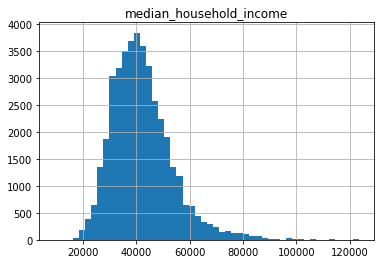

```python
import pandas as pd
import numpy as np
import matplotlib.pyplot as plt
from sklearn.model_selection import train_test_split
from sklearn import svm
import xgboost as xgb
import seaborn as sns
from sklearn import linear_model
from sklearn.linear_model import SGDRegressor
%matplotlib inline
```


```python
#df = pd.read_csv("block-groups.csv")
df = pd.read_csv("counties_US.csv")
df.dropna(axis=0, how='any', inplace=True)
#print(df.iloc[0])
columns = df.columns
renames = {}
for col in columns:
    renames[col] = col.replace('-', '_')
df = df.rename(columns=renames)
df.describe()
```


<div>
<style>
    .dataframe thead tr:only-child th {
        text-align: right;
    }

    .dataframe thead th {
        text-align: left;
    }

    .dataframe tbody tr th {
        vertical-align: top;
    }
</style>
<table border="1" class="dataframe">
  <thead>
    <tr style="text-align: right;">
      <th></th>
      <th>GEOID</th>
      <th>year</th>
      <th>population</th>
      <th>poverty_rate</th>
      <th>pct_renter_occupied</th>
      <th>median_gross_rent</th>
      <th>median_household_income</th>
      <th>median_property_value</th>
      <th>rent_burden</th>
      <th>pct_white</th>
      <th>...</th>
      <th>pct_nh_pi</th>
      <th>pct_multiple</th>
      <th>pct_other</th>
      <th>renter_occupied_households</th>
      <th>eviction_filings</th>
      <th>evictions</th>
      <th>eviction_rate</th>
      <th>eviction_filing_rate</th>
      <th>imputed</th>
      <th>subbed</th>
    </tr>
  </thead>
  <tbody>
    <tr>
      <th>count</th>
      <td>41299.000000</td>
      <td>41299.000000</td>
      <td>4.129900e+04</td>
      <td>41299.000000</td>
      <td>41299.000000</td>
      <td>41299.000000</td>
      <td>41299.000000</td>
      <td>4.129900e+04</td>
      <td>41299.000000</td>
      <td>41299.000000</td>
      <td>...</td>
      <td>41299.000000</td>
      <td>41299.000000</td>
      <td>41299.000000</td>
      <td>4.129900e+04</td>
      <td>41299.000000</td>
      <td>41299.000000</td>
      <td>41299.000000</td>
      <td>41299.000000</td>
      <td>41299.000000</td>
      <td>41299.000000</td>
    </tr>
    <tr>
      <th>mean</th>
      <td>30928.597956</td>
      <td>2008.187753</td>
      <td>9.717697e+04</td>
      <td>12.410998</td>
      <td>26.820699</td>
      <td>592.652970</td>
      <td>42136.557350</td>
      <td>1.164624e+05</td>
      <td>26.821584</td>
      <td>79.966203</td>
      <td>...</td>
      <td>0.063298</td>
      <td>1.431872</td>
      <td>0.087025</td>
      <td>1.301934e+04</td>
      <td>892.026490</td>
      <td>374.336449</td>
      <td>1.678239</td>
      <td>3.201757</td>
      <td>0.014819</td>
      <td>0.015860</td>
    </tr>
    <tr>
      <th>std</th>
      <td>14754.405831</td>
      <td>4.819986</td>
      <td>3.287348e+05</td>
      <td>5.813251</td>
      <td>7.648861</td>
      <td>189.157504</td>
      <td>11524.034138</td>
      <td>7.300267e+04</td>
      <td>4.754268</td>
      <td>18.957256</td>
      <td>...</td>
      <td>0.611061</td>
      <td>1.426454</td>
      <td>0.150616</td>
      <td>5.425438e+04</td>
      <td>4419.432913</td>
      <td>1543.484514</td>
      <td>1.977446</td>
      <td>5.027240</td>
      <td>0.120828</td>
      <td>0.124935</td>
    </tr>
    <tr>
      <th>min</th>
      <td>1001.000000</td>
      <td>2000.000000</td>
      <td>6.700000e+01</td>
      <td>0.000000</td>
      <td>7.350000</td>
      <td>178.000000</td>
      <td>9333.000000</td>
      <td>0.000000e+00</td>
      <td>8.300000</td>
      <td>2.860000</td>
      <td>...</td>
      <td>0.000000</td>
      <td>0.000000</td>
      <td>0.000000</td>
      <td>5.000000e+00</td>
      <td>0.000000</td>
      <td>0.000000</td>
      <td>0.000000</td>
      <td>0.000000</td>
      <td>0.000000</td>
      <td>0.000000</td>
    </tr>
    <tr>
      <th>25%</th>
      <td>19089.000000</td>
      <td>2004.000000</td>
      <td>1.044500e+04</td>
      <td>8.300000</td>
      <td>21.740000</td>
      <td>464.000000</td>
      <td>34202.000000</td>
      <td>7.470000e+04</td>
      <td>23.600000</td>
      <td>69.460000</td>
      <td>...</td>
      <td>0.000000</td>
      <td>0.710000</td>
      <td>0.000000</td>
      <td>9.710000e+02</td>
      <td>5.000000</td>
      <td>3.000000</td>
      <td>0.320000</td>
      <td>0.490000</td>
      <td>0.000000</td>
      <td>0.000000</td>
    </tr>
    <tr>
      <th>50%</th>
      <td>29181.000000</td>
      <td>2008.000000</td>
      <td>2.351300e+04</td>
      <td>11.460000</td>
      <td>25.540000</td>
      <td>571.000000</td>
      <td>40657.000000</td>
      <td>9.640000e+04</td>
      <td>26.800000</td>
      <td>87.330000</td>
      <td>...</td>
      <td>0.010000</td>
      <td>1.130000</td>
      <td>0.040000</td>
      <td>2.315000e+03</td>
      <td>37.000000</td>
      <td>25.000000</td>
      <td>1.110000</td>
      <td>1.630000</td>
      <td>0.000000</td>
      <td>0.000000</td>
    </tr>
    <tr>
      <th>75%</th>
      <td>45086.000000</td>
      <td>2012.000000</td>
      <td>6.268300e+04</td>
      <td>15.315000</td>
      <td>30.430000</td>
      <td>680.000000</td>
      <td>48007.000000</td>
      <td>1.363000e+05</td>
      <td>29.800000</td>
      <td>94.790000</td>
      <td>...</td>
      <td>0.040000</td>
      <td>1.710000</td>
      <td>0.110000</td>
      <td>6.844500e+03</td>
      <td>240.000000</td>
      <td>140.000000</td>
      <td>2.320000</td>
      <td>3.800000</td>
      <td>0.000000</td>
      <td>0.000000</td>
    </tr>
    <tr>
      <th>max</th>
      <td>56045.000000</td>
      <td>2016.000000</td>
      <td>1.003839e+07</td>
      <td>45.380000</td>
      <td>100.000000</td>
      <td>1827.000000</td>
      <td>123453.000000</td>
      <td>1.000001e+06</td>
      <td>50.100000</td>
      <td>100.000000</td>
      <td>...</td>
      <td>48.300000</td>
      <td>23.490000</td>
      <td>4.900000</td>
      <td>1.792186e+06</td>
      <td>143753.000000</td>
      <td>47716.000000</td>
      <td>24.160000</td>
      <td>118.620000</td>
      <td>1.000000</td>
      <td>1.000000</td>
    </tr>
  </tbody>
</table>
<p>8 rows × 24 columns</p>
</div>


```python
#visualization
df.hist(column= 'poverty_rate', bins = 50)
plt.show()
df.hist(column= 'eviction_rate', bins = 50)
df.hist(column = 'median_household_income', bins = 50)
```


    array([[<matplotlib.axes._subplots.AxesSubplot object at 0x0000022600C836D8>]], dtype=object)





```python
df_sampled = df.sample(frac=.01)
```


```python
make_plot(df_sampled)
```


```python
def get_x_y(df, features=['poverty_rate'], label='eviction_rate'):
    #features = ['pct_af_am']
    X = df[features]
    y = df[label]
    #
    #print(X.shape, len(y))
    return X, y
```


```python
def make_plot(df, features=['poverty_rate'], label='eviction_rate'):
    X, y = get_x_y(df, features, label)
    plt.plot(X, y, '.')
```


```python
make_plot(df, ['population'], 'eviction_rate')
```


```python
df.columns
```


    Index(['GEOID', 'year', 'name', 'parent_location', 'population',
           'poverty_rate', 'pct_renter_occupied', 'median_gross_rent',
           'median_household_income', 'median_property_value', 'rent_burden',
           'pct_white', 'pct_af_am', 'pct_hispanic', 'pct_am_ind', 'pct_asian',
           'pct_nh_pi', 'pct_multiple', 'pct_other', 'renter_occupied_households',
           'eviction_filings', 'evictions', 'eviction_rate',
           'eviction_filing_rate', 'imputed', 'subbed'],
          dtype='object')


```python
print(df.iloc[0])
```

    GEOID                                   1001
    year                                    2000
    name                          Autauga County
    parent_location                      Alabama
    population                             43671
    poverty_rate                           10.92
    pct_renter_occupied                    19.21
    median_gross_rent                        537
    median_household_income                42013
    median_property_value                  94800
    rent_burden                             22.6
    pct_white                              79.74
    pct_af_am                              17.01
    pct_hispanic                             1.4
    pct_am_ind                              0.43
    pct_asian                               0.44
    pct_nh_pi                               0.03
    pct_multiple                            0.86
    pct_other                                0.1
    renter_occupied_households              3074
    eviction_filings                          61
    evictions                                 40
    eviction_rate                            1.3
    eviction_filing_rate                    1.98
    imputed                                    0
    subbed                                     0
    Name: 0, dtype: object
    


```python
X, y = get_x_y(df, features=['population', 'pct_renter_occupied', 'median_gross_rent', 'poverty_rate', 'rent_burden','pct_af_am'])

# X, y = get_x_y(df, features=['population',
#        'poverty_rate', 'pct_renter_occupied', 'median_gross_rent',
#        'median_household_income', 'median_property_value', 'rent_burden',
#        'pct_white', 'pct_af_am', 'pct_multiple', 'pct_other', 'renter_occupied_households'])


X, y = get_x_y(df3, features=[ 'year','population',
       'poverty_rate', 'pct_renter_occupied', 'median_gross_rent',
       'median_household_income', 'median_property_value', 'rent_burden',
       'pct_white', 'pct_af_am', 'renter_occupied_households', 'Percent of adults with less than a high school diploma 2012_2016',
       'Percent of adults with a high school diploma only 2012_2016', 'Percent of adults completing some college or associates degree 2012_2016', \
       'Percent of adults with a bachelors degree or higher 2012_2016','Unemployment_rate_2016', 'Med_HH_Income_Percent_of_State_Total_2016','students_total_enrollments' ])

# X, y = get_x_y(df4, features=[ 'year','population',
#        'poverty_rate', 'pct_renter_occupied', 'median_gross_rent',
#        'median_household_income', 'median_property_value', 'rent_burden',
#        'pct_white', 'pct_af_am', 'renter_occupied_households', 'Percent of adults with less than a high school diploma 2012_2016',
#        'Percent of adults with a high school diploma only 2012_2016', 'Percent of adults completing some college or associates degree 2012_2016', \
#        'Percent of adults with a bachelors degree or higher 2012_2016','Unemployment_rate_2016', 'Med_HH_Income_Percent_of_State_Total_2016','students_total_enrollments', 'State short_AL',
#  'State short_AZ',
#  'State short_CA',
#  'State short_CO',
#  'State short_CT',
#  'State short_DE',
#  'State short_FL',
#  'State short_GA',
#  'State short_HI',
#  'State short_IA',
#  'State short_ID',
#  'State short_IL',
#  'State short_IN',
#  'State short_KS',
#  'State short_KY',
#  'State short_LA',
#  'State short_MA',
#  'State short_MD',
#  'State short_ME',
#  'State short_MI',
#  'State short_MN',
#  'State short_MO',
#  'State short_MS',
#  'State short_MT',
#  'State short_NC',
#  'State short_NE',
#  'State short_NH',
#  'State short_NJ',
#  'State short_NM',
#  'State short_NV',
#  'State short_NY',
#  'State short_OH',
#  'State short_OK',
#  'State short_OR',
#  'State short_PA',
#  'State short_RI',
#  'State short_SC',
#  'State short_TN',
#  'State short_TX',
#  'State short_UT',
#  'State short_VA',
#  'State short_VT',
#  'State short_WA',
#  'State short_WI',
#  'State short_WV',
#  'State short_WY'])


X_train, X_test, y_train, y_test = train_test_split(X, y, test_size=0.3, random_state=42)
```


```python
#clf = linear_model.SGDRegressor(max_iter=1000, tol=1e-5)
#clf.fit(X_train, y_train)
#clf.score(X_test, y_test)
```


```python
xgtrain = xgb.DMatrix(X_train.values, y_train.values)
xgtest = xgb.DMatrix(X_test.values, y_test.values)
evallist = [(xgtest, 'eval'), (xgtrain, 'train')]
param = {'silent': 1, 'max_depth': 10, 'eta': 1, 'lambda':10, 'alpha': 10, 'objective': 'reg:linear'}
```


```python
np.mean(y_test)
```


    1.691047872340415


```python
np.mean((y_test-np.mean(y_test))**2)**.5
```


    1.9605448885754657


```python
num_round = 100
bst = xgb.train(param, xgtrain, num_round, evallist)
```

    [0]	eval-rmse:1.23858	train-rmse:1.18015
    [1]	eval-rmse:1.09295	train-rmse:0.988379
    [2]	eval-rmse:1.05601	train-rmse:0.937815
    [3]	eval-rmse:0.972679	train-rmse:0.838154
    [4]	eval-rmse:0.930549	train-rmse:0.780951
    [5]	eval-rmse:0.922622	train-rmse:0.763522
    [6]	eval-rmse:0.892202	train-rmse:0.710054
    [7]	eval-rmse:0.874484	train-rmse:0.683333
    [8]	eval-rmse:0.852448	train-rmse:0.647566
    [9]	eval-rmse:0.833398	train-rmse:0.620927
    [10]	eval-rmse:0.826465	train-rmse:0.605294
    [11]	eval-rmse:0.817119	train-rmse:0.591738
    [12]	eval-rmse:0.809983	train-rmse:0.5793
    [13]	eval-rmse:0.804765	train-rmse:0.567373
    [14]	eval-rmse:0.79841	train-rmse:0.558188
    [15]	eval-rmse:0.792258	train-rmse:0.544387
    [16]	eval-rmse:0.788913	train-rmse:0.536144
    [17]	eval-rmse:0.784057	train-rmse:0.525883
    [18]	eval-rmse:0.779387	train-rmse:0.517531
    [19]	eval-rmse:0.776427	train-rmse:0.508876
    [20]	eval-rmse:0.771349	train-rmse:0.499002
    [21]	eval-rmse:0.769189	train-rmse:0.492671
    [22]	eval-rmse:0.767758	train-rmse:0.485352
    [23]	eval-rmse:0.7654	train-rmse:0.479393
    [24]	eval-rmse:0.764366	train-rmse:0.474628
    [25]	eval-rmse:0.762205	train-rmse:0.46911
    [26]	eval-rmse:0.76157	train-rmse:0.464271
    [27]	eval-rmse:0.759763	train-rmse:0.459957
    [28]	eval-rmse:0.757715	train-rmse:0.455372
    [29]	eval-rmse:0.756713	train-rmse:0.448699
    [30]	eval-rmse:0.755067	train-rmse:0.44451
    [31]	eval-rmse:0.75337	train-rmse:0.439039
    [32]	eval-rmse:0.752232	train-rmse:0.435959
    [33]	eval-rmse:0.751524	train-rmse:0.431144
    [34]	eval-rmse:0.750721	train-rmse:0.42782
    [35]	eval-rmse:0.749609	train-rmse:0.424201
    [36]	eval-rmse:0.748694	train-rmse:0.421762
    [37]	eval-rmse:0.747488	train-rmse:0.418067
    [38]	eval-rmse:0.746219	train-rmse:0.413411
    [39]	eval-rmse:0.745439	train-rmse:0.410178
    [40]	eval-rmse:0.744904	train-rmse:0.40844
    [41]	eval-rmse:0.743333	train-rmse:0.406306
    [42]	eval-rmse:0.743124	train-rmse:0.404133
    [43]	eval-rmse:0.742512	train-rmse:0.402759
    [44]	eval-rmse:0.741468	train-rmse:0.400569
    [45]	eval-rmse:0.741388	train-rmse:0.399326
    [46]	eval-rmse:0.740727	train-rmse:0.396629
    [47]	eval-rmse:0.740141	train-rmse:0.394025
    [48]	eval-rmse:0.73956	train-rmse:0.391821
    [49]	eval-rmse:0.738793	train-rmse:0.38995
    [50]	eval-rmse:0.738225	train-rmse:0.38809
    [51]	eval-rmse:0.737543	train-rmse:0.386413
    [52]	eval-rmse:0.737063	train-rmse:0.384867
    [53]	eval-rmse:0.737043	train-rmse:0.383578
    [54]	eval-rmse:0.737119	train-rmse:0.381645
    [55]	eval-rmse:0.73663	train-rmse:0.380025
    [56]	eval-rmse:0.736011	train-rmse:0.37846
    [57]	eval-rmse:0.735624	train-rmse:0.377511
    [58]	eval-rmse:0.735082	train-rmse:0.375943
    [59]	eval-rmse:0.734961	train-rmse:0.375119
    [60]	eval-rmse:0.734784	train-rmse:0.37414
    [61]	eval-rmse:0.734303	train-rmse:0.372327
    [62]	eval-rmse:0.73375	train-rmse:0.370252
    [63]	eval-rmse:0.733334	train-rmse:0.368603
    [64]	eval-rmse:0.732935	train-rmse:0.366876
    [65]	eval-rmse:0.732768	train-rmse:0.365608
    [66]	eval-rmse:0.732319	train-rmse:0.364234
    [67]	eval-rmse:0.732019	train-rmse:0.363234
    [68]	eval-rmse:0.731889	train-rmse:0.36155
    [69]	eval-rmse:0.731151	train-rmse:0.359438
    [70]	eval-rmse:0.730545	train-rmse:0.358776
    [71]	eval-rmse:0.730245	train-rmse:0.357989
    [72]	eval-rmse:0.729979	train-rmse:0.357027
    [73]	eval-rmse:0.72993	train-rmse:0.356248
    [74]	eval-rmse:0.729248	train-rmse:0.354029
    [75]	eval-rmse:0.728888	train-rmse:0.352813
    [76]	eval-rmse:0.728785	train-rmse:0.352092
    [77]	eval-rmse:0.72836	train-rmse:0.351148
    [78]	eval-rmse:0.72799	train-rmse:0.349113
    [79]	eval-rmse:0.727918	train-rmse:0.347727
    [80]	eval-rmse:0.727655	train-rmse:0.34699
    [81]	eval-rmse:0.727456	train-rmse:0.34621
    [82]	eval-rmse:0.727626	train-rmse:0.345046
    [83]	eval-rmse:0.727451	train-rmse:0.343739
    [84]	eval-rmse:0.727099	train-rmse:0.343228
    [85]	eval-rmse:0.726471	train-rmse:0.342272
    [86]	eval-rmse:0.726281	train-rmse:0.341267
    [87]	eval-rmse:0.726053	train-rmse:0.340728
    [88]	eval-rmse:0.725786	train-rmse:0.340136
    [89]	eval-rmse:0.725701	train-rmse:0.339383
    [90]	eval-rmse:0.725361	train-rmse:0.338371
    [91]	eval-rmse:0.72487	train-rmse:0.337583
    [92]	eval-rmse:0.724933	train-rmse:0.337
    [93]	eval-rmse:0.724982	train-rmse:0.336329
    [94]	eval-rmse:0.724831	train-rmse:0.335333
    [95]	eval-rmse:0.724617	train-rmse:0.334656
    [96]	eval-rmse:0.724213	train-rmse:0.333663
    [97]	eval-rmse:0.72369	train-rmse:0.332918
    [98]	eval-rmse:0.72353	train-rmse:0.332261
    [99]	eval-rmse:0.723449	train-rmse:0.331351
    


```python
num_round = 100
bst = xgb.train(param, xgtrain, num_round, evallist)
```

    [0]	eval-rmse:1.16518	train-rmse:1.11729
    [1]	eval-rmse:1.06783	train-rmse:0.997675
    [2]	eval-rmse:0.991798	train-rmse:0.905045
    [3]	eval-rmse:0.963919	train-rmse:0.872483
    [4]	eval-rmse:0.950015	train-rmse:0.853665
    [5]	eval-rmse:0.929078	train-rmse:0.818836
    [6]	eval-rmse:0.909728	train-rmse:0.786521
    [7]	eval-rmse:0.874631	train-rmse:0.734245
    [8]	eval-rmse:0.861871	train-rmse:0.715257
    [9]	eval-rmse:0.844194	train-rmse:0.683438
    [10]	eval-rmse:0.829301	train-rmse:0.662962
    [11]	eval-rmse:0.813518	train-rmse:0.638058
    [12]	eval-rmse:0.800331	train-rmse:0.614744
    [13]	eval-rmse:0.793462	train-rmse:0.601018
    [14]	eval-rmse:0.786068	train-rmse:0.585447
    [15]	eval-rmse:0.777386	train-rmse:0.572877
    [16]	eval-rmse:0.774489	train-rmse:0.566401
    [17]	eval-rmse:0.768717	train-rmse:0.554148
    [18]	eval-rmse:0.761439	train-rmse:0.540785
    [19]	eval-rmse:0.758459	train-rmse:0.532793
    [20]	eval-rmse:0.753764	train-rmse:0.519911
    [21]	eval-rmse:0.750528	train-rmse:0.511126
    [22]	eval-rmse:0.746296	train-rmse:0.504114
    [23]	eval-rmse:0.742725	train-rmse:0.496824
    [24]	eval-rmse:0.74041	train-rmse:0.490882
    [25]	eval-rmse:0.738139	train-rmse:0.48491
    [26]	eval-rmse:0.735362	train-rmse:0.478813
    [27]	eval-rmse:0.732384	train-rmse:0.47269
    [28]	eval-rmse:0.73012	train-rmse:0.468301
    [29]	eval-rmse:0.729073	train-rmse:0.463549
    [30]	eval-rmse:0.727027	train-rmse:0.459173
    [31]	eval-rmse:0.724453	train-rmse:0.451476
    [32]	eval-rmse:0.722641	train-rmse:0.447869
    [33]	eval-rmse:0.721156	train-rmse:0.443861
    [34]	eval-rmse:0.718742	train-rmse:0.439591
    [35]	eval-rmse:0.71751	train-rmse:0.435455
    [36]	eval-rmse:0.716813	train-rmse:0.432953
    [37]	eval-rmse:0.715532	train-rmse:0.428676
    [38]	eval-rmse:0.714602	train-rmse:0.424697
    [39]	eval-rmse:0.714194	train-rmse:0.420295
    [40]	eval-rmse:0.712917	train-rmse:0.416878
    [41]	eval-rmse:0.712248	train-rmse:0.413905
    [42]	eval-rmse:0.711189	train-rmse:0.410626
    [43]	eval-rmse:0.710239	train-rmse:0.407942
    [44]	eval-rmse:0.709725	train-rmse:0.405436
    [45]	eval-rmse:0.709375	train-rmse:0.403434
    [46]	eval-rmse:0.70815	train-rmse:0.401302
    [47]	eval-rmse:0.706587	train-rmse:0.398281
    [48]	eval-rmse:0.706465	train-rmse:0.395686
    [49]	eval-rmse:0.706005	train-rmse:0.39237
    [50]	eval-rmse:0.705893	train-rmse:0.389971
    [51]	eval-rmse:0.70545	train-rmse:0.387806
    [52]	eval-rmse:0.704989	train-rmse:0.385966
    [53]	eval-rmse:0.704358	train-rmse:0.383683
    [54]	eval-rmse:0.703819	train-rmse:0.381389
    [55]	eval-rmse:0.703515	train-rmse:0.379715
    [56]	eval-rmse:0.702984	train-rmse:0.378011
    [57]	eval-rmse:0.702902	train-rmse:0.376426
    [58]	eval-rmse:0.702317	train-rmse:0.374938
    [59]	eval-rmse:0.701927	train-rmse:0.373192
    [60]	eval-rmse:0.701769	train-rmse:0.371476
    [61]	eval-rmse:0.701343	train-rmse:0.370309
    [62]	eval-rmse:0.701195	train-rmse:0.369022
    [63]	eval-rmse:0.701047	train-rmse:0.368126
    [64]	eval-rmse:0.700529	train-rmse:0.367086
    [65]	eval-rmse:0.699731	train-rmse:0.365655
    [66]	eval-rmse:0.699414	train-rmse:0.363817
    [67]	eval-rmse:0.699162	train-rmse:0.361688
    [68]	eval-rmse:0.698887	train-rmse:0.360538
    [69]	eval-rmse:0.69845	train-rmse:0.359605
    [70]	eval-rmse:0.697806	train-rmse:0.357333
    [71]	eval-rmse:0.697729	train-rmse:0.355777
    [72]	eval-rmse:0.697238	train-rmse:0.354508
    [73]	eval-rmse:0.697011	train-rmse:0.35378
    [74]	eval-rmse:0.696899	train-rmse:0.352836
    [75]	eval-rmse:0.696479	train-rmse:0.350075
    [76]	eval-rmse:0.696346	train-rmse:0.349369
    [77]	eval-rmse:0.696496	train-rmse:0.348029
    [78]	eval-rmse:0.696442	train-rmse:0.346594
    [79]	eval-rmse:0.696229	train-rmse:0.3451
    [80]	eval-rmse:0.695576	train-rmse:0.343703
    [81]	eval-rmse:0.695634	train-rmse:0.342868
    [82]	eval-rmse:0.695651	train-rmse:0.342268
    [83]	eval-rmse:0.695502	train-rmse:0.341522
    [84]	eval-rmse:0.695372	train-rmse:0.340677
    [85]	eval-rmse:0.695103	train-rmse:0.339358
    [86]	eval-rmse:0.694895	train-rmse:0.338297
    [87]	eval-rmse:0.695059	train-rmse:0.337695
    [88]	eval-rmse:0.694972	train-rmse:0.336551
    [89]	eval-rmse:0.694481	train-rmse:0.335506
    [90]	eval-rmse:0.69436	train-rmse:0.335028
    [91]	eval-rmse:0.693834	train-rmse:0.33387
    [92]	eval-rmse:0.693741	train-rmse:0.333237
    [93]	eval-rmse:0.693469	train-rmse:0.33195
    [94]	eval-rmse:0.693156	train-rmse:0.330905
    [95]	eval-rmse:0.692843	train-rmse:0.330043
    [96]	eval-rmse:0.692705	train-rmse:0.329091
    [97]	eval-rmse:0.692568	train-rmse:0.32861
    [98]	eval-rmse:0.692383	train-rmse:0.328122
    [99]	eval-rmse:0.692407	train-rmse:0.327509
    


```python
plt.subplot(1,2,1)
preds = bst.predict(xgtest)

plt.plot(preds, (preds-y_test), '.')
plt.subplot(1,2,2)
plt.plot(preds, y_test, '.')
```


    [<matplotlib.lines.Line2D at 0x226019d0860>]


```python
make_plot(df.sample(frac=1), features=['median_gross_rent'])
```


```python
import chardet
with open('CollegeCity.csv', 'rb') as f:
    result = chardet.detect(f.read())  # or readline if the file is large
print(result['encoding'])
```

    ISO-8859-1
    


```python
us_state_abbrev = {
    'Alabama': 'AL',
    'Alaska': 'AK',
    'Arizona': 'AZ',
    'Arkansas': 'AR',
    'California': 'CA',
    'Colorado': 'CO',
    'Connecticut': 'CT',
    'Delaware': 'DE',
    'Florida': 'FL',
    'Georgia': 'GA',
    'Hawaii': 'HI',
    'Idaho': 'ID',
    'Illinois': 'IL',
    'Indiana': 'IN',
    'Iowa': 'IA',
    'Kansas': 'KS',
    'Kentucky': 'KY',
    'Louisiana': 'LA',
    'Maine': 'ME',
    'Maryland': 'MD',
    'Massachusetts': 'MA',
    'Michigan': 'MI',
    'Minnesota': 'MN',
    'Mississippi': 'MS',
    'Missouri': 'MO',
    'Montana': 'MT',
    'Nebraska': 'NE',
    'Nevada': 'NV',
    'New Hampshire': 'NH',
    'New Jersey': 'NJ',
    'New Mexico': 'NM',
    'New York': 'NY',
    'North Carolina': 'NC',
    'North Dakota': 'ND',
    'Ohio': 'OH',
    'Oklahoma': 'OK',
    'Oregon': 'OR',
    'Pennsylvania': 'PA',
    'Rhode Island': 'RI',
    'South Carolina': 'SC',
    'South Dakota': 'SD',
    'Tennessee': 'TN',
    'Texas': 'TX',
    'Utah': 'UT',
    'Vermont': 'VT',
    'Virginia': 'VA',
    'Washington': 'WA',
    'West Virginia': 'WV',
    'Wisconsin': 'WI',
    'Wyoming': 'WY',
}
df['State short'] = df['parent_location'].map(us_state_abbrev)
```


```python
dfCollege0 = pd.read_csv('CollegeCity.csv', encoding='ISO-8859-1')
dfCollege0.drop_duplicates(subset=['UNITID'], inplace = True)
dfCollegEnroll = pd.read_csv('Enrollment.csv')
dfCollegeEnroll.drop_duplicates(subset=['UNITID'], inplace = True)
dfCollege = pd.merge(dfCollege0, dfCollegeEnroll, how = 'left', on = ['UNITID'])
dfCollege.loc[dfCollege['UNITID']==210605]
```


<div>
<style>
    .dataframe thead tr:only-child th {
        text-align: right;
    }

    .dataframe thead th {
        text-align: left;
    }

    .dataframe tbody tr th {
        vertical-align: top;
    }
</style>
<table border="1" class="dataframe">
  <thead>
    <tr style="text-align: right;">
      <th></th>
      <th>UNITID</th>
      <th>INSTNM</th>
      <th>City</th>
      <th>State short</th>
      <th>ZIP</th>
      <th>REGION</th>
      <th>LOCALE</th>
      <th>LATITUDE</th>
      <th>LONGITUDE</th>
      <th>ADM_RATE</th>
      <th>ADM_RATE_ALL</th>
      <th>EFFYLEV</th>
      <th>LSTUDY</th>
      <th>XEYTOTLT</th>
      <th>EFYTOTLT</th>
      <th>XEYTOTLM</th>
      <th>EFYTOTLM</th>
      <th>XEYTOTLW</th>
      <th>EFYTOTLW</th>
    </tr>
  </thead>
  <tbody>
    <tr>
      <th>3076</th>
      <td>210605</td>
      <td>Community College of Allegheny County</td>
      <td>Pittsburgh</td>
      <td>PA</td>
      <td>15233-1895</td>
      <td>2</td>
      <td>11.0</td>
      <td>40.450632</td>
      <td>-80.01855</td>
      <td>NaN</td>
      <td>NaN</td>
      <td>1.0</td>
      <td>999.0</td>
      <td>R</td>
      <td>26778.0</td>
      <td>R</td>
      <td>11794.0</td>
      <td>R</td>
      <td>14984.0</td>
    </tr>
  </tbody>
</table>
</div>


```python
dfCounty = pd.read_csv('CityCounty.csv')
dfCounty.drop('City alias', axis = 1,inplace = True)
dfCollegeCounty = pd.merge(dfCollege, dfCounty, how='left', on=['City', 'State short'])
#dfCollegeCounty.drop('City', axis = 1,inplace = True)
dfCollegeCounty.drop_duplicates(subset=['UNITID'], inplace = True)
dfCollegeCount = dfCollegeCounty.groupby(['County','State short'])['EFYTOTLT'].agg(['count','sum']).reset_index()
dfCollegeCount.rename(index=str, columns={"count": "number_of_colleges", "sum": "students_total_enrollments"}, inplace = True)
```


```python
#dfCounty.loc[dfCounty['County'] =='ADAMS']
```


```python
#fCollegeCounty.loc[dfCollegeCounty['County'] =='ADAMS']
```


```python
dfCollegeCount
```


<div>
<style>
    .dataframe thead tr:only-child th {
        text-align: right;
    }

    .dataframe thead th {
        text-align: left;
    }

    .dataframe tbody tr th {
        vertical-align: top;
    }
</style>
<table border="1" class="dataframe">
  <thead>
    <tr style="text-align: right;">
      <th></th>
      <th>County</th>
      <th>State short</th>
      <th>number_of_colleges</th>
      <th>students_total_enrollments</th>
    </tr>
  </thead>
  <tbody>
    <tr>
      <th>0</th>
      <td>ABBEVILLE</td>
      <td>SC</td>
      <td>1</td>
      <td>887.0</td>
    </tr>
    <tr>
      <th>1</th>
      <td>ACCOMACK</td>
      <td>VA</td>
      <td>1</td>
      <td>987.0</td>
    </tr>
    <tr>
      <th>2</th>
      <td>ADA</td>
      <td>ID</td>
      <td>12</td>
      <td>31698.0</td>
    </tr>
    <tr>
      <th>3</th>
      <td>ADAIR</td>
      <td>KY</td>
      <td>1</td>
      <td>3028.0</td>
    </tr>
    <tr>
      <th>4</th>
      <td>ADAIR</td>
      <td>MO</td>
      <td>4</td>
      <td>10700.0</td>
    </tr>
    <tr>
      <th>5</th>
      <td>ADAIR</td>
      <td>OK</td>
      <td>1</td>
      <td>194.0</td>
    </tr>
    <tr>
      <th>6</th>
      <td>ADAMS</td>
      <td>CO</td>
      <td>5</td>
      <td>31875.0</td>
    </tr>
    <tr>
      <th>7</th>
      <td>ADAMS</td>
      <td>IL</td>
      <td>7</td>
      <td>5468.0</td>
    </tr>
    <tr>
      <th>8</th>
      <td>ADAMS</td>
      <td>MS</td>
      <td>0</td>
      <td>NaN</td>
    </tr>
    <tr>
      <th>9</th>
      <td>ADAMS</td>
      <td>NE</td>
      <td>1</td>
      <td>1385.0</td>
    </tr>
    <tr>
      <th>10</th>
      <td>ADAMS</td>
      <td>PA</td>
      <td>2</td>
      <td>2803.0</td>
    </tr>
    <tr>
      <th>11</th>
      <td>ADDISON</td>
      <td>VT</td>
      <td>1</td>
      <td>4749.0</td>
    </tr>
    <tr>
      <th>12</th>
      <td>AGUADA</td>
      <td>PR</td>
      <td>3</td>
      <td>231.0</td>
    </tr>
    <tr>
      <th>13</th>
      <td>AGUADILLA</td>
      <td>PR</td>
      <td>6</td>
      <td>7323.0</td>
    </tr>
    <tr>
      <th>14</th>
      <td>AIKEN</td>
      <td>SC</td>
      <td>4</td>
      <td>7978.0</td>
    </tr>
    <tr>
      <th>15</th>
      <td>ALACHUA</td>
      <td>FL</td>
      <td>9</td>
      <td>80737.0</td>
    </tr>
    <tr>
      <th>16</th>
      <td>ALAMANCE</td>
      <td>NC</td>
      <td>3</td>
      <td>13587.0</td>
    </tr>
    <tr>
      <th>17</th>
      <td>ALAMEDA</td>
      <td>CA</td>
      <td>38</td>
      <td>177369.0</td>
    </tr>
    <tr>
      <th>18</th>
      <td>ALAMOSA</td>
      <td>CO</td>
      <td>1</td>
      <td>4336.0</td>
    </tr>
    <tr>
      <th>19</th>
      <td>ALBANY</td>
      <td>NY</td>
      <td>18</td>
      <td>86932.0</td>
    </tr>
    <tr>
      <th>20</th>
      <td>ALBANY</td>
      <td>WY</td>
      <td>2</td>
      <td>15056.0</td>
    </tr>
    <tr>
      <th>21</th>
      <td>ALBEMARLE</td>
      <td>VA</td>
      <td>3</td>
      <td>35269.0</td>
    </tr>
    <tr>
      <th>22</th>
      <td>ALCORN</td>
      <td>MS</td>
      <td>1</td>
      <td>194.0</td>
    </tr>
    <tr>
      <th>23</th>
      <td>ALEXANDRIA CITY</td>
      <td>VA</td>
      <td>3</td>
      <td>811.0</td>
    </tr>
    <tr>
      <th>24</th>
      <td>ALLEGAN</td>
      <td>MI</td>
      <td>1</td>
      <td>524.0</td>
    </tr>
    <tr>
      <th>25</th>
      <td>ALLEGANY</td>
      <td>MD</td>
      <td>2</td>
      <td>10292.0</td>
    </tr>
    <tr>
      <th>26</th>
      <td>ALLEGANY</td>
      <td>NY</td>
      <td>3</td>
      <td>7932.0</td>
    </tr>
    <tr>
      <th>27</th>
      <td>ALLEGHANY</td>
      <td>VA</td>
      <td>1</td>
      <td>1806.0</td>
    </tr>
    <tr>
      <th>28</th>
      <td>ALLEGHENY</td>
      <td>PA</td>
      <td>40</td>
      <td>118708.0</td>
    </tr>
    <tr>
      <th>29</th>
      <td>ALLEN</td>
      <td>IN</td>
      <td>10</td>
      <td>30462.0</td>
    </tr>
    <tr>
      <th>...</th>
      <td>...</td>
      <td>...</td>
      <td>...</td>
      <td>...</td>
    </tr>
    <tr>
      <th>1449</th>
      <td>WINNESHIEK</td>
      <td>IA</td>
      <td>2</td>
      <td>8986.0</td>
    </tr>
    <tr>
      <th>1450</th>
      <td>WINONA</td>
      <td>MN</td>
      <td>3</td>
      <td>20272.0</td>
    </tr>
    <tr>
      <th>1451</th>
      <td>WISE</td>
      <td>VA</td>
      <td>2</td>
      <td>7097.0</td>
    </tr>
    <tr>
      <th>1452</th>
      <td>WOOD</td>
      <td>OH</td>
      <td>5</td>
      <td>37116.0</td>
    </tr>
    <tr>
      <th>1453</th>
      <td>WOOD</td>
      <td>TX</td>
      <td>2</td>
      <td>1214.0</td>
    </tr>
    <tr>
      <th>1454</th>
      <td>WOOD</td>
      <td>WI</td>
      <td>1</td>
      <td>4649.0</td>
    </tr>
    <tr>
      <th>1455</th>
      <td>WOOD</td>
      <td>WV</td>
      <td>5</td>
      <td>4334.0</td>
    </tr>
    <tr>
      <th>1456</th>
      <td>WOODBURY</td>
      <td>IA</td>
      <td>5</td>
      <td>13550.0</td>
    </tr>
    <tr>
      <th>1457</th>
      <td>WOODFORD</td>
      <td>IL</td>
      <td>1</td>
      <td>707.0</td>
    </tr>
    <tr>
      <th>1458</th>
      <td>WOODFORD</td>
      <td>KY</td>
      <td>1</td>
      <td>1350.0</td>
    </tr>
    <tr>
      <th>1459</th>
      <td>WOODS</td>
      <td>OK</td>
      <td>2</td>
      <td>2701.0</td>
    </tr>
    <tr>
      <th>1460</th>
      <td>WOODWARD</td>
      <td>OK</td>
      <td>2</td>
      <td>372.0</td>
    </tr>
    <tr>
      <th>1461</th>
      <td>WORCESTER</td>
      <td>MA</td>
      <td>20</td>
      <td>62634.0</td>
    </tr>
    <tr>
      <th>1462</th>
      <td>WYANDOTTE</td>
      <td>KS</td>
      <td>2</td>
      <td>8942.0</td>
    </tr>
    <tr>
      <th>1463</th>
      <td>WYTHE</td>
      <td>VA</td>
      <td>1</td>
      <td>3916.0</td>
    </tr>
    <tr>
      <th>1464</th>
      <td>YAKIMA</td>
      <td>WA</td>
      <td>6</td>
      <td>9089.0</td>
    </tr>
    <tr>
      <th>1465</th>
      <td>YAMHILL</td>
      <td>OR</td>
      <td>1</td>
      <td>4663.0</td>
    </tr>
    <tr>
      <th>1466</th>
      <td>YANKTON</td>
      <td>SD</td>
      <td>2</td>
      <td>1739.0</td>
    </tr>
    <tr>
      <th>1467</th>
      <td>YATES</td>
      <td>NY</td>
      <td>1</td>
      <td>2358.0</td>
    </tr>
    <tr>
      <th>1468</th>
      <td>YAUCO</td>
      <td>PR</td>
      <td>1</td>
      <td>474.0</td>
    </tr>
    <tr>
      <th>1469</th>
      <td>YAVAPAI</td>
      <td>AZ</td>
      <td>3</td>
      <td>13597.0</td>
    </tr>
    <tr>
      <th>1470</th>
      <td>YELLOW MEDICINE</td>
      <td>MN</td>
      <td>1</td>
      <td>4707.0</td>
    </tr>
    <tr>
      <th>1471</th>
      <td>YELLOWSTONE</td>
      <td>MT</td>
      <td>3</td>
      <td>6860.0</td>
    </tr>
    <tr>
      <th>1472</th>
      <td>YOLO</td>
      <td>CA</td>
      <td>3</td>
      <td>42159.0</td>
    </tr>
    <tr>
      <th>1473</th>
      <td>YORK</td>
      <td>ME</td>
      <td>3</td>
      <td>14793.0</td>
    </tr>
    <tr>
      <th>1474</th>
      <td>YORK</td>
      <td>NE</td>
      <td>1</td>
      <td>462.0</td>
    </tr>
    <tr>
      <th>1475</th>
      <td>YORK</td>
      <td>PA</td>
      <td>9</td>
      <td>10584.0</td>
    </tr>
    <tr>
      <th>1476</th>
      <td>YORK</td>
      <td>SC</td>
      <td>4</td>
      <td>13878.0</td>
    </tr>
    <tr>
      <th>1477</th>
      <td>YUBA</td>
      <td>CA</td>
      <td>1</td>
      <td>10244.0</td>
    </tr>
    <tr>
      <th>1478</th>
      <td>YUMA</td>
      <td>AZ</td>
      <td>1</td>
      <td>11766.0</td>
    </tr>
  </tbody>
</table>
<p>1479 rows × 4 columns</p>
</div>


```python
dfCounty.iloc[0]
```


    City           Holtsville
    State short            NY
    State full       New York
    County            SUFFOLK
    Name: 0, dtype: object


```python
df['County'], df['type'] = df['name'].str.split(' ', 1).str
df['County'] = df['County'].str.upper()
df.iloc[0]
```


    GEOID                                   1001
    year                                    2000
    name                          Autauga County
    parent_location                      Alabama
    population                             43671
    poverty_rate                           10.92
    pct_renter_occupied                    19.21
    median_gross_rent                        537
    median_household_income                42013
    median_property_value                  94800
    rent_burden                             22.6
    pct_white                              79.74
    pct_af_am                              17.01
    pct_hispanic                             1.4
    pct_am_ind                              0.43
    pct_asian                               0.44
    pct_nh_pi                               0.03
    pct_multiple                            0.86
    pct_other                                0.1
    renter_occupied_households              3074
    eviction_filings                          61
    evictions                                 40
    eviction_rate                            1.3
    eviction_filing_rate                    1.98
    imputed                                    0
    subbed                                     0
    State short                               AL
    County                               AUTAUGA
    type                                  County
    Name: 0, dtype: object


```python
df_withCollege = pd.merge(df, dfCollegeCount, how = 'left', on =['County', 'State short'])
```


```python
df.columns
```


    Index(['GEOID', 'year', 'name', 'parent_location', 'population',
           'poverty_rate', 'pct_renter_occupied', 'median_gross_rent',
           'median_household_income', 'median_property_value', 'rent_burden',
           'pct_white', 'pct_af_am', 'pct_hispanic', 'pct_am_ind', 'pct_asian',
           'pct_nh_pi', 'pct_multiple', 'pct_other', 'renter_occupied_households',
           'eviction_filings', 'evictions', 'eviction_rate',
           'eviction_filing_rate', 'imputed', 'subbed', 'State short', 'County',
           'type'],
          dtype='object')


```python
###df_withCollege['has_college'] = 1 - df_withCollege.INSTNM.isnull()
df_withCollege.columns
```


    Index(['GEOID', 'year', 'name', 'parent_location', 'population',
           'poverty_rate', 'pct_renter_occupied', 'median_gross_rent',
           'median_household_income', 'median_property_value', 'rent_burden',
           'pct_white', 'pct_af_am', 'pct_hispanic', 'pct_am_ind', 'pct_asian',
           'pct_nh_pi', 'pct_multiple', 'pct_other', 'renter_occupied_households',
           'eviction_filings', 'evictions', 'eviction_rate',
           'eviction_filing_rate', 'imputed', 'subbed', 'State short', 'County',
           'type', 'number_of_colleges', 'students_total_enrollments'],
          dtype='object')


```python
plt.plot(df_withCollege['students_total_enrollments'], df_withCollege['eviction_rate'],'.')
plt.xlim([0,150000])
```


    (0, 150000)


```python
dfEducation = pd.read_excel('Education.xls')
dfUnemployment = pd.read_excel('Unemployment.xls')
#dfEducation.head()
```


```python
dfEducation.columns = dfEducation.columns.str.replace("-", "_")
dfEducation.columns = dfEducation.columns.str.replace("'", "")
dfEducation.columns = dfEducation.columns.str.replace(",", "")
dfEducation['County'], dfEducation['AreaType'] = dfEducation['Area name'].str.split(' ', 1).str
dfEducation['County'] = dfEducation['County'].str.upper()

dfEducation.columns
dfEducation.head()
```


<div>
<style>
    .dataframe thead tr:only-child th {
        text-align: right;
    }

    .dataframe thead th {
        text-align: left;
    }

    .dataframe tbody tr th {
        vertical-align: top;
    }
</style>
<table border="1" class="dataframe">
  <thead>
    <tr style="text-align: right;">
      <th></th>
      <th>FIPS Code</th>
      <th>State</th>
      <th>Area name</th>
      <th>2003 Rural_urban Continuum Code</th>
      <th>2003 Urban Influence Code</th>
      <th>2013 Rural_urban Continuum Code</th>
      <th>2013 Urban Influence Code</th>
      <th>Less than a high school diploma 1970</th>
      <th>High school diploma only 1970</th>
      <th>Some college (1_3 years) 1970</th>
      <th>...</th>
      <th>Less than a high school diploma 2012_2016</th>
      <th>High school diploma only 2012_2016</th>
      <th>Some college or associates degree 2012_2016</th>
      <th>Bachelors degree or higher 2012_2016</th>
      <th>Percent of adults with less than a high school diploma 2012_2016</th>
      <th>Percent of adults with a high school diploma only 2012_2016</th>
      <th>Percent of adults completing some college or associates degree 2012_2016</th>
      <th>Percent of adults with a bachelors degree or higher 2012_2016</th>
      <th>County</th>
      <th>AreaType</th>
    </tr>
  </thead>
  <tbody>
    <tr>
      <th>0</th>
      <td>0</td>
      <td>US</td>
      <td>United States</td>
      <td>NaN</td>
      <td>NaN</td>
      <td>NaN</td>
      <td>NaN</td>
      <td>52373312.0</td>
      <td>34158051.0</td>
      <td>11650730.0</td>
      <td>...</td>
      <td>27818380.0</td>
      <td>58820411.0</td>
      <td>62242569.0</td>
      <td>64767787.0</td>
      <td>13.021</td>
      <td>27.531</td>
      <td>29.133</td>
      <td>30.315</td>
      <td>UNITED</td>
      <td>States</td>
    </tr>
    <tr>
      <th>1</th>
      <td>1000</td>
      <td>AL</td>
      <td>Alabama</td>
      <td>NaN</td>
      <td>NaN</td>
      <td>NaN</td>
      <td>NaN</td>
      <td>1062306.0</td>
      <td>468269.0</td>
      <td>136287.0</td>
      <td>...</td>
      <td>496036.0</td>
      <td>1009593.0</td>
      <td>972703.0</td>
      <td>783076.0</td>
      <td>15.209</td>
      <td>30.956</td>
      <td>29.825</td>
      <td>24.010</td>
      <td>ALABAMA</td>
      <td>NaN</td>
    </tr>
    <tr>
      <th>2</th>
      <td>1001</td>
      <td>AL</td>
      <td>Autauga County</td>
      <td>2.0</td>
      <td>2.0</td>
      <td>2.0</td>
      <td>2.0</td>
      <td>6611.0</td>
      <td>3757.0</td>
      <td>933.0</td>
      <td>...</td>
      <td>4528.0</td>
      <td>12519.0</td>
      <td>10451.0</td>
      <td>8968.0</td>
      <td>12.417</td>
      <td>34.331</td>
      <td>28.660</td>
      <td>24.593</td>
      <td>AUTAUGA</td>
      <td>County</td>
    </tr>
    <tr>
      <th>3</th>
      <td>1003</td>
      <td>AL</td>
      <td>Baldwin County</td>
      <td>4.0</td>
      <td>5.0</td>
      <td>3.0</td>
      <td>2.0</td>
      <td>18726.0</td>
      <td>8426.0</td>
      <td>2334.0</td>
      <td>...</td>
      <td>13956.0</td>
      <td>40154.0</td>
      <td>44486.0</td>
      <td>41350.0</td>
      <td>9.972</td>
      <td>28.692</td>
      <td>31.788</td>
      <td>29.547</td>
      <td>BALDWIN</td>
      <td>County</td>
    </tr>
    <tr>
      <th>4</th>
      <td>1005</td>
      <td>AL</td>
      <td>Barbour County</td>
      <td>6.0</td>
      <td>6.0</td>
      <td>6.0</td>
      <td>6.0</td>
      <td>8120.0</td>
      <td>2242.0</td>
      <td>581.0</td>
      <td>...</td>
      <td>4824.0</td>
      <td>6422.0</td>
      <td>4775.0</td>
      <td>2366.0</td>
      <td>26.236</td>
      <td>34.927</td>
      <td>25.969</td>
      <td>12.868</td>
      <td>BARBOUR</td>
      <td>County</td>
    </tr>
  </tbody>
</table>
<p>5 rows × 49 columns</p>
</div>


```python
dfEducation.shape
```


    (3283, 49)


```python
dfUnemployment['County'], dfUnemployment['AreaType'] = dfUnemployment['Area_name'].str.split(' ', 1).str
dfUnemployment['County'] = dfUnemployment['County'].str.upper()

dfUnemployment.head()

```


<div>
<style>
    .dataframe thead tr:only-child th {
        text-align: right;
    }

    .dataframe thead th {
        text-align: left;
    }

    .dataframe tbody tr th {
        vertical-align: top;
    }
</style>
<table border="1" class="dataframe">
  <thead>
    <tr style="text-align: right;">
      <th></th>
      <th>FIPStxt</th>
      <th>State</th>
      <th>Area_name</th>
      <th>Rural_urban_continuum_code_2013</th>
      <th>Urban_influence_code_2013</th>
      <th>Metro_2013</th>
      <th>Civilian_labor_force_2007</th>
      <th>Employed_2007</th>
      <th>Unemployed_2007</th>
      <th>Unemployment_rate_2007</th>
      <th>...</th>
      <th>Unemployed_2015</th>
      <th>Unemployment_rate_2015</th>
      <th>Civilian_labor_force_2016</th>
      <th>Employed_2016</th>
      <th>Unemployed_2016</th>
      <th>Unemployment_rate_2016</th>
      <th>Median_Household_Income_2016</th>
      <th>Med_HH_Income_Percent_of_State_Total_2016</th>
      <th>County</th>
      <th>AreaType</th>
    </tr>
  </thead>
  <tbody>
    <tr>
      <th>0</th>
      <td>1000</td>
      <td>AL</td>
      <td>Alabama</td>
      <td>NaN</td>
      <td>NaN</td>
      <td>NaN</td>
      <td>2175612.0</td>
      <td>2089127.0</td>
      <td>86485.0</td>
      <td>4.0</td>
      <td>...</td>
      <td>131614.0</td>
      <td>6.1</td>
      <td>2168608.0</td>
      <td>2038775.0</td>
      <td>129833.0</td>
      <td>6.0</td>
      <td>46309.0</td>
      <td>100.0</td>
      <td>ALABAMA</td>
      <td>NaN</td>
    </tr>
    <tr>
      <th>1</th>
      <td>1001</td>
      <td>AL</td>
      <td>Autauga County, AL</td>
      <td>2.0</td>
      <td>2.0</td>
      <td>1.0</td>
      <td>24383.0</td>
      <td>23577.0</td>
      <td>806.0</td>
      <td>3.3</td>
      <td>...</td>
      <td>1332.0</td>
      <td>5.3</td>
      <td>25649.0</td>
      <td>24297.0</td>
      <td>1352.0</td>
      <td>5.3</td>
      <td>54487.0</td>
      <td>117.7</td>
      <td>AUTAUGA</td>
      <td>County, AL</td>
    </tr>
    <tr>
      <th>2</th>
      <td>1003</td>
      <td>AL</td>
      <td>Baldwin County, AL</td>
      <td>3.0</td>
      <td>2.0</td>
      <td>1.0</td>
      <td>82659.0</td>
      <td>80099.0</td>
      <td>2560.0</td>
      <td>3.1</td>
      <td>...</td>
      <td>4874.0</td>
      <td>5.6</td>
      <td>89931.0</td>
      <td>85061.0</td>
      <td>4870.0</td>
      <td>5.4</td>
      <td>56460.0</td>
      <td>121.9</td>
      <td>BALDWIN</td>
      <td>County, AL</td>
    </tr>
    <tr>
      <th>3</th>
      <td>1005</td>
      <td>AL</td>
      <td>Barbour County, AL</td>
      <td>6.0</td>
      <td>6.0</td>
      <td>0.0</td>
      <td>10334.0</td>
      <td>9684.0</td>
      <td>650.0</td>
      <td>6.3</td>
      <td>...</td>
      <td>765.0</td>
      <td>8.8</td>
      <td>8302.0</td>
      <td>7584.0</td>
      <td>718.0</td>
      <td>8.6</td>
      <td>32884.0</td>
      <td>71.0</td>
      <td>BARBOUR</td>
      <td>County, AL</td>
    </tr>
    <tr>
      <th>4</th>
      <td>1007</td>
      <td>AL</td>
      <td>Bibb County, AL</td>
      <td>1.0</td>
      <td>1.0</td>
      <td>1.0</td>
      <td>8791.0</td>
      <td>8432.0</td>
      <td>359.0</td>
      <td>4.1</td>
      <td>...</td>
      <td>569.0</td>
      <td>6.7</td>
      <td>8573.0</td>
      <td>8004.0</td>
      <td>569.0</td>
      <td>6.6</td>
      <td>43079.0</td>
      <td>93.0</td>
      <td>BIBB</td>
      <td>County, AL</td>
    </tr>
  </tbody>
</table>
<p>5 rows × 50 columns</p>
</div>


```python
df2 = pd.merge(df_withCollege, dfEducation[['State','County','Less than a high school diploma 2012_2016',
       'High school diploma only 2012_2016',
       'Some college or associates degree 2012_2016',
       'Bachelors degree or higher 2012_2016',
       'Percent of adults with less than a high school diploma 2012_2016',
       'Percent of adults with a high school diploma only 2012_2016',
       'Percent of adults completing some college or associates degree 2012_2016',
       'Percent of adults with a bachelors degree or higher 2012_2016']], \
               how = 'left', left_on =['County', 'State short'], right_on = ['County', 'State'])
df2.head()
```


<div>
<style>
    .dataframe thead tr:only-child th {
        text-align: right;
    }

    .dataframe thead th {
        text-align: left;
    }

    .dataframe tbody tr th {
        vertical-align: top;
    }
</style>
<table border="1" class="dataframe">
  <thead>
    <tr style="text-align: right;">
      <th></th>
      <th>GEOID</th>
      <th>year</th>
      <th>name</th>
      <th>parent_location</th>
      <th>population</th>
      <th>poverty_rate</th>
      <th>pct_renter_occupied</th>
      <th>median_gross_rent</th>
      <th>median_household_income</th>
      <th>median_property_value</th>
      <th>...</th>
      <th>students_total_enrollments</th>
      <th>State</th>
      <th>Less than a high school diploma 2012_2016</th>
      <th>High school diploma only 2012_2016</th>
      <th>Some college or associates degree 2012_2016</th>
      <th>Bachelors degree or higher 2012_2016</th>
      <th>Percent of adults with less than a high school diploma 2012_2016</th>
      <th>Percent of adults with a high school diploma only 2012_2016</th>
      <th>Percent of adults completing some college or associates degree 2012_2016</th>
      <th>Percent of adults with a bachelors degree or higher 2012_2016</th>
    </tr>
  </thead>
  <tbody>
    <tr>
      <th>0</th>
      <td>1001</td>
      <td>2000</td>
      <td>Autauga County</td>
      <td>Alabama</td>
      <td>43671.0</td>
      <td>10.92</td>
      <td>19.21</td>
      <td>537.0</td>
      <td>42013.0</td>
      <td>94800.0</td>
      <td>...</td>
      <td>NaN</td>
      <td>AL</td>
      <td>4528.0</td>
      <td>12519.0</td>
      <td>10451.0</td>
      <td>8968.0</td>
      <td>12.417</td>
      <td>34.331</td>
      <td>28.660</td>
      <td>24.593</td>
    </tr>
    <tr>
      <th>1</th>
      <td>1003</td>
      <td>2000</td>
      <td>Baldwin County</td>
      <td>Alabama</td>
      <td>140415.0</td>
      <td>10.15</td>
      <td>20.46</td>
      <td>566.0</td>
      <td>40250.0</td>
      <td>122500.0</td>
      <td>...</td>
      <td>43644.0</td>
      <td>AL</td>
      <td>13956.0</td>
      <td>40154.0</td>
      <td>44486.0</td>
      <td>41350.0</td>
      <td>9.972</td>
      <td>28.692</td>
      <td>31.788</td>
      <td>29.547</td>
    </tr>
    <tr>
      <th>2</th>
      <td>1005</td>
      <td>2000</td>
      <td>Barbour County</td>
      <td>Alabama</td>
      <td>29038.0</td>
      <td>26.80</td>
      <td>26.87</td>
      <td>333.0</td>
      <td>25101.0</td>
      <td>68600.0</td>
      <td>...</td>
      <td>NaN</td>
      <td>AL</td>
      <td>4824.0</td>
      <td>6422.0</td>
      <td>4775.0</td>
      <td>2366.0</td>
      <td>26.236</td>
      <td>34.927</td>
      <td>25.969</td>
      <td>12.868</td>
    </tr>
    <tr>
      <th>3</th>
      <td>1007</td>
      <td>2000</td>
      <td>Bibb County</td>
      <td>Alabama</td>
      <td>20826.0</td>
      <td>20.61</td>
      <td>19.81</td>
      <td>348.0</td>
      <td>31420.0</td>
      <td>74600.0</td>
      <td>...</td>
      <td>NaN</td>
      <td>AL</td>
      <td>3040.0</td>
      <td>6586.0</td>
      <td>4234.0</td>
      <td>1890.0</td>
      <td>19.302</td>
      <td>41.816</td>
      <td>26.883</td>
      <td>12.000</td>
    </tr>
    <tr>
      <th>4</th>
      <td>1011</td>
      <td>2000</td>
      <td>Bullock County</td>
      <td>Alabama</td>
      <td>11714.0</td>
      <td>33.48</td>
      <td>25.51</td>
      <td>324.0</td>
      <td>20605.0</td>
      <td>56600.0</td>
      <td>...</td>
      <td>NaN</td>
      <td>AL</td>
      <td>2452.0</td>
      <td>2504.0</td>
      <td>1625.0</td>
      <td>752.0</td>
      <td>33.438</td>
      <td>34.147</td>
      <td>22.160</td>
      <td>10.255</td>
    </tr>
  </tbody>
</table>
<p>5 rows × 40 columns</p>
</div>


```python
df3 = pd.merge(df2, dfUnemployment[['Unemployment_rate_2016', 'Med_HH_Income_Percent_of_State_Total_2016', 'County', 'State']], \
               how = 'left', left_on =['County', 'State short'], right_on = ['County', 'State'])
```


```python
df3.size
df3['Unemployment_rate_2016'].isnull().sum()
df3.drop(['name', 'parent_location','type','State_x','State_y'], axis = 1, inplace = True)
```


    ---------------------------------------------------------------------------

    ValueError                                Traceback (most recent call last)

    <ipython-input-333-802106fdc76d> in <module>()
          1 df3.size
          2 df3['Unemployment_rate_2016'].isnull().sum()
    ----> 3 df3.drop(['name', 'parent_location','type','State_x','State_y'], axis = 1, inplace = True)
    

    ~\Anaconda3\lib\site-packages\pandas\core\generic.py in drop(self, labels, axis, level, inplace, errors)
       2159                 new_axis = axis.drop(labels, level=level, errors=errors)
       2160             else:
    -> 2161                 new_axis = axis.drop(labels, errors=errors)
       2162             dropped = self.reindex(**{axis_name: new_axis})
       2163             try:
    

    ~\Anaconda3\lib\site-packages\pandas\core\indexes\base.py in drop(self, labels, errors)
       3622             if errors != 'ignore':
       3623                 raise ValueError('labels %s not contained in axis' %
    -> 3624                                  labels[mask])
       3625             indexer = indexer[~mask]
       3626         return self.delete(indexer)
    

    ValueError: labels ['name' 'parent_location' 'type' 'State_x' 'State_y'] not contained in axis


```python
df3.iloc[0]
```


    GEOID                                                                          1001
    year                                                                           2000
    population                                                                    43671
    poverty_rate                                                                  10.92
    pct_renter_occupied                                                           19.21
    median_gross_rent                                                               537
    median_household_income                                                       42013
    median_property_value                                                         94800
    rent_burden                                                                    22.6
    pct_white                                                                     79.74
    pct_af_am                                                                     17.01
    pct_hispanic                                                                    1.4
    pct_am_ind                                                                     0.43
    pct_asian                                                                      0.44
    pct_nh_pi                                                                      0.03
    pct_multiple                                                                   0.86
    pct_other                                                                       0.1
    renter_occupied_households                                                     3074
    eviction_filings                                                                 61
    evictions                                                                        40
    eviction_rate                                                                   1.3
    eviction_filing_rate                                                           1.98
    imputed                                                                           0
    subbed                                                                            0
    State short                                                                      AL
    County                                                                      AUTAUGA
    number_of_colleges                                                              NaN
    students_total_enrollments                                                      NaN
    Less than a high school diploma 2012_2016                                      4528
    High school diploma only 2012_2016                                            12519
    Some college or associates degree 2012_2016                                   10451
    Bachelors degree or higher 2012_2016                                           8968
    Percent of adults with less than a high school diploma 2012_2016             12.417
    Percent of adults with a high school diploma only 2012_2016                  34.331
    Percent of adults completing some college or associates degree 2012_2016      28.66
    Percent of adults with a bachelors degree or higher 2012_2016                24.593
    Unemployment_rate_2016                                                          5.3
    Med_HH_Income_Percent_of_State_Total_2016                                     117.7
    Name: 0, dtype: object


```python
#df3.plot(x='Unemployment_rate_2016', y = 'eviction_rate', style = 'o')
```


```python
f, (ax1, ax2, ax3, ax4, ax5) = plt.subplots(5,1, sharex=True)
ax1.plot(df3['pct_white'],  df3['eviction_rate'],'.')
ax1.set_title('pct_white')

ax2.plot(df3['pct_af_am'],  df3['eviction_rate'],'.')
ax2.set_title('pct_af_am')

ax3.plot(df3['pct_hispanic'],  df3['eviction_rate'],'.')
ax3.set_title('pct_hispanic')

ax4.plot(df3['pct_am_ind'],  df3['eviction_rate'],'.')
ax4.set_title('pct_am_ind')

ax5.plot(df3['pct_asian'],  df3['eviction_rate'],'.')
ax5.set_title('pct_asian')
```


    Text(0.5,1,'pct_asian')


```python
plt.plot(df3['pct_renter_occupied'], df3['eviction_rate'],'.')
```


    [<matplotlib.lines.Line2D at 0x22601aa5f98>]


```python
f, (ax1, ax2, ax3, ax4, ax5) = plt.subplots(1,5, sharey=True)
ax1.plot(df3['poverty_rate'],  df3['eviction_rate'],'.')
ax1.set_title('poverty_rate')

ax2.plot(df3['median_gross_rent'],  df3['eviction_rate'],'.')
ax2.set_title('median_gross_rent')

ax3.plot(df3['median_household_income'],  df3['eviction_rate'],'.')
ax3.set_title('median_household_income')

ax4.plot(df3['median_property_value'],  df3['eviction_rate'],'.')
ax4.set_title('median_property_value')

ax5.plot(df3['rent_burden'],  df3['eviction_rate'],'.')
ax5.set_title('rent_burden')
```


    Text(0.5,1,'rent_burden')


```python
plt.plot(df3['students_total_enrollments']/df3['population'], df3['eviction_rate'],'.')
```


    [<matplotlib.lines.Line2D at 0x226080c8470>]


```python
plt.plot(df3['Unemployment_rate_2016'], df3['eviction_rate'],'.')
```


    [<matplotlib.lines.Line2D at 0x22602fd0f98>]


```python
plt.plot(df3['Med_HH_Income_Percent_of_State_Total_2016'], df3['eviction_rate'],'.')
```


    [<matplotlib.lines.Line2D at 0x22609d17a20>]


```python
plt.plot(df3['median_property_value'], df3['eviction_rate'],'.')
```


    [<matplotlib.lines.Line2D at 0x22602f66cc0>]


```python
plt.plot(df3['Unemployment_rate_2016'], df3['eviction_rate'],'.')
```


    [<matplotlib.lines.Line2D at 0x226027b9ba8>]


```python
f, (ax1, ax2, ax3, ax4) = plt.subplots(4,1, sharex=True)
ax1.plot(df3['Percent of adults with less than a high school diploma 2012_2016'],  df3['eviction_rate'],'.')
ax1.set_title('Percent of adults with less than a high school diploma 2012_2016')

ax2.plot(df3['Percent of adults with a high school diploma only 2012_2016'],  df3['eviction_rate'],'.')
ax2.set_title(' high school diploma only 2012_2016')

ax3.plot(df3['Percent of adults completing some college or associates degree 2012_2016'],  df3['eviction_rate'],'.')
ax3.set_title('some college or associates degree 2012_2016')

ax4.plot(df3['Percent of adults with a bachelors degree or higher 2012_2016'],  df3['eviction_rate'],'.')
ax4.set_title(' bachelors degree or higher 2012_2016')
```


    Text(0.5,1,' bachelors degree or higher 2012_2016')


```python
plt.plot(df3['County'], df3['eviction_rate'], '.')
```


    [<matplotlib.lines.Line2D at 0x226033a8da0>]


```python
plt.plot(df3['students_total_enrollments'], df3['eviction_rate'], '.')
plt.xlim([0,150000])
```


    (0, 150000)


```python
plt.plot(df3['year'], df3['eviction_rate'], '.')
```


    [<matplotlib.lines.Line2D at 0x2260045aa58>]


```python
dftest = pd.DataFrame({'A': ['a', 'b', 'a'], 'B': ['b', 'a', 'c'],
                    'C': [1, 2, 3]})
dftest
```


<div>
<style>
    .dataframe thead tr:only-child th {
        text-align: right;
    }

    .dataframe thead th {
        text-align: left;
    }

    .dataframe tbody tr th {
        vertical-align: top;
    }
</style>
<table border="1" class="dataframe">
  <thead>
    <tr style="text-align: right;">
      <th></th>
      <th>A</th>
      <th>B</th>
      <th>C</th>
    </tr>
  </thead>
  <tbody>
    <tr>
      <th>0</th>
      <td>a</td>
      <td>b</td>
      <td>1</td>
    </tr>
    <tr>
      <th>1</th>
      <td>b</td>
      <td>a</td>
      <td>2</td>
    </tr>
    <tr>
      <th>2</th>
      <td>a</td>
      <td>c</td>
      <td>3</td>
    </tr>
  </tbody>
</table>
</div>


```python
pd.get_dummies(dftest, prefix=['col1', 'col2'])
```


<div>
<style>
    .dataframe thead tr:only-child th {
        text-align: right;
    }

    .dataframe thead th {
        text-align: left;
    }

    .dataframe tbody tr th {
        vertical-align: top;
    }
</style>
<table border="1" class="dataframe">
  <thead>
    <tr style="text-align: right;">
      <th></th>
      <th>C</th>
      <th>col1_a</th>
      <th>col1_b</th>
      <th>col2_a</th>
      <th>col2_b</th>
      <th>col2_c</th>
    </tr>
  </thead>
  <tbody>
    <tr>
      <th>0</th>
      <td>1</td>
      <td>1</td>
      <td>0</td>
      <td>0</td>
      <td>1</td>
      <td>0</td>
    </tr>
    <tr>
      <th>1</th>
      <td>2</td>
      <td>0</td>
      <td>1</td>
      <td>1</td>
      <td>0</td>
      <td>0</td>
    </tr>
    <tr>
      <th>2</th>
      <td>3</td>
      <td>1</td>
      <td>0</td>
      <td>0</td>
      <td>0</td>
      <td>1</td>
    </tr>
  </tbody>
</table>
</div>


```python
df4 = pd.get_dummies(df3)
list(df4.columns)

```


    ['GEOID',
     'year',
     'population',
     'poverty_rate',
     'pct_renter_occupied',
     'median_gross_rent',
     'median_household_income',
     'median_property_value',
     'rent_burden',
     'pct_white',
     'pct_af_am',
     'pct_hispanic',
     'pct_am_ind',
     'pct_asian',
     'pct_nh_pi',
     'pct_multiple',
     'pct_other',
     'renter_occupied_households',
     'eviction_filings',
     'evictions',
     'eviction_rate',
     'eviction_filing_rate',
     'imputed',
     'subbed',
     'number_of_colleges',
     'students_total_enrollments',
     'Less than a high school diploma 2012_2016',
     'High school diploma only 2012_2016',
     'Some college or associates degree 2012_2016',
     'Bachelors degree or higher 2012_2016',
     'Percent of adults with less than a high school diploma 2012_2016',
     'Percent of adults with a high school diploma only 2012_2016',
     'Percent of adults completing some college or associates degree 2012_2016',
     'Percent of adults with a bachelors degree or higher 2012_2016',
     'Unemployment_rate_2016',
     'Med_HH_Income_Percent_of_State_Total_2016',
     'State short_AL',
     'State short_AZ',
     'State short_CA',
     'State short_CO',
     'State short_CT',
     'State short_DE',
     'State short_FL',
     'State short_GA',
     'State short_HI',
     'State short_IA',
     'State short_ID',
     'State short_IL',
     'State short_IN',
     'State short_KS',
     'State short_KY',
     'State short_LA',
     'State short_MA',
     'State short_MD',
     'State short_ME',
     'State short_MI',
     'State short_MN',
     'State short_MO',
     'State short_MS',
     'State short_MT',
     'State short_NC',
     'State short_NE',
     'State short_NH',
     'State short_NJ',
     'State short_NM',
     'State short_NV',
     'State short_NY',
     'State short_OH',
     'State short_OK',
     'State short_OR',
     'State short_PA',
     'State short_RI',
     'State short_SC',
     'State short_TN',
     'State short_TX',
     'State short_UT',
     'State short_VA',
     'State short_VT',
     'State short_WA',
     'State short_WI',
     'State short_WV',
     'State short_WY',
     'County_ABBEVILLE',
     'County_ACADIA',
     'County_ACCOMACK',
     'County_ADA',
     'County_ADAIR',
     'County_ADAMS',
     'County_ADDISON',
     'County_AIKEN',
     'County_AITKIN',
     'County_ALACHUA',
     'County_ALAMANCE',
     'County_ALAMEDA',
     'County_ALAMOSA',
     'County_ALBANY',
     'County_ALBEMARLE',
     'County_ALCONA',
     'County_ALCORN',
     'County_ALEXANDER',
     'County_ALEXANDRIA',
     'County_ALFALFA',
     'County_ALGER',
     'County_ALLAMAKEE',
     'County_ALLEGAN',
     'County_ALLEGANY',
     'County_ALLEGHANY',
     'County_ALLEGHENY',
     'County_ALLEN',
     'County_ALLENDALE',
     'County_ALPENA',
     'County_ALPINE',
     'County_AMADOR',
     'County_AMELIA',
     'County_AMHERST',
     'County_AMITE',
     'County_ANDERSON',
     'County_ANDREW',
     'County_ANDREWS',
     'County_ANDROSCOGGIN',
     'County_ANGELINA',
     'County_ANNE',
     'County_ANOKA',
     'County_ANSON',
     'County_ANTELOPE',
     'County_ANTRIM',
     'County_APACHE',
     'County_APPANOOSE',
     'County_APPLING',
     'County_APPOMATTOX',
     'County_ARANSAS',
     'County_ARAPAHOE',
     'County_ARCHER',
     'County_ARCHULETA',
     'County_ARENAC',
     'County_ARLINGTON',
     'County_ARMSTRONG',
     'County_AROOSTOOK',
     'County_ARTHUR',
     'County_ASHE',
     'County_ASHLAND',
     'County_ASHTABULA',
     'County_ASOTIN',
     'County_ATASCOSA',
     'County_ATCHISON',
     'County_ATHENS',
     'County_ATKINSON',
     'County_ATLANTIC',
     'County_ATOKA',
     'County_ATTALA',
     'County_AUDRAIN',
     'County_AUDUBON',
     'County_AUGLAIZE',
     'County_AUGUSTA',
     'County_AUSTIN',
     'County_AUTAUGA',
     'County_AVERY',
     'County_AVOYELLES',
     'County_BACA',
     'County_BACON',
     'County_BAILEY',
     'County_BAKER',
     'County_BALDWIN',
     'County_BALLARD',
     'County_BALTIMORE',
     'County_BAMBERG',
     'County_BANDERA',
     'County_BANNER',
     'County_BANNOCK',
     'County_BARAGA',
     'County_BARBER',
     'County_BARBOUR',
     'County_BARNSTABLE',
     'County_BARNWELL',
     'County_BARREN',
     'County_BARRON',
     'County_BARROW',
     'County_BARRY',
     'County_BARTHOLOMEW',
     'County_BARTON',
     'County_BARTOW',
     'County_BATES',
     'County_BATH',
     'County_BAY',
     'County_BAYFIELD',
     'County_BAYLOR',
     'County_BEAR',
     'County_BEAUFORT',
     'County_BEAVER',
     'County_BEAVERHEAD',
     'County_BECKER',
     'County_BECKHAM',
     'County_BEDFORD',
     'County_BEE',
     'County_BELKNAP',
     'County_BELL',
     'County_BELMONT',
     'County_BELTRAMI',
     'County_BEN',
     'County_BENEWAH',
     'County_BENNINGTON',
     'County_BENT',
     'County_BENTON',
     'County_BENZIE',
     'County_BERGEN',
     'County_BERKELEY',
     'County_BERKS',
     'County_BERKSHIRE',
     'County_BERNALILLO',
     'County_BERRIEN',
     'County_BERTIE',
     'County_BEXAR',
     'County_BIBB',
     'County_BIG',
     'County_BINGHAM',
     'County_BLACK',
     'County_BLACKFORD',
     'County_BLADEN',
     'County_BLAINE',
     'County_BLAIR',
     'County_BLANCO',
     'County_BLAND',
     'County_BLECKLEY',
     'County_BLEDSOE',
     'County_BLOUNT',
     'County_BLUE',
     'County_BOISE',
     'County_BOLIVAR',
     'County_BOLLINGER',
     'County_BOND',
     'County_BONNER',
     'County_BONNEVILLE',
     'County_BOONE',
     'County_BORDEN',
     'County_BOSQUE',
     'County_BOSSIER',
     'County_BOTETOURT',
     'County_BOULDER',
     'County_BOUNDARY',
     'County_BOURBON',
     'County_BOWIE',
     'County_BOX',
     'County_BOYD',
     'County_BRACKEN',
     'County_BRADFORD',
     'County_BRADLEY',
     'County_BRANCH',
     'County_BRANTLEY',
     'County_BRAXTON',
     'County_BRAZORIA',
     'County_BRAZOS',
     'County_BREATHITT',
     'County_BRECKINRIDGE',
     'County_BREMER',
     'County_BREVARD',
     'County_BREWSTER',
     'County_BRISCOE',
     'County_BRISTOL',
     'County_BROADWATER',
     'County_BRONX',
     'County_BROOKE',
     'County_BROOKS',
     'County_BROWARD',
     'County_BROWN',
     'County_BRUNSWICK',
     'County_BRYAN',
     'County_BUCHANAN',
     'County_BUCKINGHAM',
     'County_BUCKS',
     'County_BUENA',
     'County_BUFFALO',
     'County_BULLITT',
     'County_BULLOCH',
     'County_BULLOCK',
     'County_BUNCOMBE',
     'County_BUREAU',
     'County_BURKE',
     'County_BURLESON',
     'County_BURLINGTON',
     'County_BURNETT',
     'County_BURT',
     'County_BUTLER',
     'County_BUTTE',
     'County_BUTTS',
     'County_CABARRUS',
     'County_CABELL',
     'County_CACHE',
     'County_CADDO',
     'County_CALAVERAS',
     'County_CALCASIEU',
     'County_CALDWELL',
     'County_CALEDONIA',
     'County_CALHOUN',
     'County_CALLAWAY',
     'County_CALLOWAY',
     'County_CALUMET',
     'County_CAMAS',
     'County_CAMBRIA',
     'County_CAMDEN',
     'County_CAMERON',
     'County_CAMPBELL',
     'County_CANADIAN',
     'County_CANDLER',
     'County_CANNON',
     'County_CANYON',
     'County_CAPE',
     'County_CARBON',
     'County_CARIBOU',
     'County_CARLISLE',
     'County_CARLTON',
     'County_CAROLINE',
     'County_CARROLL',
     'County_CARSON',
     'County_CARTER',
     'County_CARTERET',
     'County_CARVER',
     'County_CASCADE',
     'County_CASEY',
     'County_CASS',
     'County_CASSIA',
     'County_CASTRO',
     'County_CASWELL',
     'County_CATAHOULA',
     'County_CATAWBA',
     'County_CATOOSA',
     'County_CATRON',
     'County_CATTARAUGUS',
     'County_CAYUGA',
     'County_CEDAR',
     'County_CENTRE',
     'County_CERRO',
     'County_CHAFFEE',
     'County_CHAMBERS',
     'County_CHAMPAIGN',
     'County_CHARITON',
     'County_CHARLES',
     'County_CHARLESTON',
     'County_CHARLEVOIX',
     'County_CHARLOTTE',
     'County_CHARLOTTESVILLE',
     'County_CHARLTON',
     'County_CHASE',
     'County_CHATHAM',
     'County_CHATTOOGA',
     'County_CHAUTAUQUA',
     'County_CHAVES',
     'County_CHEATHAM',
     'County_CHEBOYGAN',
     'County_CHELAN',
     'County_CHENANGO',
     'County_CHEROKEE',
     'County_CHERRY',
     'County_CHESAPEAKE',
     'County_CHESTER',
     'County_CHESTERFIELD',
     'County_CHEYENNE',
     'County_CHICKASAW',
     'County_CHILDRESS',
     'County_CHILTON',
     'County_CHIPPEWA',
     'County_CHISAGO',
     'County_CHOCTAW',
     'County_CHOUTEAU',
     'County_CHOWAN',
     'County_CHRISTIAN',
     'County_CHURCHILL',
     'County_CIBOLA',
     'County_CIMARRON',
     'County_CITRUS',
     'County_CLACKAMAS',
     'County_CLAIBORNE',
     'County_CLALLAM',
     'County_CLARE',
     'County_CLARENDON',
     'County_CLARION',
     'County_CLARK',
     'County_CLARKE',
     'County_CLATSOP',
     'County_CLAY',
     'County_CLAYTON',
     'County_CLEAR',
     'County_CLEARFIELD',
     'County_CLEARWATER',
     'County_CLEBURNE',
     'County_CLERMONT',
     'County_CLEVELAND',
     'County_CLINCH',
     'County_CLINTON',
     'County_CLOUD',
     'County_COAHOMA',
     'County_COAL',
     'County_COBB',
     'County_COCHISE',
     'County_COCHRAN',
     'County_COCKE',
     'County_COCONINO',
     'County_COFFEE',
     'County_COFFEY',
     'County_COKE',
     'County_COLBERT',
     'County_COLE',
     'County_COLEMAN',
     'County_COLES',
     'County_COLFAX',
     'County_COLLETON',
     'County_COLLIER',
     'County_COLLIN',
     'County_COLLINGSWORTH',
     'County_COLONIAL',
     'County_COLQUITT',
     'County_COLUMBIA',
     'County_COLUMBIANA',
     'County_COLUMBUS',
     'County_COLUSA',
     'County_COMAL',
     'County_COMANCHE',
     'County_CONCHO',
     'County_CONECUH',
     'County_CONEJOS',
     'County_CONTRA',
     'County_COOK',
     'County_COOKE',
     'County_COOPER',
     'County_COOS',
     'County_COOSA',
     'County_COPIAH',
     'County_CORTLAND',
     'County_CORYELL',
     'County_COSHOCTON',
     'County_COSTILLA',
     'County_COTTLE',
     'County_COTTON',
     'County_COTTONWOOD',
     'County_COVINGTON',
     'County_COWETA',
     'County_COWLEY',
     'County_COWLITZ',
     'County_CRAIG',
     'County_CRANE',
     'County_CRAVEN',
     'County_CRAWFORD',
     'County_CREEK',
     'County_CRENSHAW',
     'County_CRISP',
     'County_CRITTENDEN',
     'County_CROCKETT',
     'County_CROOK',
     'County_CROSBY',
     'County_CROW',
     'County_CROWLEY',
     'County_CULBERSON',
     'County_CULLMAN',
     'County_CULPEPER',
     'County_CUMBERLAND',
     'County_CUMING',
     'County_CURRITUCK',
     'County_CURRY',
     'County_CUSTER',
     'County_CUYAHOGA',
     'County_DADE',
     'County_DAGGETT',
     'County_DAKOTA',
     'County_DALE',
     'County_DALLAM',
     'County_DALLAS',
     'County_DANE',
     'County_DANIELS',
     'County_DANVILLE',
     'County_DARE',
     'County_DARKE',
     'County_DARLINGTON',
     'County_DAUPHIN',
     'County_DAVIDSON',
     'County_DAVIE',
     'County_DAVIESS',
     'County_DAVIS',
     'County_DAWSON',
     'County_DE',
     'County_DEAF',
     'County_DEARBORN',
     'County_DECATUR',
     'County_DEER',
     'County_DEFIANCE',
     'County_DEKALB',
     'County_DEL',
     'County_DELAWARE',
     'County_DELTA',
     'County_DENT',
     'County_DENTON',
     'County_DENVER',
     'County_DES',
     'County_DESCHUTES',
     'County_DESOTO',
     'County_DEUEL',
     'County_DEWEY',
     'County_DEWITT',
     'County_DICKENS',
     'County_DICKENSON',
     'County_DICKINSON',
     'County_DICKSON',
     'County_DILLON',
     'County_DIMMIT',
     'County_DINWIDDIE',
     'County_DISTRICT',
     'County_DIXIE',
     'County_DIXON',
     'County_DODDRIDGE',
     'County_DODGE',
     'County_DOLORES',
     'County_DONA',
     'County_DONIPHAN',
     'County_DONLEY',
     'County_DOOLY',
     'County_DOOR',
     'County_DORCHESTER',
     'County_DOUGHERTY',
     'County_DOUGLAS',
     'County_DOÑA',
     'County_DUBOIS',
     'County_DUBUQUE',
     'County_DUCHESNE',
     'County_DUKES',
     'County_DUNDY',
     'County_DUNKLIN',
     'County_DUNN',
     'County_DUPAGE',
     'County_DUPLIN',
     'County_DURHAM',
     'County_DUTCHESS',
     'County_DUVAL',
     'County_DYER',
     'County_EAGLE',
     'County_EARLY',
     'County_EAST',
     'County_EATON',
     'County_EAU',
     'County_ECHOLS',
     'County_ECTOR',
     'County_EDDY',
     'County_EDGAR',
     'County_EDGECOMBE',
     'County_EDGEFIELD',
     'County_EDMONSON',
     'County_EDWARDS',
     'County_EFFINGHAM',
     'County_EL',
     'County_ELBERT',
     'County_ELK',
     'County_ELKHART',
     'County_ELKO',
     'County_ELLIOTT',
     'County_ELLIS',
     'County_ELLSWORTH',
     'County_ELMORE',
     'County_EMANUEL',
     'County_EMERY',
     'County_EMMET',
     'County_EMPORIA',
     'County_ERATH',
     'County_ERIE',
     'County_ESCAMBIA',
     'County_ESMERALDA',
     'County_ESSEX',
     'County_ESTILL',
     'County_ETOWAH',
     'County_EUREKA',
     'County_EVANS',
     'County_FAIRFAX',
     'County_FAIRFIELD',
     'County_FALLON',
     'County_FALLS',
     'County_FANNIN',
     'County_FARIBAULT',
     'County_FAUQUIER',
     'County_FAYETTE',
     'County_FENTRESS',
     'County_FERGUS',
     'County_FERRY',
     'County_FILLMORE',
     'County_FINNEY',
     'County_FISHER',
     'County_FLATHEAD',
     'County_FLEMING',
     'County_FLORENCE',
     'County_FLOYD',
     'County_FLUVANNA',
     'County_FOARD',
     'County_FOND',
     'County_FORD',
     'County_FOREST',
     'County_FORREST',
     'County_FORSYTH',
     'County_FORT',
     'County_FOUNTAIN',
     'County_FRANKLIN',
     'County_FREDERICK',
     'County_FREDERICKSBURG',
     'County_FREEBORN',
     'County_FREESTONE',
     'County_FREMONT',
     'County_FRESNO',
     'County_FRIO',
     'County_FRONTIER',
     'County_FULTON',
     'County_FURNAS',
     'County_GADSDEN',
     'County_GAGE',
     'County_GALAX',
     'County_GALLATIN',
     'County_GALLIA',
     'County_GALVESTON',
     'County_GARDEN',
     'County_GARFIELD',
     'County_GARRARD',
     'County_GARRETT',
     'County_GARZA',
     'County_GASCONADE',
     'County_GASTON',
     'County_GATES',
     'County_GEARY',
     'County_GEAUGA',
     'County_GEM',
     'County_GENESEE',
     'County_GENEVA',
     'County_GENTRY',
     'County_GEORGE',
     'County_GEORGETOWN',
     'County_GIBSON',
     'County_GILA',
     'County_GILCHRIST',
     'County_GILES',
     'County_GILLESPIE',
     'County_GILLIAM',
     'County_GILMER',
     'County_GILPIN',
     'County_GLACIER',
     'County_GLADES',
     'County_GLADWIN',
     'County_GLASCOCK',
     'County_GLASSCOCK',
     'County_GLENN',
     'County_GLOUCESTER',
     'County_GLYNN',
     'County_GOGEBIC',
     'County_GOLDEN',
     'County_GOLIAD',
     'County_GONZALES',
     'County_GOOCHLAND',
     'County_GOODHUE',
     'County_GOODING',
     'County_GORDON',
     'County_GOSHEN',
     'County_GOSPER',
     'County_GOVE',
     'County_GRADY',
     'County_GRAFTON',
     'County_GRAHAM',
     'County_GRAINGER',
     'County_GRAND',
     'County_GRANITE',
     'County_GRANT',
     'County_GRANVILLE',
     'County_GRATIOT',
     'County_GRAVES',
     'County_GRAY',
     'County_GRAYS',
     'County_GRAYSON',
     'County_GREELEY',
     'County_GREEN',
     'County_GREENBRIER',
     'County_GREENE',
     'County_GREENLEE',
     'County_GREENSVILLE',
     'County_GREENVILLE',
     'County_GREENWOOD',
     'County_GREER',
     'County_GREGG',
     'County_GRENADA',
     'County_GRIMES',
     'County_GRUNDY',
     'County_GUADALUPE',
     'County_GUERNSEY',
     'County_GUILFORD',
     'County_GULF',
     'County_GUNNISON',
     'County_GUTHRIE',
     'County_GWINNETT',
     'County_HABERSHAM',
     'County_HALE',
     'County_HALIFAX',
     'County_HALL',
     'County_HAMBLEN',
     'County_HAMILTON',
     'County_HAMPDEN',
     'County_HAMPSHIRE',
     'County_HAMPTON',
     'County_HANCOCK',
     'County_HANOVER',
     'County_HANSFORD',
     'County_HARALSON',
     'County_HARDEE',
     'County_HARDEMAN',
     'County_HARDIN',
     'County_HARDING',
     'County_HARDY',
     'County_HARFORD',
     'County_HARLAN',
     'County_HARMON',
     'County_HARNETT',
     'County_HARNEY',
     'County_HARPER',
     'County_HARRIS',
     'County_HARRISON',
     'County_HART',
     'County_HARTFORD',
     'County_HARTLEY',
     'County_HARVEY',
     'County_HASKELL',
     'County_HAWAII',
     'County_HAWKINS',
     'County_HAYES',
     'County_HAYS',
     'County_HAYWOOD',
     'County_HEARD',
     'County_HEMPHILL',
     'County_HENDERSON',
     'County_HENDRY',
     'County_HENNEPIN',
     'County_HENRICO',
     'County_HENRY',
     'County_HERNANDO',
     'County_HERTFORD',
     'County_HICKMAN',
     'County_HICKORY',
     'County_HIDALGO',
     'County_HIGHLAND',
     'County_HIGHLANDS',
     'County_HILL',
     'County_HILLSBOROUGH',
     'County_HILLSDALE',
     'County_HINDS',
     'County_HINSDALE',
     'County_HITCHCOCK',
     'County_HOCKING',
     'County_HODGEMAN',
     'County_HOKE',
     'County_HOLMES',
     'County_HOLT',
     'County_HONOLULU',
     'County_HOOD',
     'County_HOOKER',
     'County_HOPEWELL',
     'County_HOPKINS',
     'County_HORRY',
     'County_HOT',
     'County_HOUGHTON',
     'County_HOUSTON',
     'County_HOWARD',
     'County_HOWELL',
     'County_HUBBARD',
     'County_HUDSON',
     'County_HUDSPETH',
     'County_HUERFANO',
     'County_HUGHES',
     'County_HUMBOLDT',
     'County_HUMPHREYS',
     'County_HUNT',
     'County_HUNTERDON',
     'County_HUNTINGDON',
     'County_HUNTINGTON',
     'County_HURON',
     'County_HUTCHINSON',
     'County_HYDE',
     'County_IBERIA',
     'County_IDA',
     'County_IMPERIAL',
     'County_INDIAN',
     'County_INDIANA',
     'County_INGHAM',
     'County_INYO',
     'County_IONIA',
     'County_IOSCO',
     'County_IOWA',
     'County_IREDELL',
     'County_IRION',
     'County_IRON',
     'County_IROQUOIS',
     'County_IRWIN',
     'County_ISABELLA',
     'County_ISANTI',
     'County_ISLAND',
     'County_ISLE',
     'County_ISSAQUENA',
     'County_ITAWAMBA',
     'County_JACK',
     'County_JACKSON',
     'County_JAMES',
     'County_JASPER',
     'County_JAY',
     'County_JEFF',
     'County_JEFFERSON',
     'County_JENKINS',
     'County_JENNINGS',
     'County_JEROME',
     'County_JERSEY',
     'County_JESSAMINE',
     'County_JEWELL',
     'County_JIM',
     'County_JO',
     'County_JOHNSON',
     'County_JOHNSTON',
     'County_JONES',
     'County_JOSEPHINE',
     'County_JUAB',
     'County_JUDITH',
     'County_JUNEAU',
     'County_JUNIATA',
     'County_KALAMAZOO',
     'County_KALAWAO',
     'County_KALKASKA',
     'County_KANABEC',
     'County_KANAWHA',
     'County_KANDIYOHI',
     'County_KANE',
     'County_KANKAKEE',
     'County_KAUAI',
     'County_KAUFMAN',
     'County_KAY',
     'County_KEARNEY',
     'County_KEARNY',
     'County_KEITH',
     'County_KEMPER',
     'County_KENDALL',
     'County_KENEDY',
     'County_KENNEBEC',
     'County_KENOSHA',
     'County_KENT',
     'County_KEOKUK',
     'County_KERN',
     'County_KERR',
     'County_KERSHAW',
     'County_KEWAUNEE',
     'County_KEWEENAW',
     'County_KEYA',
     'County_KIMBALL',
     'County_KIMBLE',
     'County_KING',
     'County_KINGFISHER',
     'County_KINGMAN',
     'County_KINGS',
     'County_KINNEY',
     'County_KIOWA',
     'County_KIT',
     'County_KITSAP',
     'County_KITTITAS',
     'County_KITTSON',
     'County_KLAMATH',
     'County_KLEBERG',
     'County_KLICKITAT',
     'County_KNOTT',
     'County_KNOX',
     'County_KOOTENAI',
     'County_KOSCIUSKO',
     'County_KOSSUTH',
     'County_LA',
     'County_LABETTE',
     'County_LAC',
     'County_LACKAWANNA',
     'County_LACLEDE',
     'County_LAFAYETTE',
     'County_LAFOURCHE',
     'County_LAGRANGE',
     'County_LAKE',
     'County_LAMAR',
     'County_LAMB',
     'County_LAMOILLE',
     'County_LAMPASAS',
     'County_LANCASTER',
     'County_LANDER',
     'County_LANE',
     'County_LANGLADE',
     'County_LANIER',
     'County_LAPEER',
     'County_LAPORTE',
     'County_LARAMIE',
     'County_LARIMER',
     'County_LARUE',
     'County_LAS',
     'County_LASALLE',
     'County_LASSEN',
     'County_LATAH',
     'County_LATIMER',
     'County_LAUDERDALE',
     'County_LAUREL',
     'County_LAURENS',
     'County_LAWRENCE',
     'County_LE',
     'County_LEA',
     'County_LEAKE',
     'County_LEAVENWORTH',
     'County_LEBANON',
     'County_LEE',
     'County_LEELANAU',
     'County_LEFLORE',
     'County_LEHIGH',
     'County_LEMHI',
     'County_LENAWEE',
     'County_LENOIR',
     'County_LEON',
     'County_LESLIE',
     'County_LETCHER',
     'County_LEVY',
     'County_LEWIS',
     'County_LEXINGTON',
     'County_LIBERTY',
     'County_LICKING',
     'County_LIMESTONE',
     'County_LINCOLN',
     'County_LINN',
     'County_LIPSCOMB',
     'County_LIVE',
     'County_LIVINGSTON',
     'County_LLANO',
     'County_LOGAN',
     'County_LONG',
     'County_LORAIN',
     'County_LOS',
     'County_LOUDON',
     'County_LOUDOUN',
     'County_LOUISA',
     'County_LOUP',
     'County_LOVE',
     'County_LOVING',
     'County_LOWNDES',
     'County_LUBBOCK',
     'County_LUCAS',
     'County_LUCE',
     'County_LUMPKIN',
     'County_LUNA',
     'County_LUNENBURG',
     'County_LUZERNE',
     'County_LYCOMING',
     'County_LYNCHBURG',
     'County_LYNN',
     'County_LYON',
     'County_MACKINAC',
     'County_MACOMB',
     'County_MACON',
     'County_MACOUPIN',
     'County_MADERA',
     'County_MADISON',
     'County_MAGOFFIN',
     'County_MAHASKA',
     'County_MAHNOMEN',
     'County_MAHONING',
     'County_MAJOR',
     'County_MALHEUR',
     'County_MANASSAS',
     'County_MANATEE',
     'County_MANISTEE',
     'County_MANITOWOC',
     'County_MARATHON',
     'County_MARENGO',
     'County_MARICOPA',
     'County_MARIES',
     'County_MARINETTE',
     'County_MARION',
     'County_MARIPOSA',
     'County_MARLBORO',
     'County_MARQUETTE',
     'County_MARSHALL',
     'County_MARTIN',
     'County_MARTINSVILLE',
     'County_MASON',
     'County_MASSAC',
     'County_MATAGORDA',
     'County_MATHEWS',
     'County_MAUI',
     'County_MAURY',
     'County_MAVERICK',
     'County_MAYES',
     'County_MCCLAIN',
     'County_MCCONE',
     'County_MCCORMICK',
     'County_MCCRACKEN',
     'County_MCCREARY',
     'County_MCCULLOCH',
     'County_MCCURTAIN',
     'County_MCDONALD',
     'County_MCDONOUGH',
     'County_MCDOWELL',
     'County_MCDUFFIE',
     'County_MCHENRY',
     'County_MCINTOSH',
     'County_MCKEAN',
     'County_MCKINLEY',
     'County_MCLEAN',
     'County_MCLENNAN',
     'County_MCLEOD',
     'County_MCMINN',
     ...]


```python
df3.columns.size
```


    38


